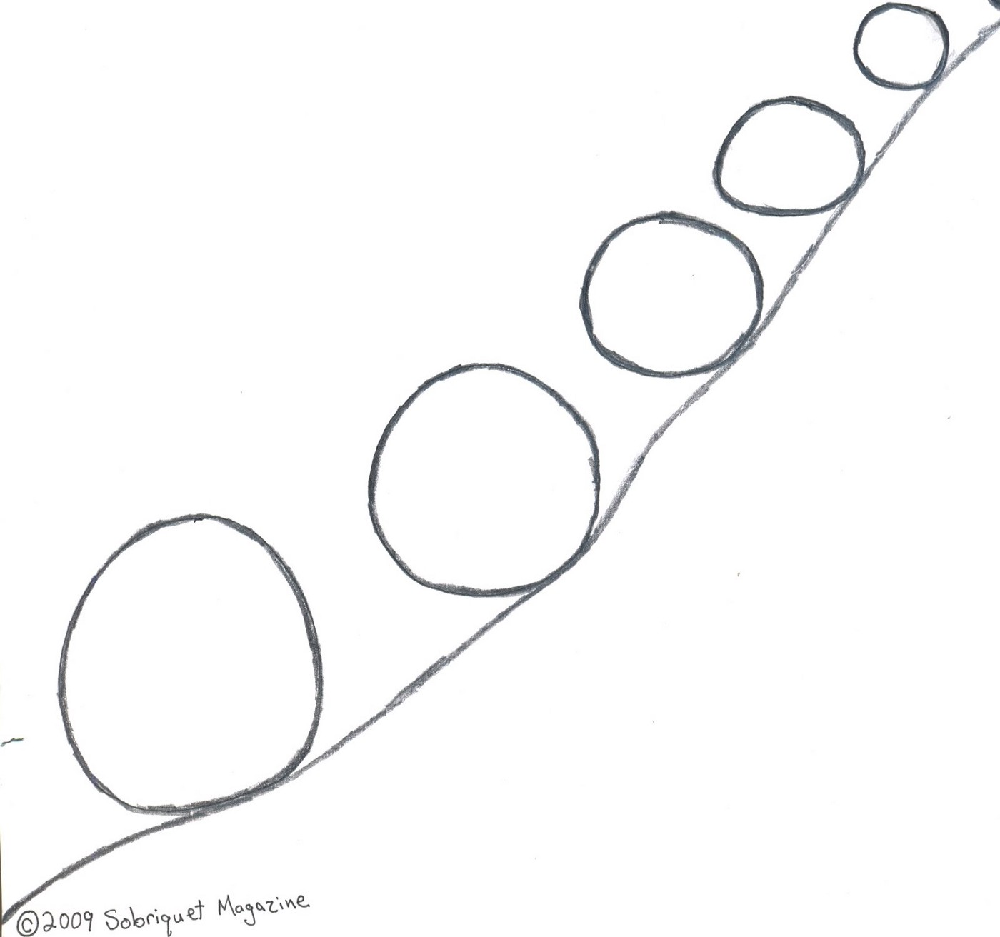

> The dangerous step is — to **FIX** price, deadlines and **vague scope** for long-term project and at the same time try to be [AGILE](http://agilemanifesto.org/) in development process.

By making this step the project is doomed for uncertainties (*what to do exactly and how, a lot of re-do stuff*), unmet deadlines (*more work than expected*), stressfulness for the team (*developers are always late, bad, and are bug-producers*) and conflicts with Customer.

Why is that?

## Project constraints triangle

Because if price, schedule and scope are fixed then the only thing left that is agile is **product quality**. There is no way to fool project constraints triangle.

Why we ever need to worry about agility of at least one of the axis from project constraints triangle? It is because a rare Customer is able to provide Developers with extensive, 100% clear and detailed scope (product feature list) at the very beginning of the project. This means that **scope is vague**, and it will be refined and grow during development process. So there should be something agile that will compensate these changes: price (fixed), scope (fixed), schedule (fixed) or quality (variable).

## The snow-ball

Since project dead-line has been fixed, project quality is suffering, and the scope is growing than developers are inevitably be in a hurry. They produce low-quality code along with bugs. They spend more time on bug fixing. Now developers are even in a bigger hurry because of blockers and bugs that constantly distract them from work. The Customer is not satisfied with the situation, he arranges more crisis-meetings distracting developers from work even more. Then managers and developers are being replaced with another “more effective” ones. New ones are digging into the project from scratch spending even more precious time on activities that were not planned… And so on and so on. Everything is getting worse and everyone loose.

## Step Back from frAgile to Agile

Only one way must be chosen either **Strict** or **Agile** but **not both** at the same time.

### Strict Way

If Customer wants the scope, price and deadline to be fixed than there is no place for uncertainties in requirements. Every requirement must be detailed and 100% clear for both sides (Customer and Developers), they are not allowed to be changed during development process. No agility. The huge planning step should be taken at the beginning of the project that will define required resources and dead-line and thus [Waterfall](https://en.wikipedia.org/wiki/Waterfall_model) methodology might be adopted.

### Agile Way

Don’t fix scope and keep quality as high as possible. If Customer have vague scope that might be changed or clarified later that is completely ok with [Agile](http://agilemanifesto.org/) methodology. In this case the Customer prioritizes a list of product features and **fixed teams** of developers (Scrum teams) accomplish most important features during **fixed time-frames** (several sprints) with **fixed and highest possible quality**.

