... by “simple” I mean a project that may consists of **many** parts (Docker containers) but that requires **one** server node (virtual or physical machine) to run its Docker containers on. So we won’t talk about distributed Docker [swarms](https://docs.docker.com/get-started/part4/#introduction) here.

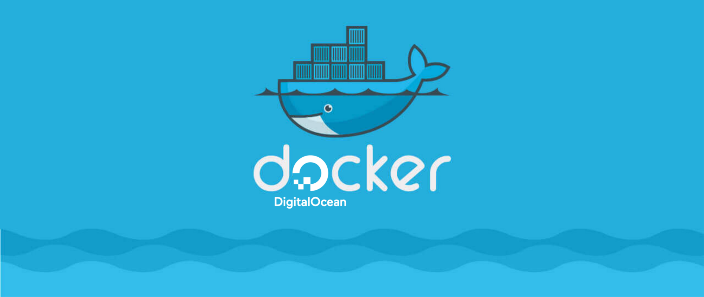

## The main idea

### High level overview

The main idea is to automate project’s code and environment deployment to production and to make this process to be smooth and easy regardless of the technologies that are being used. This is what [Continuous Delivery](https://continuousdelivery.com/) actually stands for.

As we’re talking about simple project so then let’s simplify deployment steps as well. Let’s say we want to:

1. Initiate re-deployment of a project parts by releasing a new git tag. So that after release we would see changes on production environment right away.
2. Do nothing more :)

### Lower level overview

To achieve the goal let’s use a combination of [GitHub](https://github.com/), [Docker Cloud](https://cloud.docker.com/) and [DigitalOcean](https://m.do.co/c/e53e02861c52).

- [GitHub](https://github.com/) will host our **Docker image source** codes.
- [Docker Cloud](https://cloud.docker.com/) will automatically build and host **Docker images** for us once the new git tag on GitHub is detected. It will also automatically deploy and run Docker containers on DigitalOcean after that. *As you may see all automation “magic” is happening and being set up here.*
- [DigitalOcean](https://www.digitalocean.com/) will host all running Docker containers and expose our entire project to the World.

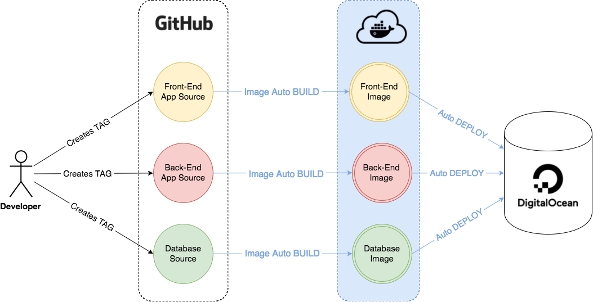

> This stack of services is just my personal preferences. You may easily switch to [BitBucket](https://bitbucket.org/) instead of GitHub or [Amazon Web Services](https://aws.amazon.com/) instead of DigitalOcean. It is up to you. The idea stays the same — to Dockerize the application parts and to use Docker Cloud as an automated connector between git repository and hosting provider.

## Before moving on

Before proceeding please make sure that all items below are covered:

- It would be nice to understand [what Docker is](https://www.docker.com/what-docker) and [why you would use Docker](https://www.docker.com/use-cases).
- We will deploy a sample Docker project that is created step-by-step in [Getting Started With Docker](https://docs.docker.com/get-started/) guide. So it would be also nice if you would read this guide as well.
- You need to have [GitHub](https://github.com/) account.
- You need to have [DockerCloud](https://cloud.docker.com/) account.
- You also need to register at [DigitalOcean](https://m.do.co/c/e53e02861c52). *You may use [this link](https://m.do.co/c/e53e02861c52) for registration to get $10 credit to your account.*

## Create hello-docker project

Let’s create a simple hello-docker project that will say “Hello Docker!” and display a number of page visits.


Project will consist of two containers:

- Python web application.
- Redis storage for visits number.

> We’re using sample Docker project from [Getting Started With Docker](https://docs.docker.com/get-started/) guide. Please address this guide if you’ll need detailed explanation of each file’s meaning.

### Fork it

You may find project source code at [trekhleb/hello-docker](https://github.com/trekhleb/hello-docker) repository. So just go and fork it.

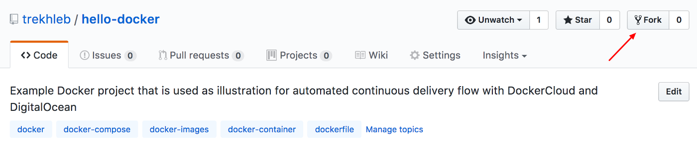

Once you forked it you’ll have hello-docker project copy as your own repository. Later we will connect this new repository to Docker Cloud so you need to have it.

### hello-docker file structure

- [Dockerfile](https://github.com/trekhleb/hello-docker/blob/master/Dockerfile) — describes how to build our web app Docker image (copy Python app, install dependencies, run it on container startup etc). [More details](https://docs.docker.com/get-started/part2/#define-a-container-with-a-dockerfile).
- [app.py](https://github.com/trekhleb/hello-docker/blob/master/app.py) — the source code of our web app (contains comments so it is pretty self-explanatory). [More details](https://docs.docker.com/get-started/part2/#the-app-itself).
- [requirements.txt](https://github.com/trekhleb/hello-docker/blob/master/requirements.txt) — web app Python dependencies (will be installed during image build). [More details](https://docs.docker.com/get-started/part2/#the-app-itself).
- [docker-cloud.yml](https://github.com/trekhleb/hello-docker/blob/master/docker-cloud.yml) — deployment config for Docker Cloud (we will copy-paste its content to Docker Cloud later). We have it here just to track the history of its changes in VCS. [More details](https://docs.docker.com/docker-cloud/apps/stack-yaml-reference/).
- [docker-compose.yml](https://github.com/trekhleb/hello-docker/blob/master/docker-compose.yml) — configuration for running multi-container application locally (this one has been added for your convenience so that you may run docker-compose up locally. [More details](https://docs.docker.com/compose/compose-file/).

Note that these **we won’t build the image locally** since Docker Cloud will handle it for us. But in case if you still want to enroll the project locally using docker-compose.yml please follow [these steps](https://docs.docker.com/get-started/part3/#your-first-docker-composeyml-file).

## Link Docker Cloud to GitHub

### Provide Access

Ok, we have our hello-docker project being set up on GitHub. Let’s now connect Docker Cloud account to GitHub account in order to have automatic image builds and also to publish our image to the cloud. We need to publish it to make it possible to pull our image from any Docker machine.

Login to [Docker Cloud](https://www.docker.com/).

Switch swarm mode off since we will deploy to one virtual machine only.

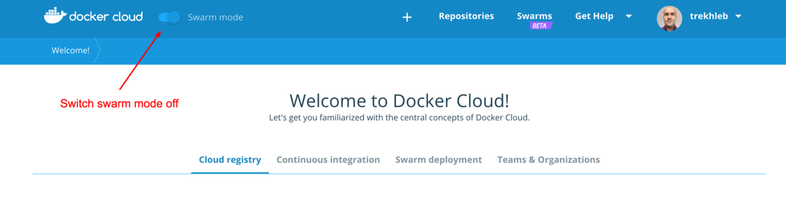

Go to Cloud settings and link your GitHub account.

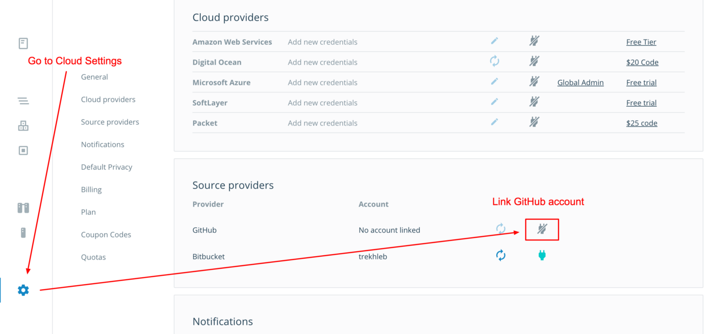

Authorize Docker Cloud Builder on GitHub.

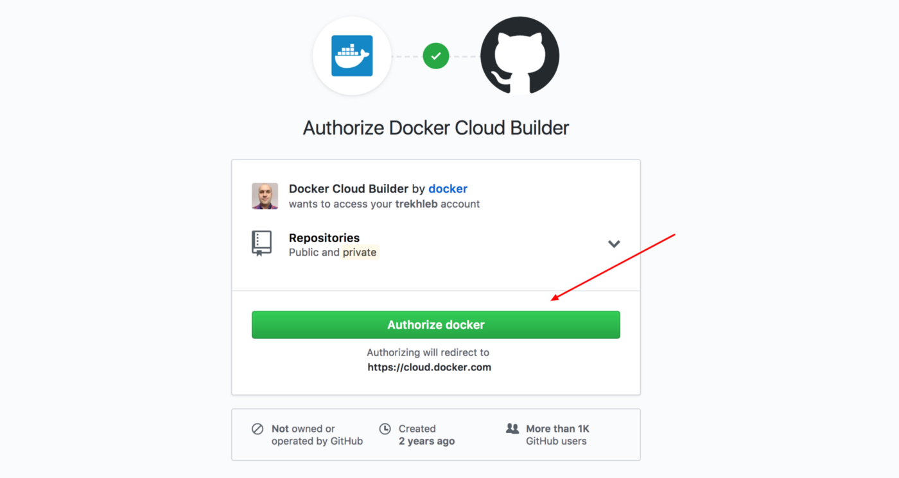

### Create `{your_user_name}/hello-docker` image

Now let’s go and create `{your_user_name}/hello-docker` image.

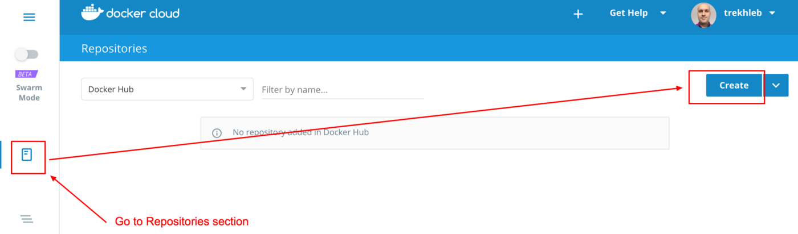

Point your hello-docker repository as a source for the image. And configure automatic image builds that will be started by publishing a new git tag to our hello-docker GitHub repository.

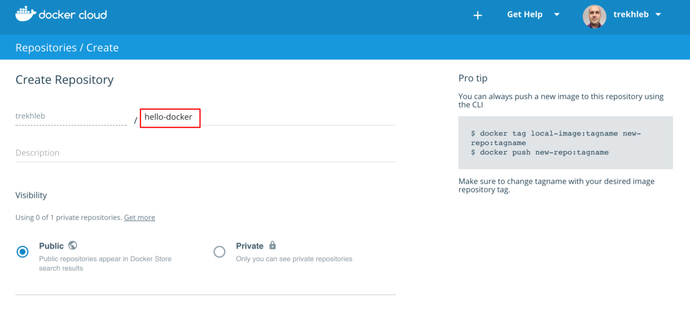

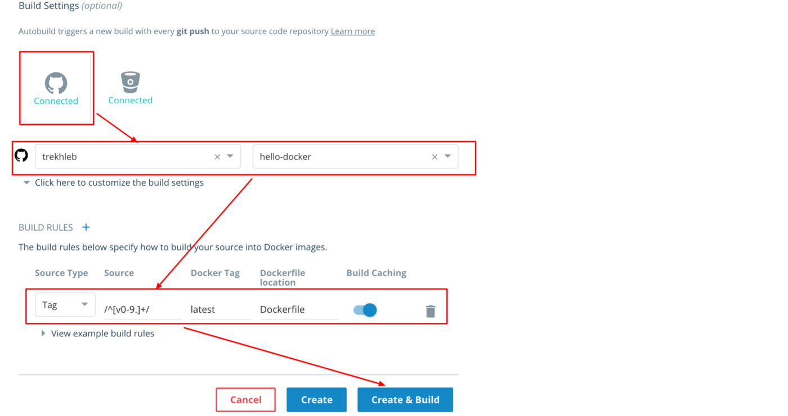

### Release hello-docker project to initiate automatic image build

Now let’s release our `hello-docker` application with a new tag `v0.0.1` to force Docker Cloud to build our image. In my example on screen-shots I’ve already done release `v0.0.1` and thus I’ll do release `v0.0.2`, but you may proceed with `v0.0.1`, it doesn’t important right now.

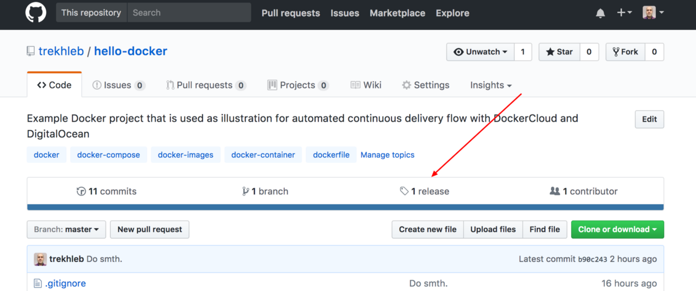

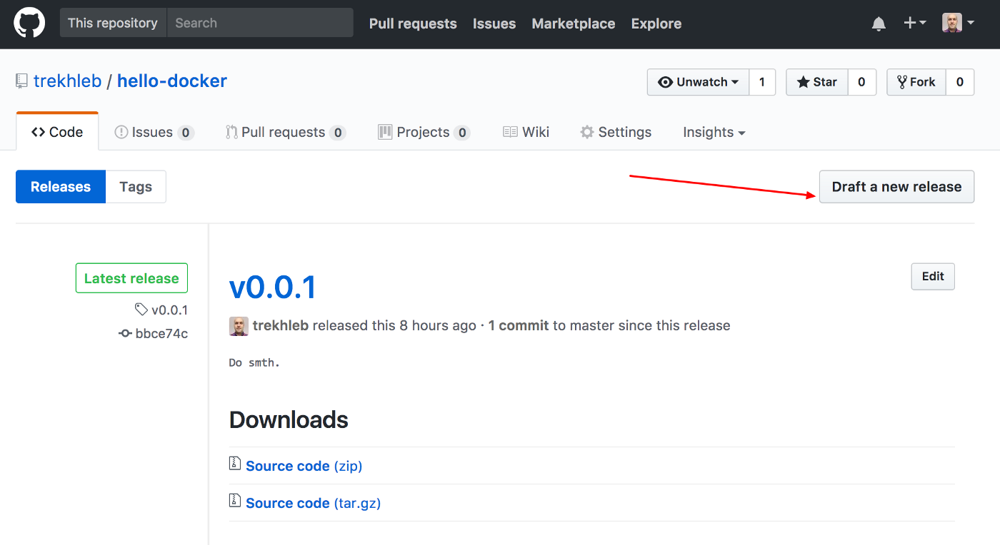

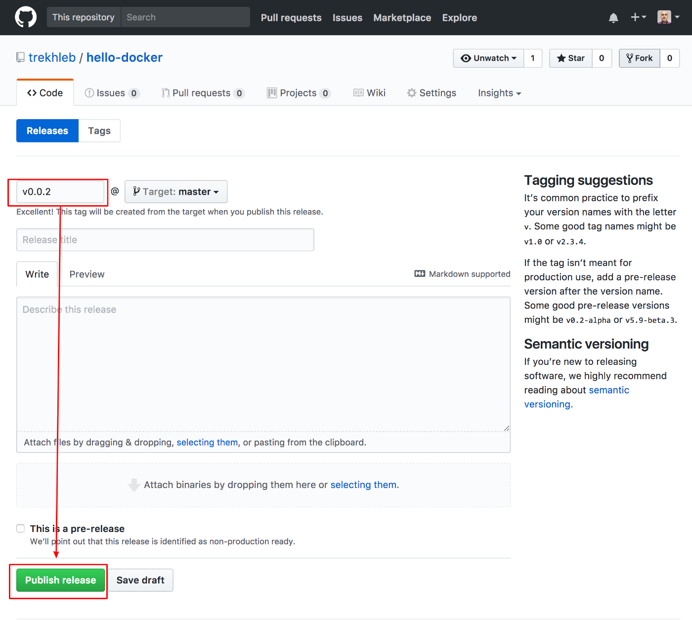

If you go to your Docker Cloud repositories and click on your hello-docker image you’ll notice that your image is building. After waiting a little bit the image is build, published and ready to be deployed!

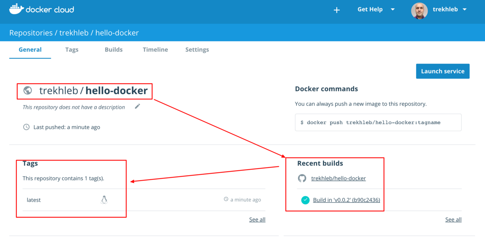

Congratulation! You’ve just set up GitHab ← → Docker Cloud integration with automatic image builds! Now every time you publish a new release of you project the image on Docker Cloud will automatically be rebuilt.

## Link DockerCloud with DigitalOcean

We have Docker image on Docker Cloud but it still isn’t deployed yet. Let’s fix it.

### Provide access to DigitalOcean

[Login](https://cloud.digitalocean.com/login) to your DigitalOcean account.

Go to Docker Cloud settings once again and authorize it to create DigitalOcean droplets for you.

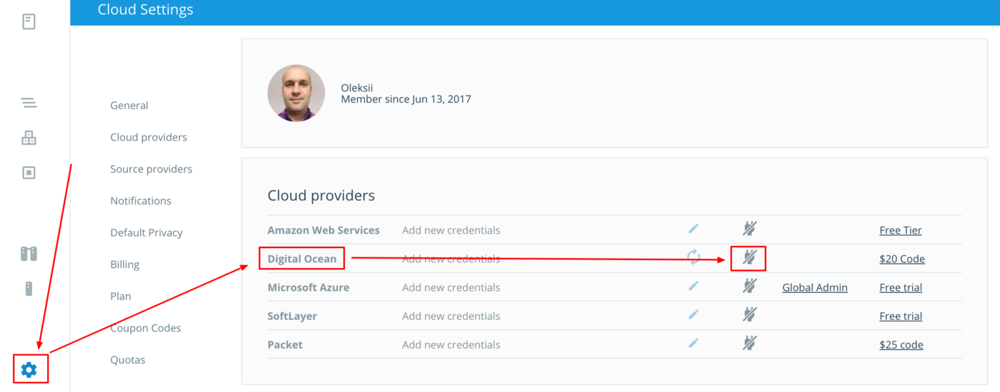


### Create our production node

Let’s ask Docker Cloud to create a node for us that will be used for further deployments.

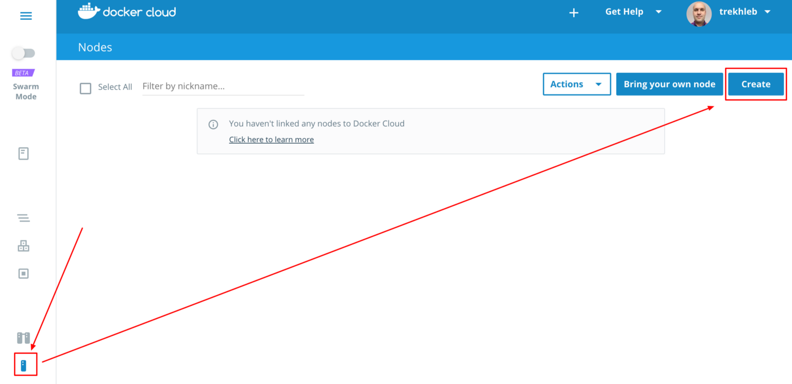

Our application is pretty simple so we may choose a pretty simple DigitalOcean droplet as well.

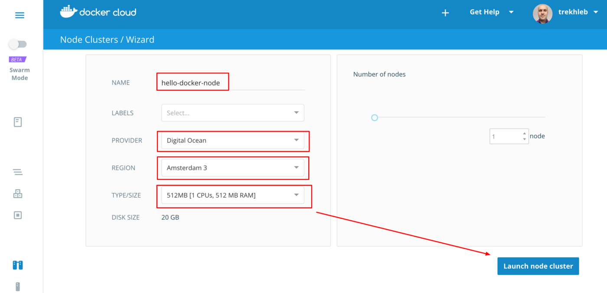

If you go to your DigitalOcean admin panel you will see that new droplet has been automatically created for you by DockerCloud.

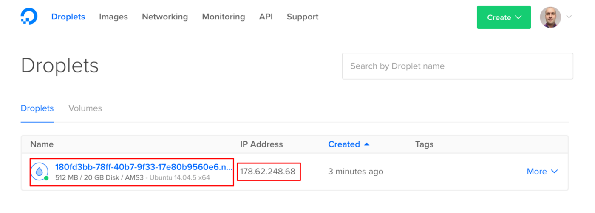

You may also see it in Docker Cloud admin panel.

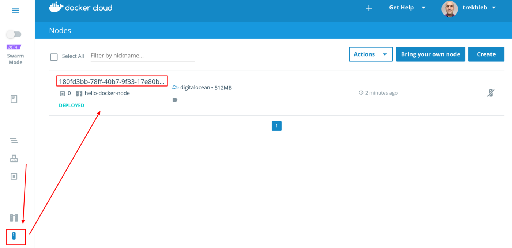

Cool! So we have our droplet (our virtual machine) ready for deployment and it is being automatically managed by DockerCloud.

## Setup Docker Cloud to deploy our project.

Now, let’s configure Docker Cloud so that it would actually deploy our application to DigitalOcean.

Take a closer look to `docker-cloud.yml` file on GitHub. It describes the rules of how we want our project to be build and enrolled.

```yaml
web:
  # Replace username/repo:tag with your name and image details.
  image: 'trekhleb/hello-docker:latest'

  # Redeploy web app in case if it's image is updated.
  autoredeploy: true

  # Expose port 80 of the container and map it to host's port 80
  ports:
    - '80:80'

  # Make it possible for app.py to call Redis on http://redis:6379
  links:
    - redis
redis:
  # Build redis container from official Redis image.
  image: 'redis:latest'
```

It describes two containers that should run: `web` and `redis`. `web` container will be built from our custom `{your_docker_cloud_username}/hello-docker` image. And we want `redis` container to be build from [official Redis image](https://store.docker.com/images/redis).

Take a look at `autoredeploy: true` string. It will configure Digital Cloud to do re-deploys on every `hello-docker` image update.

You may read [Docker Cloud YML Reference](https://docs.docker.com/docker-cloud/apps/stack-yaml-reference/) for further explanations of what fields it could have.

This file basically describes the stack of Docker services we’re going to deploy. Thus let’s go to “Stacks” partition of Docker Cloud admin panel and copy/paste our stack configuration.

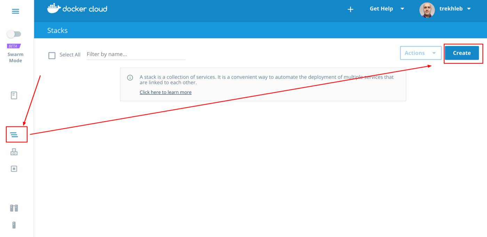

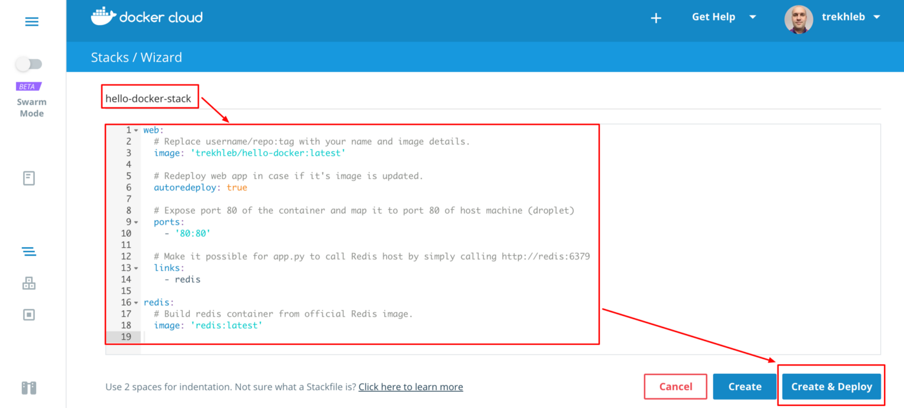

Let’s wait until deployment is finished.

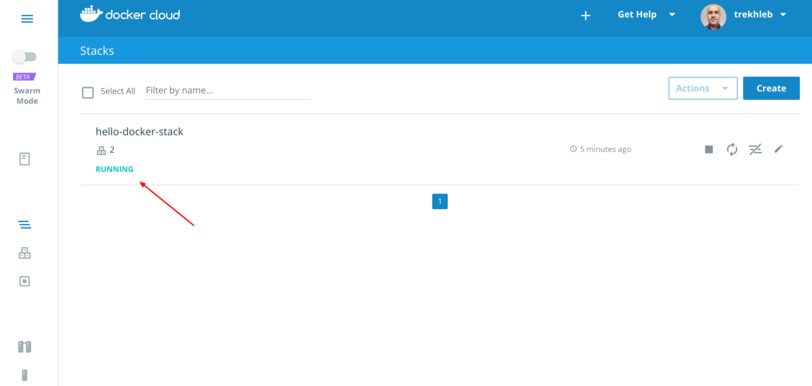

Now we’re getting really close to the end :)

Let’s check if application is running as expected. Go to DigitalOcean admin panel and check the public IP address of your droplet.


Enter this IP address to your browser. And... Voila! We have our application up and running!

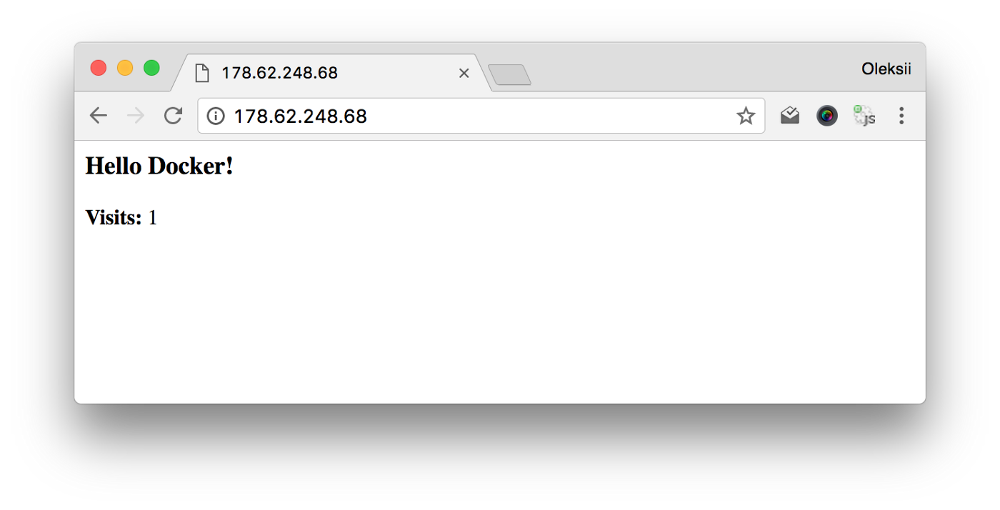

## Test full deployment flow

Now let’s test full flow of our deployment.

Do any change in your `hello-docker` GitHub project. Let’s replace phrase from “Hello Docker!” to “Hi Docker!”. Commit and push the changes to GitHub.

Now, the only thing we need to do is to release a new version of our app (v0.0.2). The rest of the flow should be done automatically: image will be build and published, docker containers will be updated and restarted. You may watch over the process from DockerCloud admin panel.

Once everything is rebuild and redeployed (normally it takes up to 5 minutes). Go to you public IP and check the changes.

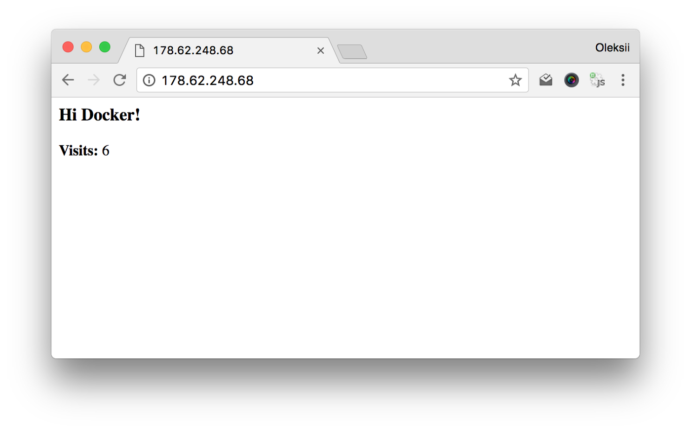

Congrats! It works!

Enjoy your coding and forget about deployments :)


## What next

The flow that was described here may be too simplified. But still it may work for you projects that is being hosted on single droplet.

In case if you want distributed deployment take a look at [Docker Cloud in swarm mode](https://docs.docker.com/engine/swarm/). Also, you might probably want to actively use [docker-machine](https://docs.docker.com/machine/overview/) for node manipulation and [docker stack deploy](https://docs.docker.com/engine/reference/commandline/stack_deploy/) for deploying stack from your swarm manager.

Also, you might noticed that in described continuous delivery flow we didn’t change the tag of Docker images in Docker Cloud. Our docker image always had `latest` which is not good. You might want to tag images with GitHub release versions like `v0.0.1` as Marc Campbell has mentioned in [his post](https://medium.com/@mccode/the-misunderstood-docker-tag-latest-af3babfd6375). This way you’ll be able to roll back to previous Docker images fast in case of troubles.
