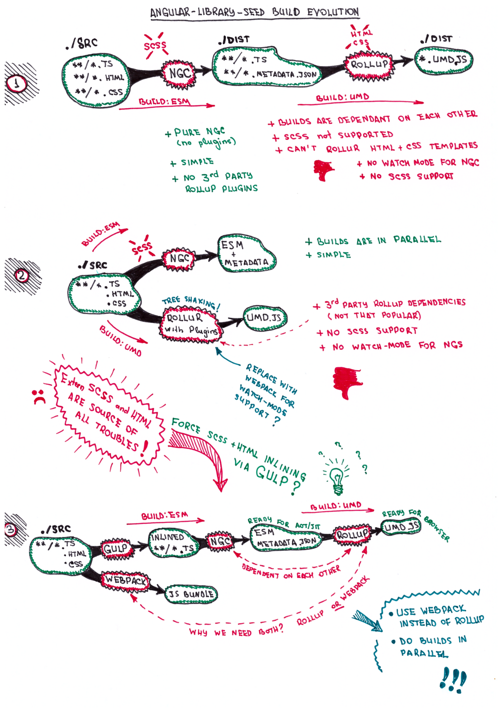
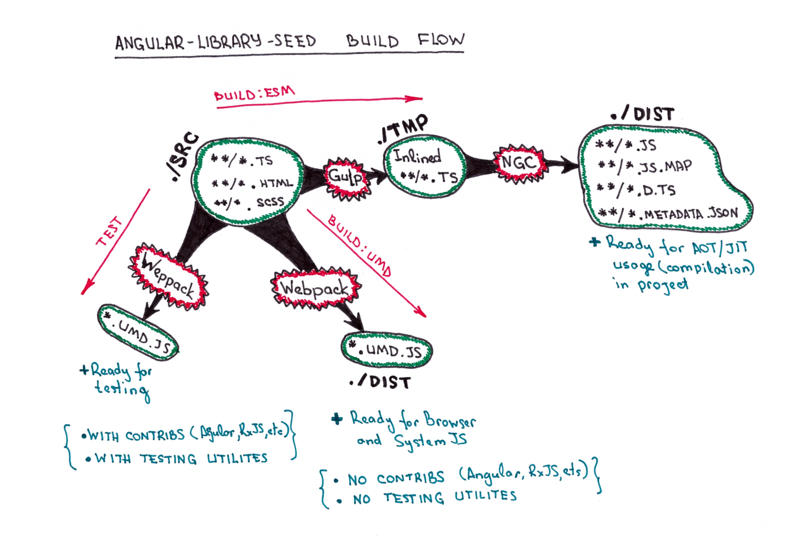

## TL;DR or Library Requirements

I’ve created [angular-library-seed](https://github.com/trekhleb/angular-library-seed) project that may be interesting for you in case if:

- You want to create component library for **Angular 4** and publish it on NPM.
- You want your library to be ready for further **AOT** and **JIT** compilation.
- You want your library to be ready for further usage **directly in browsers** (let’s say **UMD** bundle loaded by SystemJS).
- You want to write component styles in **external SCSS** files.
- You want to write component templates in **external HTML** files.
- You want to have **watch-mode** for library builds (including **AOT** build).

This project contains TickTock library example. The library itself is small, and the only thing it does is [displaying current time](http://embed.plnkr.co/VbO1hldrCfF6ITG6VvGG/). But what most important is that the project contains reusable environment for Angular libraries that allows to build, test, lint, document, explore and publish them.

## The Frustration of Back-End Developer

I’m a backend developer that for last several years was working on developing RESTful APIs and thus was not involved too much in front-end part of the projects. So those several years of front-end news have passed me by.

Once I decided to develop my own pet-project it was interesting for me to dive into front-end world (as I used to do before when jQuery ruled that world :)

And I was frustrated...

*React, AngularJS, Angular 2, Angular 4, Vue, Ember, Webapck, Rollup, Babel, Prepack, Node.js, NPM, Yarn, Gulp, Grunt, Karma, Jasmine, Protractor, Istanbul, Mocha, Chai, Sinon, TypeScript, ECMAScript, ES5, ES2015, TSlint, Codelyzer, AMD, UMD, CommonJS, Compodoc, SystemJS, Ahead-of-Time compilation, Just-in-Time compilation, Redux, Flux, RxJS, Promises, Observables, SCSS, Flex… Came on! Stop! That is too much for one who thought that if you know jQuery you’re front-end ninja :D What to choose? How to use them together? Thats a lot of possible combinations, man!*


Of course, I’m not going to cover all that topics here. I’m not going to say that I’ve fully covered them for myself yet.

What I’m going to do is to share a little bit of my experience (frustrations and answers I’ve found for myself) in one specific area — **developing component library for Angular 4**.

The answers and solutions I’m going to suggest below of course are not perfect and not “the only ones”. This is just something that answered my questions and worked for me in my project. So I hope you might find them useful for you as well. And also I hope you forgive me if you find any incorrectness below and take into account my fresh start in front-end world.

## The Questions


When I decided to move one of my internal Angular 4 module to a separate npm library to make it re-usable in many future project I’ve faced the following questions that were not that trivial for me.

### 1. What to export and in what format?

If I want my library be [AOT/JIT compatible](https://blog.craftlab.hu/multiple-solutions-for-angular-ahead-of-time-aot-compilation-c474d9a0d508) and to be usable in browser builds via [SystemJS](https://github.com/systemjs/systemjs) in what formats and structure should I export it?

- Should it be just one JS bundle file or should it be many not-bundled JS-files with folder structure being preserved? Or should be be both?
- Do I need to export *.js.map, *.d.ts files? What the heck is *.metadata.json and *.ngfactory.ts files and should I export them as well?
- Should I include Angular core in JS bundles or should I skip it? If I need to skip it then how should I do it?
- What JS standard should I use: ES5 or ES2015?

### 2. How to export?

Let’s pretend we have all answers on first question. How should I build it then? Looks like there are plenty of options:

- [Webpack](https://webpack.js.org/) or [Rollup](https://rollupjs.org/)?
- TypeScript compiler (tsc) or Angular compiler (ngc)?
- “ngc + Webpack” or “ngc + Rollup”?
- [ngtools/webpack Webpack](https://www.npmjs.com/package/@ngtools/webpack) plugin without ngc?
- [rollup-plugin-angular-aot](https://www.npmjs.com/package/rollup-plugin-angular-aot) Rollup plugin without ngc?

### 3. How to utilize external SCSS styles and HTML templates?

There are several [good examples](https://github.com/mgechev/angular-lib-seed) of Angular library starters (my favorite one is [Yo generator for Angular libraries](https://github.com/mattlewis92/generator-angular-library#readme)), but they don’t support external SCSS styles or HTML templates or watch-mode for AOT builds. But I wanted to have my templates, styles and component-related logic separately.

The issue is that Webpack allows you to have external SCSS and HTML templates with watch-mode but it is a bundler by its nature and thus it produces bundles that are not AOT-compatible. Angular Compiler in turn provides AOT-friendly output (all files separately with *.metadata.jsons), but it [doesn’t support watch-mode yet](https://github.com/angular/angular/issues/12867) and also it doesn’t support external SCSS templates.

### 4. Development flow

As a developer I want to have more or less automated developing workflow. So I should have been able to change the library sources and test them in a browser instantly without doing transpiation, linking, copying and all of that stuff manually.

#### How to provide watch-mode for AOT-build?

As it was mentioned in previous question Angular Compiler [doesn’t support watch-mode yet](https://github.com/angular/angular/issues/12867). I needed a workaround here.

#### How to link locally developed library to the local project?

Of course there is npm-link for that but there is a [bug](https://github.com/npm/npm/issues/10343) that causes npm to steal library’s dependancies from it and move them to the project’s node_modules folder. As a result all builders scripts inside library package become not functional.

## The Answers


You may browse [angular-library-seed](https://github.com/trekhleb/angular-library-seed) project on [GitHub](https://github.com/trekhleb/angular-library-seed) to see full working example and source-files. I’ve also provided descriptive README there so it should be easy to grasp whole idea.

But for now let’s focus on the questions listed above.

### 1. What to export and in what format?

#### 1.1 Files to be consumed by browsers directly

Since I wanted my library to be ready for consuming from browser by [SystemJS](https://github.com/systemjs/systemjs) I definitely needed to export it as one JS file (bundle).

SystemJS [understands](https://github.com/systemjs/systemjs/blob/master/docs/module-formats.md) different module formats such as ESM (ECMAScript Module), AMD (Asynchronous Module Definition), CJS (CommonJS) etc. So basically I might pick any of those.

But there also another one format that is called [UMD](http://davidbcalhoun.com/2014/what-is-amd-commonjs-and-umd/) (Universal Module Definition). This format seems to fit pretty well for delivering library as a bundle since it ultimately implements both [AMD](http://davidbcalhoun.com/2014/what-is-amd-commonjs-and-umd/) and [CommonJS](http://davidbcalhoun.com/2014/what-is-amd-commonjs-and-umd/) formats. In a result our bundle may be consumed even on the back-end by Node.

So we’re getting our first file that need to be exported:

> - index.umd.js

For consumers convenience the library should also provide minified version of the bundle to decrease download time for the user:

> - index.umd.min.js

Ok, we took care about end-users let’s also take care of developers who might want to debug the bundle. Thankfully we have JavaScript [SourceMaps](https://www.html5rocks.com/en/tutorials/developertools/sourcemaps/). Basically it’s a way to map a combined/compiled/minified file back to an unbuilt state.

So there is two more files to export:

> - index.umd.js.map
> - index.umd.min.js.map

Once the library is published to [npm](http://npmjs.com/) the dist folder with your library builds become also available on [UNPKG](https://unpkg.com/) server. You may find real-world examples of files mentioned above [there](https://unpkg.com/angular-library-seed/dist/):

Since we have our bundle available on the web you might [play with it on Plunker](http://embed.plnkr.co/VbO1hldrCfF6ITG6VvGG/) *(this approach is not a real-world example and it should be used only for testing or demo purposes since it utilizes TypeScript compilation and project build on browser side which is quite slow and traffic consuming)*.

#### 1.1.1 Exclude Angular core from the bundle

It might be pretty obvious, but we must keep in mind that we’re writing library for Angular project. Since project itself must have Angular core as a dependency the library should not include Angular sources in the bundles it produces. To do so, we need to set a [peer dependencies](https://docs.npmjs.com/files/package.json#peerdependencies) in our package.json file.

```json
{
  // ...
  "peerDependencies": {
    "@angular/common": "^4.0.0",
    "@angular/core": "^4.0.0"
  }
  // ...
}
```

[Full version of package.json](https://github.com/trekhleb/angular-library-seed/blob/master/package.json) in [angular-library-seed](https://github.com/trekhleb/angular-library-seed) repository.

And then exclude peer packages from the bundle by asking Webpack bundler to do so in webpack-umd.config.ts.

```typescript
import * as angularExternals from 'webpack-angular-externals';
import * as rxjsExternals from 'webpack-rxjs-externals';

export default {
  // ...
  externals: [angularExternals()],
  // ...
}
```

[Full version of webpack-umd.config.ts](https://github.com/trekhleb/angular-library-seed/blob/master/webpack-umd.config.ts) in [angular-library-seed](https://github.com/trekhleb/angular-library-seed) repository.

#### 1.2 Files to be consumed by Angular projects on the back-end

One of the requirement your library must fulfill is to be **AOT-compatible**. It is because you, as library developer, will never know what kind of projects will try to consume your library: with [JIT](https://angular.io/docs/ts/latest/cookbook/aot-compiler.html) or [AOT](https://angular.io/docs/ts/latest/cookbook/aot-compiler.html) types of compilation or even with both. And you probably don’t want to shrink your consumer audience.

Also according to [official Angular documentation](https://angular.io/docs/ts/latest/cookbook/aot-compiler.html) it is preferable to use JIT in development and AOT in production.

These are not the only reasons to support AOT compilation. AOT itself is a great option for minimising overall library weight, speed up rendering process and catch template-related exception during compilation and not during execution in browsers. More about AOT over JIT advantages you may read in the [official documentation](https://angular.io/docs/ts/latest/cookbook/aot-compiler.html) and, for example, in Minko Gechev’s [article](http://blog.mgechev.com/2016/08/14/ahead-of-time-compilation-angular-offline-precompilation/).

Ok, I guess we’re clear now that we need this Ahead-of-Time compilation support. So how would we gain it?

We need [Angular Compiler](https://www.npmjs.com/package/@angular/compiler) (or ngc) to do that for us. NGC is kind of wrapper over TSC ([TypeScriptCompiler](https://www.typescriptlang.org/docs/handbook/compiler-options.html)), but it takes Angular’s specifics into account while compiling *.ts files (see additional files it produces below).

Let’s forget about NGC for a moment and think about why we need that transpilation from TypeScript to JavaScript at all. Since project-consumers of the library might be written on [TypeScript](https://www.typescriptlang.org/) as well as on JavaScript we need to make our builds to be TypeScript-agnostic. In other words we need to transpile the sources from *.ts to *.js format utilizing one of the current standards: ES5 or ES2015 (aka ES6). This way not only TypeScript projects will be able to consume your library but JavaScript ones as well. You may read more about ES5 and ES2015 (aka ES6) in John Papa’s [article](https://johnpapa.net/es5-es2015-typescript/). In our case we will produce ES5 version of JavaScript files along with ES2015 [polyfills](https://en.wikipedia.org/wiki/Polyfill) to provide greater support for “not that modern” browsers.


<center><i>
Image source: <a href="https://johnpapa.net/es5-es2015-typescript/">johnpapa.net</a>
</i></center>

Ok, let’s get back to Angular Compiler. Unfortunately it is not documented enough (comparing to, let’s say, [TSC](https://www.typescriptlang.org/docs/handbook/compiler-options.html)) at the moment. And thus the following piece of information may be hard to grasp and confusing.

NGC takes component’s and service’s TypeScript files as an input and produces the following files as an output:

- `*.js` — produced by tsc, remember that ngc is a wrapper, compiled JavaScript representation of the component/service *.ts file from the input.
- `*.d.ts` — produced by tsc, remember that ngc is a wrapper declaration files. Since *.ts files with types are being transpiled to *.js files that don’t support typings the TypeScript Compiler needs to put all types information to separate *.d.ts files in order to be able to use those *.js files in TypeScript projects later. By the way, there is a [DefinitelyTyped](https://github.com/DefinitelyTyped/DefinitelyTyped) project with a lot of type definitions that have been already contributed for a plenty of JS non-TypeScript libraries.
- `*.ngfactory.ts` — component factory. In other words an instance of the component at runtime — the combination of original class file and a JavaScript representation of the component’s HTML template. The original component class is still referenced internally by the generated factory.
- `*.css.shim.ts` — compiled version of component’s CSS styles.
- `*.metadata.json` — metadata associated with the current component (or NgModule). It is kind of JSON representation of the objects we pass to the @Component, @NgModule decorators. This file contains the information that project’s (not library’s) NGC will need that was in the original library *.ts files but was not included in the *.d.ts files.

As Chuck Jazdzewski [mentioned](https://github.com/angular/angular/issues/11262#issuecomment-244472000): “All libraries must include the *.metadata.json file along side any *.d.ts files they produce otherwise they will not work correctly with ngc. If we don’t have that information we cannot generate the factories for the library”.

Also Minko Gechev writes in his [article](http://blog.mgechev.com/2016/08/14/ahead-of-time-compilation-angular-offline-precompilation/): “Angular Compiler needs metadata for the components in order to compile their templates. Lets suppose that in our application we use a third-party component library. How does the Angular AoT compiler knows the metadata of the components defined there if they are distributed as plain JavaScript? It doesn’t. In order to be able to compile ahead-of-time an application, referencing an external Angular library, the library needs to be distributed with the *.metadata.json produced by the compiler.”

Also, we don’t need to deliver our library’s *.ngfactory.ts files since it is something that will be compiled and produced by NGC on project’s (not library’s) side based on *.metadata.json files that must be provided by library. As explained [here](http://kylecordes.com/2017/angular-component-library-aot): “The actual implementation of AOT expects AOT to be performed always at a project level and never at a library level (although the letter is not exactly true; you may use the AOT tool in the library to produce “metadata” files). With this design, you can consume a library written (for example) with Angular 2.3.3, even if your project is using Angular 2.4.5 (somewhat different AOT output) or Angular 4.x (very different AOT output).

Ok, let’s sum up. In order our library to be consumable by Angular projects with AOT/JIT types of compilation we need to produce the following four files out of each *.ts file:

- `**/*.js` — transpiled version of *.ts file in ES5 standard.
- `**/*.js.map` — JavaScript map for pleasant debugging.
- `**/*.d.ts` — declaration files for saving types information.
- `**/*.metadata.json` — metadata required for further AOT compilation.

#### 1.2.1 Angular Compiler Configuration

So how do we run ngc? It is done via [npm scripts](https://docs.npmjs.com/misc/scripts). Take a look at the piece of package.json file:

```json
{
  "scripts": {
    // ...
    "ngcompile": "node_modules/.bin/ngc -p tsconfig-aot.json"
    // ...
  },
  "devDependencies": {
    // ...
    "@angular/compiler": "^4.0.0",
    "@angular/compiler-cli": "^4.0.0"
    // ...
  }
}
```

[Full version of package.json](https://github.com/trekhleb/angular-library-seed/blob/master/package.json) in [angular-library-seed](https://github.com/trekhleb/angular-library-seed) repository.

As you might noticed Angular Compiler takes configuration file tsconfig-aot.json as a parameter. Here is where all ngc configuration happens. Here we ask the compiler to produce JS files in ES5 standard, to skip ngfactory generation, to produce source maps and declaration files and so on:

```json
{
  "compilerOptions": {
    "target": "es5",          // Specifying ES standard
    "module": "es2015",
    "sourceMap": true,        // Ask tsc to generate *.map.js files
    "declaration": true,      // Ask tsc to generate *.d.ts files
    "outDir": "dist",         // Specify output folder for the files
    // ...
  },
  "files": [                     // Specify input file for tsc/ngc
    "./tmp/src-inlined/index.ts"
  ],
  "angularCompilerOptions": {    // Angular compiler specific config
    "genDir": "dist",
    "skipTemplateCodegen": true, // Don't produce *.ngfactory.ts
    // ...
  }
}
```

[Full version of tsconfig-aot.json](https://github.com/trekhleb/angular-library-seed/blob/master/tsconfig-aot.json) in angular-library-seed repository.

### 2. How to export?

I’ve found the following building scheme working for me.


You may take a look at “Angular-Library-Seed Build Evolution” section at the end of this article for other possible solutions that for some reason couldn’t fit to all my requirements.

#### 2.1 Utilizing Gulp

The distinguishing characteristic of this approach is **inlining** of all external HTML templates with theirs SCSS styles (compiled to CSS) into related `*.component.ts` files via [Gulp](http://gulpjs.com/). By doing this at the end you’ll receive temporary folder with pure `**/*.ts` files that may be easily compiled by Angular compiler. Gulp will also help us to simulate watch-mode for Angular compiler (more on that later).

#### 2.2 Parallel Builds

Another advantage of this approach is that ESM, UMD and Test **builds are completely independent** and may be done in **parallel** or separately one by one:

```shell
# Run all builds at once.
yarn build

# Run ESM build only.
yarn build:esm

# Run UMD build only.
yarn build:umd
```

Read more about build process in angular-library-seed’s [README](https://github.com/trekhleb/angular-library-seed#build-the-library).

#### 2.3. Rollup or Webpack

[Rollup](https://rollupjs.org/) and [Webpack](https://webpack.js.org/) are two great bundlers I was looking at.

As you may see from the “Angular-Library-Seed Build Evolution” schemes below I decided to use Rollup first. It attracted me by configuration simplicity and native [TreeShaking](https://rollupjs.org/) support.

Both Webpack and Rollup has TypeScript/Angular related plugins ([rollup-plugin-typescript](https://github.com/rollup/rollup-plugin-typescript), [rollup-plugin-angular](https://github.com/cebor/rollup-plugin-angular), [ngtools/webpack](https://www.npmjs.com/package/@ngtools/webpack), [awesome-typescript-loader](https://github.com/s-panferov/awesome-typescript-loader) etc).

But personally I decided to use Webpack so far since it looks for me more mature, well documented and with greater community support.

Once again, this is my personal choice. If you would prefer using Rollup as your library bundler then [two](http://www.techumber.com/rollup-bundler-for-angular2-projects/) [good](https://www.codementor.io/stevebelovarich/use-rollup-to-build-angular-2-web-apps-du1089cq5) articles may be useful for you.

Once thing I may suggest you: don’t use both at the same time :) Keep you technology stack as thin as possible. Once I’ve ended up with Rollup making UMD bundle and Webpack doing similar bundle but for Karma tests — it was a red flag for me, so I’ve switched to Webpack for both cases.

### 3. How to utilize external SCSS styles and HTML templates?

Having Gulp in the library’s arsenal makes it possible to perform [SCSS](http://sass-lang.com/) compilation in prior to templates inlining. Template inlining are done using [gulp-inline-ng2-template](https://github.com/ludohenin/gulp-inline-ng2-template) library which in turn allows you to provide template processor function.

Take a look at [gulpfile.js](https://github.com/trekhleb/angular-library-seed/blob/master/gulpfile.js) example in angular-library-seed repository for more details.

### 4. Development flow

In order to debug your library in browser you need to have Angular project that will consume your library, build the application and display it. For your convenience all of that should happen automatically in background so once you change library source code you should instantly see the changes in browser.

There are several ways to go here:

- Use your real library-consumer project and link your library to it via `yarn link` command (see below).
- Use [demo applications](https://github.com/trekhleb/angular-library-seed/tree/master/demo) that are provided for your convenience as a part of angular-library-seed repository.
- Use [Angular-CLI](https://cli.angular.io/) to generate library-consumer project for you and then use `yarn link` to link your library to it.

#### Providing watch-mode for AOT compiler for better developing experience

Ok, so we now that Angular Compiler [doesn’t support watch-mode](https://github.com/angular/angular/issues/12867) yet. But Using [Gulp](http://gulpjs.com/) in angular-library-seed gives us a possibility to simulate watch-mode. Take a look at gulpfile.js (file with Gulp scripts) example:

It watches for any file changes in src folder and once any file change detected it forces AOT compiler to re-compile the library.

Of course, it looks like a workaround, but it may save you hours of development by launching compilation process automatically for you.

[The full version of gulpfile.js](https://github.com/trekhleb/angular-library-seed/blob/master/gulpfile.js) may be found in angular-library-seed repository.

#### Using demo applications

You may take advantage of watch-modes for both library build and [demo-projects](https://github.com/trekhleb/angular-library-seed/tree/master/demo) builds in order to see changes to your library’s source code immediately in your browser.

To do so, you need to:

1. Open two console instances.
2. Launch library build in watch mode in first console instance by running `yarn build:watch` (assuming that you're in `angular-library-seed` root folder).
3. Launch demo project build (JIT version) in watch-mode by running `yarn start` in second console instance (assuming that you're in `angular-library-seed/demo` folder).

As a result once you change library source code it will be automatically re-compiled and in turn your JIT demo-project will be automatically re-built and you will be able to see that changes in your browser instantly.

For more details about demo projects, their folder structure and npm commands please take a look at angular-library-seed [demo projects README](https://github.com/trekhleb/angular-library-seed/tree/master/demo).

#### Using yarn link

Since angular-library-seed uses [Yarn](https://yarnpkg.com/lang/en/) as a default package manager then we don’t have to deal with npm-link [bug](https://github.com/npm/npm/issues/10343) that causes npm to steal library’s dependancies from it and move them to the project’s node_modules folder. (as a result all builders scripts inside library package become not functional).

So you might simply run [yarn link](https://yarnpkg.com/lang/en/docs/cli/link/) to link your library to the project:

```shell
# Run this inside of your library folder
yarn link

# Run this inside of your project folder (replace library name)
yarn link angular-library-seed
```

But in case if you run your project on [Angular CLI](https://cli.angular.io/) then you might experience [another bug](https://github.com/angular/angular-cli/issues/4647#issuecomment-306170986) that will not allow you to have node_modules folder inside your linked library folder, and your AOT (prod) builds will fail with error: *“ERROR in Error encountered resolving symbol values statically. Calling function ɵmakeDecorator”*.

[Here](https://github.com/angular/angular-cli/issues/4647#issuecomment-305967234) is a workaround suggested. So you might simply add the following line to your AngularCLI’s tsconfig.json file:

```text
"paths": { "@angular/*": ["../node_modules/@angular/*"] }
```

[Read more](https://github.com/trekhleb/angular-library-seed#library-development-workflow) about library developing workflow and demo projects that angular-library-seed provides in [related README section](https://github.com/trekhleb/angular-library-seed#library-development-workflow).

## Additional Project Features

Additionally, to main library building functionality the [angular-library-seed](https://github.com/trekhleb/angular-library-seed) project contains the following features:

- **Testing** with [Karma](https://karma-runner.github.io/1.0/index.html) and [Jasmine](https://jasmine.github.io/).
- **Test coverage** report via [Istanbul](https://github.com/gotwarlost/istanbul).
- **Linting** with [TSLint](https://palantir.github.io/tslint/) and [Codelyzer](https://github.com/mgechev/codelyzer) for static code analysis.
- **Exploring your build** via [Sourcemap Explorer](https://www.npmjs.com/package/source-map-explorer) that shows you a treemap visualization to help you debug where all the code is coming from.
- **Documentation generation** via [Compodoc](https://github.com/compodoc/compodoc). Take a look at [documentation example](https://trekhleb.dev/angular-library-seed/).
- **Documentation hosting** via [GitHub Pages](https://pages.github.com/).
- **Continuous integration** with [Travis CI](https://travis-ci.org/).
- **Code coverage** badge via [Codecov](https://codecov.io/) as a reminder to cover code with tests.

## P.S. Angular-Library-Seed Build Evolution

These are just several examples of how the Angular library could be build depending on requirements. I’ve found the requirement of having external SCSS and HTML files the most problem one since it brought different kind of workarounds with it like copying templates into dist folder or using Gulp for inlining templates into *.component.ts files etc.





But in a result, I believe the build flow became more or less straight-forward, with a possibility of doing any build (for tests, for UMD, for ESM) in parallel.

## P.S. P.S.

I hope you’ve found something useful for you in this article. Of course it doesn’t cover the subject completely but, you might find additional information by exploring [READMEs](https://github.com/trekhleb/angular-library-seed) and browsing [the sources](https://github.com/trekhleb/angular-library-seed) themselves. All this has been written for one purpose — to help developers to spend more time on **developing the library** itself than on focusing on its build environment. Good luck!
