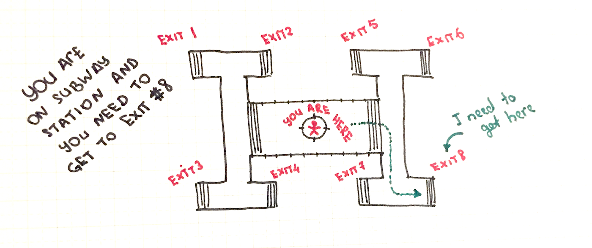
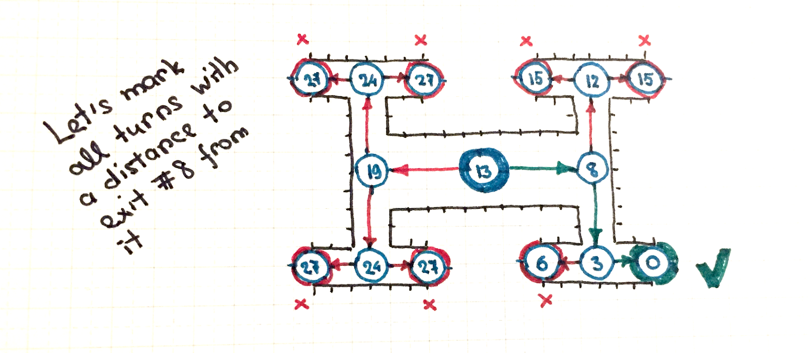
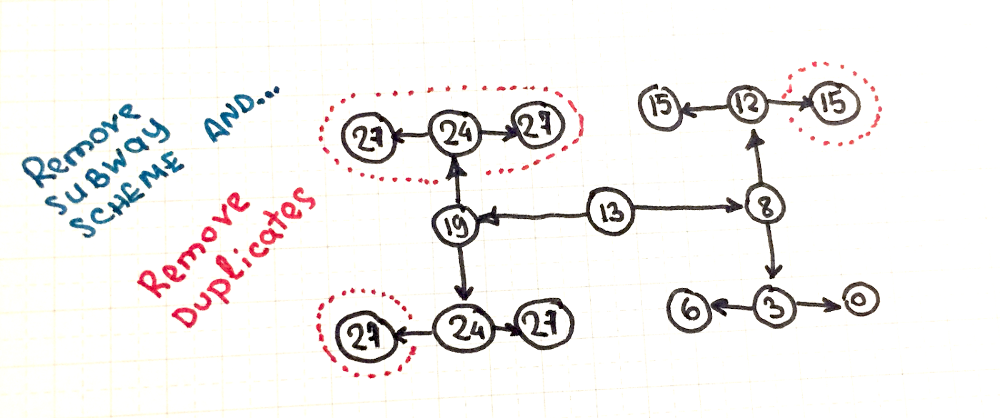
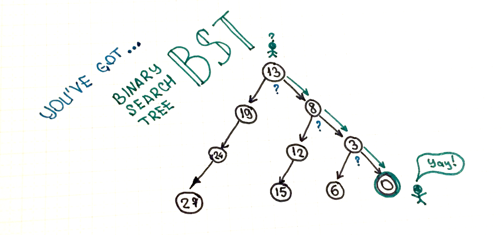

> In computer science, binary search trees ([BST](https://en.wikipedia.org/wiki/Binary_search_tree)), sometimes called ordered or sorted binary trees, are a particular type of container… **bla… bla… bla…** Stop! Binary Search Trees are brilliant and they save a lot of our search time making things much faster than they could be. But before we get to its official definition just imagine that you’ve been already using Binary Search Trees along with a subway…

Imagine you’re in the middle of a simplified subway station with eight exits, and you need to get to the eighth one.

What do you normally do? You make one turn (decision) after another each time deciding what is the shortest path to the existing `#8`.

Eventually, the distance to exit `#8` is the most valuable criteria you’re using to make correct decisions during each turn. Thus let’s mark all turns and exists with a number that represents the distance to desired exit `#8` from it. For example, if you’re in the middle of the station that it would take 13 “steps” for you to get to exit `#8`. Also if you’re already at exit `#8` it would mean that you’re zero-steps far from it. And so on for all other turns and exists.

Actually, this is something your brain automatically does. Every time you make a turn you know the shortest path. These numbers are just a way to make this process understandable not only for the human brain but for the computer as well.

OK, now let’s clean that drawing up a little and remove the subway scheme.

Now let’s clean it up even more and remove useless duplicates to simplify things.

Voila! We’ve got **Binary Search Tree** ([**BST**](https://en.wikipedia.org/wiki/Binary_search_tree)) we’re using each time during our subway trips!

How you’re using BST?

- **Start from root node**. Once you came out from the subway car you’ve appeared on the top of the binary search tree — the node with the number `13` that is also called the root node. It means that you need to make `13` “steps” to get to the target. Your target is to exit `#8` which is equal to the number `0` in a tree (zero steps to exit `#8`).
- **Remember that nodes are sorted**. Eventually, all our turns (tree nodes) became sorted by the distance to exit `#8`. It means that for every turn you make you have a hint — if the right turn is closer to the target then all other turns after the right one will be even closer. And the opposite is also true — if the left turn is farther from the target then all other turns after the left one will be even farther.
- **Perform search — make a decision**. So you’re standing in the root node. If you look to the right you would see that the next node (next turn) is `8` steps far from the target (node with number `8`). Meanwhile, the left turn will draw you farther from the target and you’ll be 19 steps far from it. So you decide to turn right. By doing so you’re actually performing a binary search. Binary because there are only two options that exists for each turn.
- **Perform a search for every other node**. If you keep doing it on every node (every turn) you’ll get to the target node you’re looking and you do it pretty fast (only `3` decisions out of `7`).

Now, I hope, we can replace those bla-bla-blas from [official Binary Search Tree definition](https://en.wikipedia.org/wiki/Binary_search_tree) that you’ve already met at the beginning of the article. Here we go:

> In computer science, binary search trees (BST), sometimes called ordered or sorted binary trees, are a particular type of container: data structures that store “items” (such as numbers, names, etc.) in memory. They allow fast lookup, addition, and removal of items, and can be used to implement either dynamic sets of items, or lookup tables that allow finding an item by its key (e.g., finding the phone number of a person by name).

I hope it sounds a little bit clearer now :)

> Btw, here is an example of [Binary Search Tree Implementation in JavaScript](https://github.com/trekhleb/javascript-algorithms/tree/master/src/data-structures/tree/binary-search-tree).

Of course, this illustration is simplified and in the real world, there could be “subway stations” (other cases) that are much more complicated with much more nodes and turns. The nodes may be added and removed dynamically. The binary search tree may be unbalanced and inefficient and the one which will require [self-balancing](https://en.wikipedia.org/wiki/Self-balancing_binary_search_tree) and so on. But this is the case for another article.
