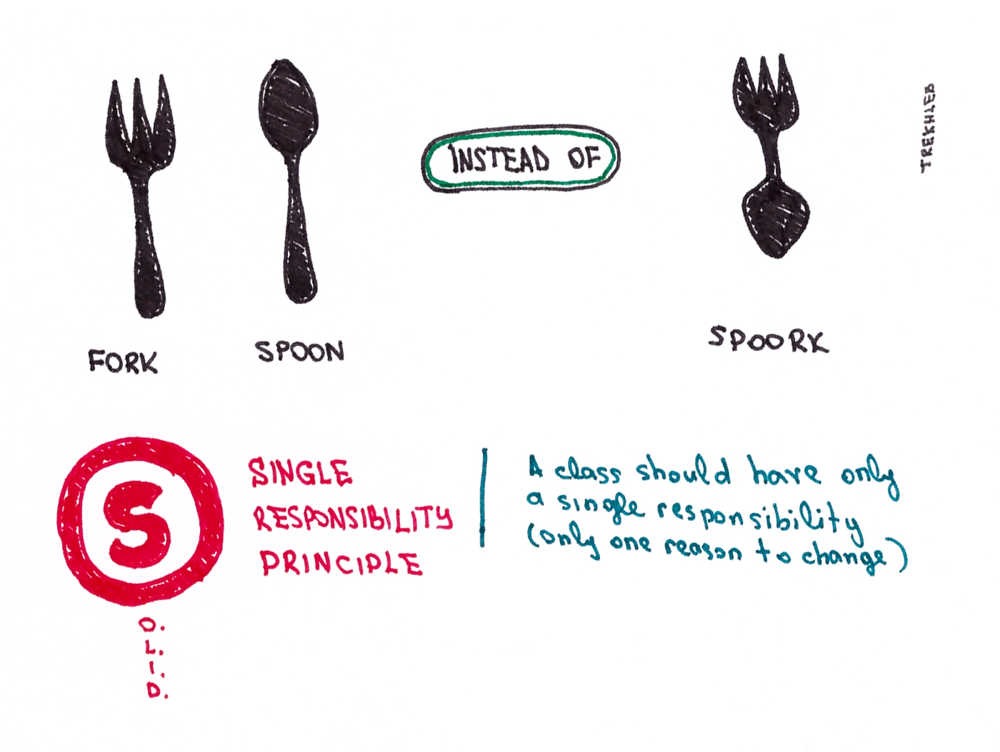
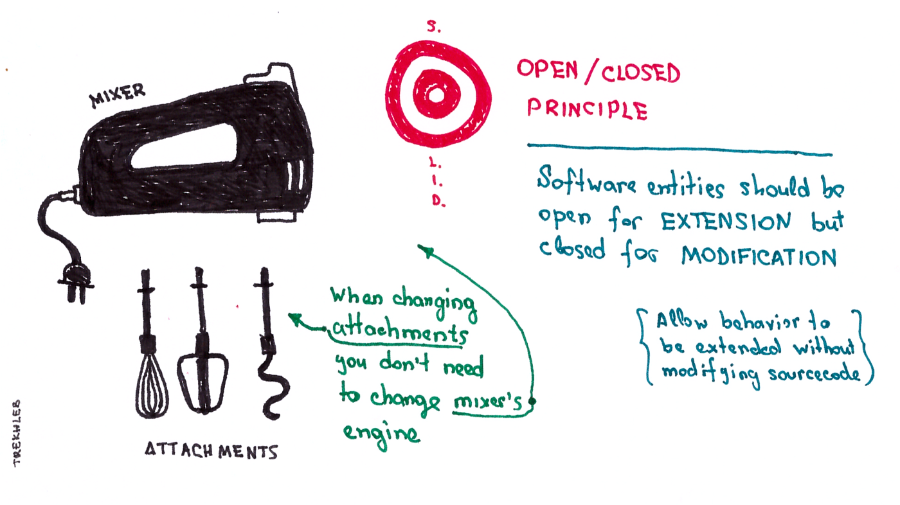
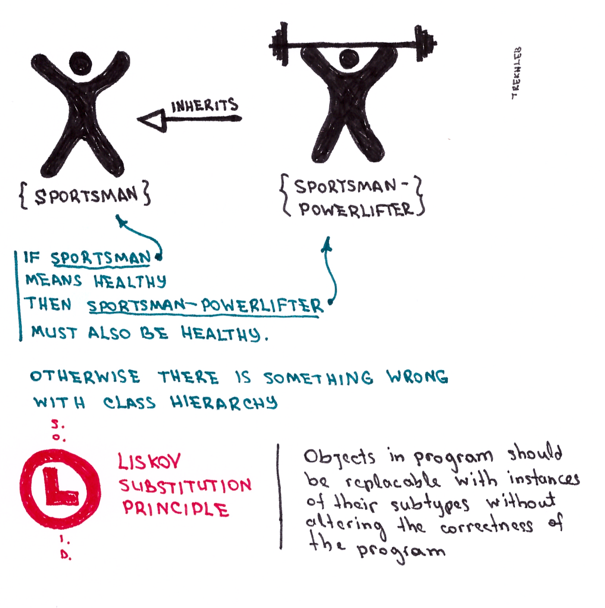
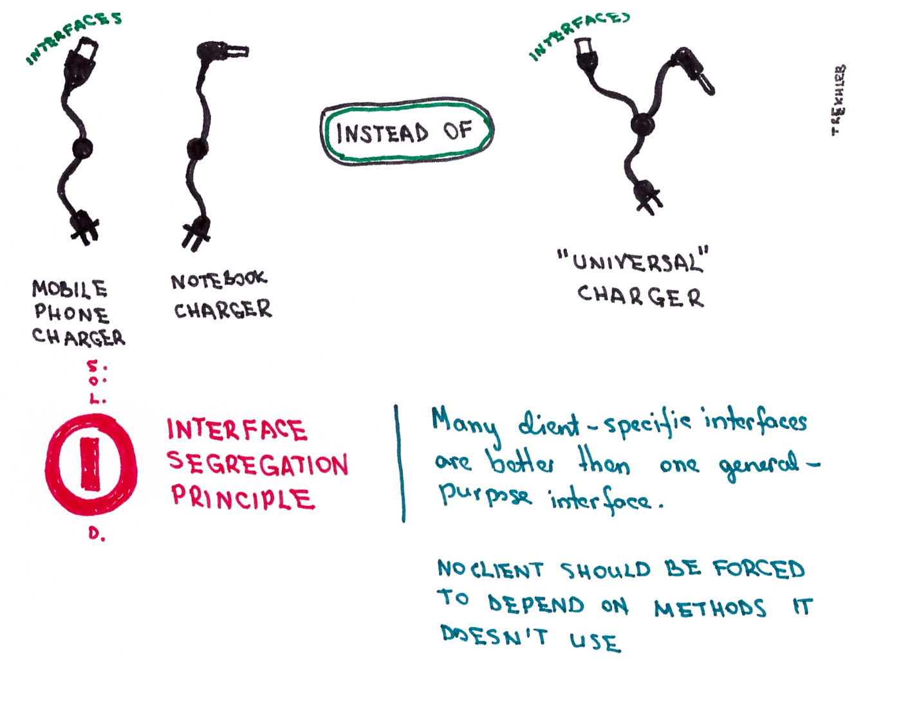
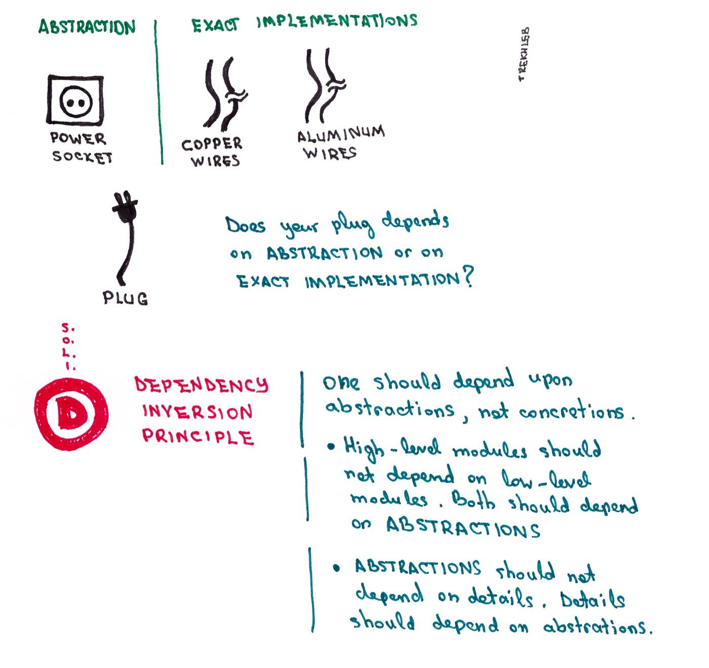

In this article, I want to briefly go through [SOLID](https://en.wikipedia.org/wiki/SOLID_(object-oriented_design)) principles (the acronym that stands for five basic principles of object-oriented programming and design) supplying each of them with real-world visual examples to make those principles more understandable, readable and memorizable.

> If you want to see code examples instead you may take a look at [variety of tree data structure implementations](https://github.com/trekhleb/javascript-algorithms/tree/master/src/data-structures/tree) in **JavaScript** like [Binary Search Tree](https://github.com/trekhleb/javascript-algorithms/tree/master/src/data-structures/tree/binary-search-tree), [AVL Tree](https://github.com/trekhleb/javascript-algorithms/tree/master/src/data-structures/tree/avl-tree), [Red-Black Tree](https://github.com/trekhleb/javascript-algorithms/tree/master/src/data-structures/tree/red-black-tree), [Segment Tree](https://github.com/trekhleb/javascript-algorithms/tree/master/src/data-structures/tree/segment-tree) or [Fenwick Tree](https://github.com/trekhleb/javascript-algorithms/tree/master/src/data-structures/tree/fenwick-tree).

> You may also check the interactive [SOLID Sketches](https://okso.app/showcase/solid)

So let’s move on!

## S — Single Responsibility Principle

a.k.a [SRP](https://en.wikipedia.org/wiki/Single_responsibility_principle)

A class should have only a single responsibility. Only one potential change in the software’s specification should be able to affect the specification of the class.

## O — Open/Closed Principle

a.k.a [OCP](https://en.wikipedia.org/wiki/Open/closed_principle)

Software entities should be open for EXTENSION, but closed for MODIFICATION. Allow behavior to be extended without modifying the source code.

## L — Liskov Substitution Principle

a.k.a. [LSP](https://en.wikipedia.org/wiki/Liskov_substitution_principle)

Objects in a program should be replaceable with instances of their subtypes without altering the correctness of that program.

## I — Interface Segregation Principle

a.k.a. [ISP](https://en.wikipedia.org/wiki/Interface_segregation_principle)

Many client-specific interfaces are better than one general-purpose interface. No client should be forced to depend on methods it does not use.

## D — Dependency Inversion Principle

a.k.a. [DIP](https://en.wikipedia.org/wiki/Dependency_inversion_principle)

One should depend upon abstractions, not concretions.

- High-level modules should not depend on low-level modules. Both should depend on abstractions.
- Abstractions should not depend on details. Details should depend on abstractions.

The plug doesn’t care which type of wire it uses, it just needs wires that conduct electricity.

I hope these illustrations have been useful for you :)
