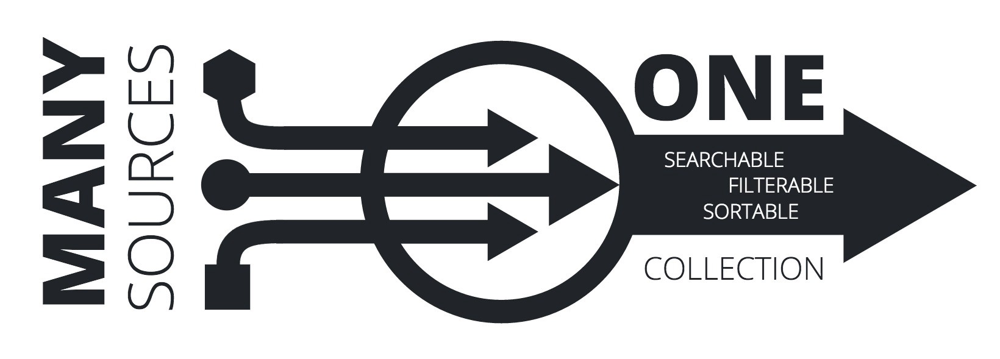
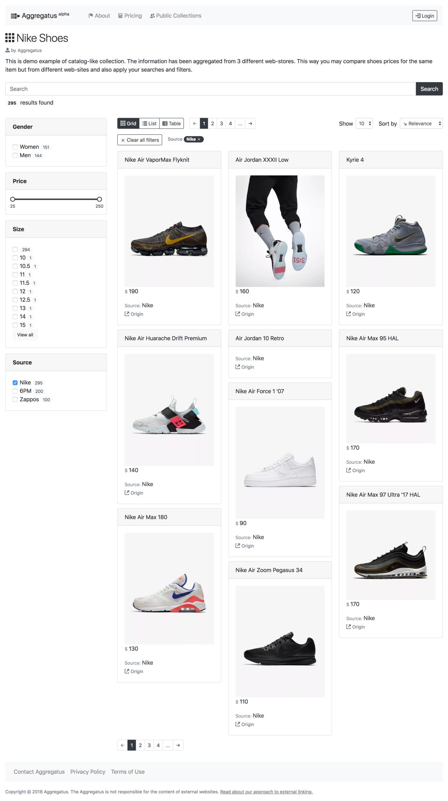

Hello everyone!

I’m glad to announce that new data aggregation service is now live and in alpha stage of testing, and it is called [Aggregatus](https://aggregatus.io/)!

[Aggregatus](https://aggregatus.io/) is a service that helps you to aggregate information of the same meaning but from the different websites and make it searchable, filterable and sortable as if it all was from the one website.

You may think of shoes catalogs, apartments advertisements, news items or whatever you want to as of certain type of data that comes from different websites or data-sources. All this information from many data-sources may be scraped and aggregated by Aggregatus into collections.

Aggregatus users are able to create many collections (collection of shoes, collection of blog posts etc.). Each collection contains data of certain type with specific set of data properties. For example shoes collection might have data with such data properties as name, photo, category, available sizes and so on.

You may check several examples of how those collections may look like by visiting [Nike Shoes](https://aggregatus.io/collection/1) or [Startup News](https://aggregatus.io/collection/2) collections.

## See how it works in action

<iframe width="100%" height="315" src="https://www.youtube.com/embed/9_3hk3dTqR4" frameBorder="0" allow="accelerometer; autoplay; clipboard-write; encrypted-media; gyroscope; picture-in-picture" allowFullScreen></iframe>

One of the challenging tasks for the Aggregatus users was a necessity to come up with a proper CSS selector on the 3rd-party web-sites for the elements that users want to parse/scrape the data from.

To make it easier the *CSS Wizard* feature was developed. It allows the users to preview the 3rd-party web-site inside the Aggregatus pop-up window, click on the elements that need to be parsed, and immediately get the CSS selector that might be used to scrape the data from the clicked element.

<iframe width="100%" height="315" src="https://www.youtube.com/embed/8V3shqtDsrQ" title="YouTube video player" frameBorder="0" allow="accelerometer; autoplay; clipboard-write; encrypted-media; gyroscope; picture-in-picture" allowFullScreen></iframe>

> The project is still in alpha stage of testing. This means that its features may be unstable. But also it means that a lot of new features are on their way. You also may take part in testing the project and [reporting new bugs and ideas](https://aggregatus.io/contact).

> **UPD 2019:** The service was deprecated...
