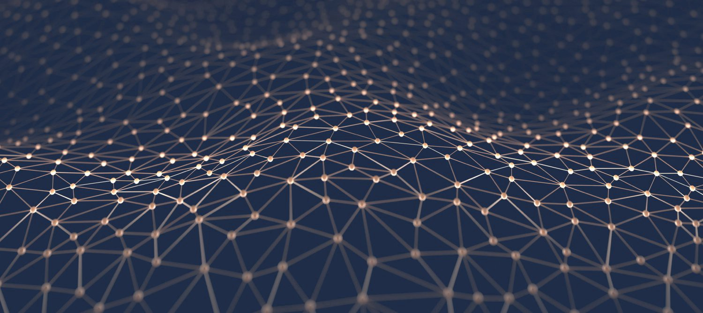

Hello Readers!

Recently I’ve created **[Machine Learning in Octave](https://github.com/trekhleb/machine-learning-octave)** repository that contains MatLab/Octave examples of popular machine learning algorithms with code examples and mathematics behind them being explained.

The purpose of this repository was not to implement machine learning algorithms using 3rd party libraries or Octave/MatLab “one-liners” but rather to practice and to better understand the mathematics behind each algorithm. In most cases, the explanations are based on this great machine learning course.

This was my attempt to learn some of the machine learning topics (that are described on the “mind map” below) for myself. Since this subject might be interesting for others I’ve decided to structure it a little bit and make it public.

The source of the following machine learning topics map is [this wonderful blog post](https://vas3k.ru/blog/machine_learning/).

Currently, the following topics have been covered:

## Supervised Learning

In supervised learning, we have a set of training data as an input, and a set of labels or “correct answers” for each training set as an output. Then we’re training our model (machine learning algorithm parameters) to map the input to the output correctly (to do correct prediction). The ultimate purpose is to find such model parameters that will successfully continue correct input→output mapping (predictions) even for new input examples.

### Regression

In regression problems, we do real value predictions. Basically, we try to draw a line/plane/n-dimensional plane along the training examples.

_Usage examples: stock price forecast, sales analysis, the dependency of any number, etc._

🤖 [Linear Regression](https://github.com/trekhleb/machine-learning-octave/blob/master/linear-regression)  —  example: house prices prediction.

### Classification

In classification problems, we split input examples by certain characteristics.

_Usage examples: spam-filters, language detection, finding similar documents, handwritten letters recognition, etc._

🤖 [Logistic Regression](https://github.com/trekhleb/machine-learning-octave/blob/master/logistic-regression) — examples: microchip fitness detection, handwritten digits recognitions using the one-vs-all approach.

## Unsupervised Learning

Unsupervised learning is a branch of machine learning that learns from test data that has not been labeled, classified, or categorized. Instead of responding to feedback, unsupervised learning identifies commonalities in the data and reacts based on the presence or absence of such commonalities in each new piece of data.

### Clustering

In clustering problems, we split the training examples by unknown characteristics. The algorithm itself decides what characteristic to use for splitting.

_Usage examples: market segmentation, social networks analysis, organize computing clusters, astronomical data analysis, image compression, etc._

🤖 [K-means algorithm](https://github.com/trekhleb/machine-learning-octave/blob/master/k-means) — example: split data into three clusters.

### Anomaly Detection

Anomaly detection (also outlier detection) is the identification of rare items, events, or observations which raise suspicions by differing significantly from the majority of the data.

_Usage examples: intrusion detection, fraud detection, system health monitoring, removing anomalous data from the dataset, etc._

🤖 [Anomaly Detection using Gaussian distribution](https://github.com/trekhleb/machine-learning-octave/blob/master/anomaly-detection) — example: detect overloaded server.

## Neural Network (NN)

The neural network itself isn’t an algorithm, but rather a framework for many different machine learning algorithms to work together and process complex data inputs.

_Usage examples: as a substitute of all other algorithms in general, image recognition, voice recognition, image processing (applying specific style), language translation, etc._

🤖 [Neural Network: Multilayer Perceptron (MLP)](https://github.com/trekhleb/machine-learning-octave/blob/master/neural-network) — example: handwritten digits recognition.

## Demos

Each machine learning algorithm folder described above contains a demo.m file that users might launch from Octave console or from MatLab. The demo scripts will output some useful information to the console and visualize the results of the work of the related algorithms.

I hope this repository will be useful for you and will help you to do one extra step towards machine learning. Happy coding!
