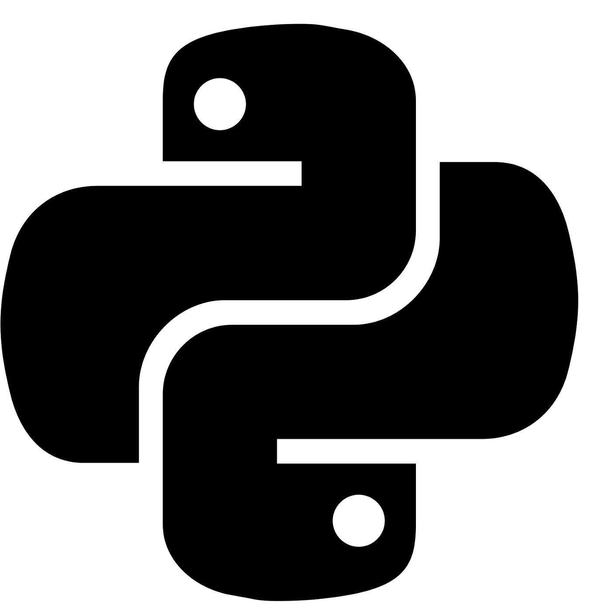

I'm learning Python and I decided to create a repository where I could put Python script samples with standard Python syntax, structures and statements examples just to be able to quickly recap how to use this or that feature of the language.

[Here is what I've got](https://github.com/trekhleb/learn-python).



This is a [collection of Python scripts](https://github.com/trekhleb/learn-python) that are split by [topics](https://github.com/trekhleb/learn-python#table-of-contents) and contain
code examples with explanations, different use cases and links to further readings.

It is a **playground** because you may change or add the code to see how it works and [test it out](https://github.com/trekhleb/learn-python#testing-the-code) using assertions. It also allows you to [lint the code](https://github.com/trekhleb/learn-python#linting-the-code) you've wrote and check if it fits to Python code style guide. Altogether it might make your learning process to be more interactive and it might help you to keep code quality pretty high from very beginning.

It is a **cheatsheet** because you may get back to these code examples once you want to recap the syntax of [standard Python statements and constructions](https://github.com/trekhleb/learn-python#table-of-contents). Also because the code is full of assertions you'll be able to see expected functions/statements output right away without launching them.

## How to Use The Repo

Each Python script in the repository has the following structure:

```python
"""Lists  <--- Name of the topic here

# @see: https://www.learnpython.org/en/Lists  <-- Link to further readings goes here

Here might go more detailed explanation of the current topic (i.e. general info about Lists).
"""


def test_list_type():
    """Explanation of sub-topic goes here.

    Each file contains test functions that illustrate sub-topics (i.e. lists type, lists methods).
    """

    # Here is an example of how to build a list.  <-- Comments here explain the action
    squares = [1, 4, 9, 16, 25]

    # Lists can be indexed and sliced.
    # Indexing returns the item.
    assert squares[0] == 1  # <-- Assertions here illustrate the result.
    # Slicing returns a new list.
    assert squares[-3:] == [9, 16, 25]  # <-- Assertions here illustrate the result.
```

So normally you might want to do the following:

- [Find the topic](https://github.com/trekhleb/learn-python#table-of-contents) you're want to learn or recap.
- Read comments and/or documentation that is linked in each script's docstring (as in example above).
- Look at code examples and assertions to see usage examples and expected output.
- Change code or add new assertions to see how things work.
- [Run tests](https://github.com/trekhleb/learn-python#testing-the-code) and [lint the code](https://github.com/trekhleb/learn-python#linting-the-code) to see if it work and is
  written correctly.

## Table of Contents

1. **Getting Started**
  - [What is Python](https://github.com/trekhleb/learn-python/blob/master/src/getting_started/what_is_python.md)
  - [Python Syntax](https://github.com/trekhleb/learn-python/blob/master/src/getting_started/python_syntax.md)
  - [Variables](https://github.com/trekhleb/learn-python/blob/master/src/getting_started/test_variables.py)
2. **Operators**
  - [Arithmetic Operators](https://github.com/trekhleb/learn-python/blob/master/src/operators/test_arithmetic.py) (`+`, `-`, `*`, `/`, `//`, `%`, `**`)
  - [Bitwise Operators](https://github.com/trekhleb/learn-python/blob/master/src/operators/test_bitwise.py) (`&`, `|`, `^`, `>>`, `<<`, `~`)
  - [Assignment Operators](https://github.com/trekhleb/learn-python/blob/master/src/operators/test_assigment.py) (`=`, `+=`, `-=`, `/=`, `//=` etc.)
  - [Comparison Operator](https://github.com/trekhleb/learn-python/blob/master/src/operators/test_comparison.py) (`==`, `!=`, `>`, `<`, `>=`, `<=`)
  - [Logical Operators](https://github.com/trekhleb/learn-python/blob/master/src/operators/test_logical.py) (`and`, `or`, `not`)
  - [Identity Operators](https://github.com/trekhleb/learn-python/blob/master/src/operators/test_identity.py) (`is`, `is not`)
  - [Membership Operators](https://github.com/trekhleb/learn-python/blob/master/src/operators/test_membership.py) (`in`, `not in`)
3. **Data Types**
  - [Numbers](https://github.com/trekhleb/learn-python/blob/master/src/data_types/test_numbers.py) (including booleans)
  - [Strings](https://github.com/trekhleb/learn-python/blob/master/src/data_types/test_strings.py) and their methods
  - [Lists](https://github.com/trekhleb/learn-python/blob/master/src/data_types/test_lists.py) and their methods (including list comprehensions)
  - [Tuples](https://github.com/trekhleb/learn-python/blob/master/src/data_types/test_tuples.py)
  - [Sets](https://github.com/trekhleb/learn-python/blob/master/src/data_types/test_sets.py) and their methods
  - [Dictionaries](https://github.com/trekhleb/learn-python/blob/master/src/data_types/test_dictionaries.py)
  - [Type Casting](https://github.com/trekhleb/learn-python/blob/master/src/data_types/test_type_casting.py)
4. **Control Flow**
  - [The `if` statement](https://github.com/trekhleb/learn-python/blob/master/src/control_flow/test_if.py)
  - [The `for` statement](https://github.com/trekhleb/learn-python/blob/master/src/control_flow/test_for.py) (and `range()` function)
  - [The `while` statement](https://github.com/trekhleb/learn-python/blob/master/src/control_flow/test_while.py)
  - [The `try` statements](https://github.com/trekhleb/learn-python/blob/master/src/control_flow/test_try.py)
  - [The `break` statement](https://github.com/trekhleb/learn-python/blob/master/src/control_flow/test_break.py)
  - [The `continue` statement](https://github.com/trekhleb/learn-python/blob/master/src/control_flow/test_break.py)
5. **Functions**
  - [Function Definition](https://github.com/trekhleb/learn-python/blob/master/src/functions/test_function_definition.py) (`def` and `return` statements)
  - [Default Argument Values](https://github.com/trekhleb/learn-python/blob/master/src/functions/test_function_default_arguments.py)
  - [Keyword Arguments](https://github.com/trekhleb/learn-python/blob/master/src/functions/test_function_keyword_arguments.py)
  - [Arbitrary Argument Lists](https://github.com/trekhleb/learn-python/blob/master/src/functions/test_function_arbitrary_arguments.py)
  - [Unpacking Argument Lists](https://github.com/trekhleb/learn-python/blob/master/src/functions/test_function_unpacking_arguments.py) (`*` and `**` statements)
  - [Lambda Expressions](https://github.com/trekhleb/learn-python/blob/master/src/functions/test_lambda_expressions.py) (`lambda` statement)
  - [Documentation Strings](https://github.com/trekhleb/learn-python/blob/master/src/functions/test_function_documentation_string.py)
  - [Function Annotations](https://github.com/trekhleb/learn-python/blob/master/src/functions/test_function_annotations.py)
6. **Classes**
  - [Class Definition](https://github.com/trekhleb/learn-python/blob/master/src/classes/test_class_definition.py) (`class` statement)
  - [Class Objects](https://github.com/trekhleb/learn-python/blob/master/src/classes/test_class_objects.py)
  - [Instance Objects](https://github.com/trekhleb/learn-python/blob/master/src/classes/test_instance_objects.py)
  - [Method Objects](https://github.com/trekhleb/learn-python/blob/master/src/classes/test_method_objects.py)
  - [Class and Instance Variables](https://github.com/trekhleb/learn-python/blob/master/src/classes/test_class_and_instance_variables.py)
  - [Inheritance](https://github.com/trekhleb/learn-python/blob/master/src/classes/test_inheritance.py)
  - [Multiple Inheritance](https://github.com/trekhleb/learn-python/blob/master/src/classes/test_multiple_inheritance.py)
7. **Modules**
  - [Modules](https://github.com/trekhleb/learn-python/blob/master/src/modules/test_modules.py) (`import` statement)
  - [Packages](https://github.com/trekhleb/learn-python/blob/master/src/modules/test_packages.py)
8. **Errors and Exceptions**
  - [Handling Exceptions](https://github.com/trekhleb/learn-python/blob/master/src/exceptions/test_handle_exceptions.py) (`try` statement)
  - [Raising Exceptions](https://github.com/trekhleb/learn-python/blob/master/src/exceptions/test_raise_exceptions.py) (`raise` statement)
9. **Files**
  - [Reading and Writing](https://github.com/trekhleb/learn-python/blob/master/src/files/test_file_reading.py) (`with` statement)
  - [Methods of File Objects](https://github.com/trekhleb/learn-python/blob/master/src/files/test_file_methdos.py)
10. **Additions**
  - [The `pass` statement](https://github.com/trekhleb/learn-python/blob/master/src/additions/test_pass.py)
  - [Generators](https://github.com/trekhleb/learn-python/blob/master/src/additions/test_generators.py) (`yield` statement)
11. **Brief Tour of the Standard Libraries**
  - [Serialization](https://github.com/trekhleb/learn-python/blob/master/src/standard_libraries/test_json.py) (`json` library)
  - [File Wildcards](https://github.com/trekhleb/learn-python/blob/master/src/standard_libraries/test_glob.py) (`glob` library)
  - [String Pattern Matching](https://github.com/trekhleb/learn-python/blob/master/src/standard_libraries/test_re.py) (`re` library)
  - [Mathematics](https://github.com/trekhleb/learn-python/blob/master/src/standard_libraries/test_math.py) (`math`, `random`, `statistics` libraries)
  - [Dates and Times](https://github.com/trekhleb/learn-python/blob/master/src/standard_libraries/test_datetime.py) (`datetime` library)
  - [Data Compression](https://github.com/trekhleb/learn-python/blob/master/src/standard_libraries/test_zlib.py) (`zlib` library)


> I hope you find this repository helpful!
