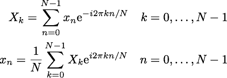

## TL;DR

You may find the Discrete Fourier Transform algorithm in [JavaScript Algorithms repository](https://github.com/trekhleb/javascript-algorithms/tree/master/src/algorithms/math/fourier-transform).

## Discrete Fourier Transform

Even though [Discrete Fourier Transform](https://en.wikipedia.org/wiki/Discrete_Fourier_transform) or **DFT** is probably not the thing you work with daily it might still be a very interesting algorithm to play with. Not because it is quite complex but because of its interesting meaning.

*This algorithm allows you to split the input signal that is spread in time into the number of frequencies of certain length, amplitudes, and phases so that all those frequencies together will form the original signal*. So it actually converts the domain of *time* into the domain of *frequencies* and backward.

It may sound complicated so let's think about it from another angle.

### Smoothie Example

Imagine you have a smoothie. DFT then will allow you to split the smoothie into its ingredients! Imagine that you provide the bottle of smoothie as input for DFT function, and it splits it out to three smaller bottles of pure carrot, apple, and orange juices! This is what DFT does - it splits the whole input into its ingredients.

### Paints Example

Or imagine that you want to paint the fence, and you've mixed several paints up so that it started to be of homogenous color. DFT function then will be able to split your mixed paint into several pure colors that will together form that initial color! Isn't it sound like magic, is it?

### The Algorithm

All algorithm beauty and complexity is hidden in the following formula:

You may find the direct and simple implementation of this formula in [JavaScript Algorithms repository](https://github.com/trekhleb/javascript-algorithms/tree/master/src/algorithms/math/fourier-transform). This is just a simple and not really efficient (*O(n^2)*) implementation of the transform. But the purpose of those functions is just to scratch the surface of such a complex, deep, and magic topic as Fourier Transform.

There is a [really good article](https://betterexplained.com/articles/an-interactive-guide-to-the-fourier-transform/) about this topic. I suggest you read it if you're interested in learning more since there are many visual and *interactive* Fourier Transform examples and explanations.

*I hope you found this Fourier thing interesting. Have fun with algorithms!*

