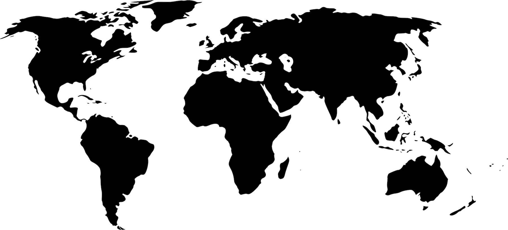

## TL;DR

In this article we’ll create a React _usePosition()_ hook to fetch and follow browser’s location. Under the hood we’ll use [getCurrentPosition](https://developer.mozilla.org/en-US/docs/Web/API/Geolocation/getCurrentPosition) and [watchPosition](https://developer.mozilla.org/en-US/docs/Web/API/Geolocation/watchPosition) functions that are provided by global object _navigator.geolocation_. The final version of the _usePosition()_ hook is [published on GitHub](https://github.com/trekhleb/use-position) and [NPM](https://www.npmjs.com/package/use-position) and is ready to be consumed by your apps.

## Why we might need usePosition() hook at all

One of the advantages of [React hooks](https://reactjs.org/docs/hooks-intro.html) is _ability to separate concerns_. Instead of having a state object with, let’s say, geo-position **and** socket connection we might avoid using state at all and just use two different hooks that will handle the state management for us. Even more, instead of initiating browser position watcher **and** opening a socket connection in the same _componentDidMount()_ callback we might split this logic into two independent hooks. This gives us cleaner and more maintainable code.

## How we’re going to usePosition() hook

Let’s do some reverse engineering and imagine that we already have a _usePosition()_ hook implemented. Here is how we might want to use it:

_⚠️ All code samples below use wrong symbol =≻ instead of => for lambda functions annotations. Be aware of this while copying the code and trying to execute it since it might not work. Please replace ≻ with > manually in your code. For some reason I had issues with pasting the > symbol inside the code block. Sorry for inconvenience._

```javascript
import React from 'react';
import {usePosition} from './usePosition';

export const UsePositionDemo = () => {
  const {latitude, longitude, error} = usePosition();
  return (
    <code>
      latitude: {latitude}<br/>
      longitude: {longitude}<br/>
      error: {error}
    </code>
  );
};
```

You see, it is only one line with _usePosition()_ hook, and you already have the data (_latitude_ and _longitude_). We don’t even use _useState()_ and _useEffect()_ here. Position subscription and watcher cleanup is incapsulated in _usePosition()_ hook. Now, the redraw component magic will be handled for us by React, and we will see the _<code>…</code>_ block constantly being updated with the latest position value of the browser. Looks pretty neat and clean.

### usePosition() hook implementation

Our custom _usePosition()_ hook is just a JavaScript function that uses other hooks like [useState()](https://reactjs.org/docs/hooks-state.html) and [useEffect()](https://reactjs.org/docs/hooks-effect.html). It will look something like:

```javascript
// imports go here...
export const usePosition = () => {
  // code goes here...
}
```

We will use _useEffect()_ hook to hook to the moment in time when a component (that will consume our hook) is rendered and to subscribe to geolocation changes. We will also use _useState()_ hook to store _latitude_, _longitude_ and _error_ message (in case if user won’t allow browser to share its position). So we need to import these hooks first:

```javascript
import {useState, useEffect} from 'react';

export const usePosition = () => {
  // code goes here...
}
```

Let’s init a storage for position and for error:

```javascript
import {useState, useEffect} from 'react';

export const usePosition = () => {
  const [position, setPosition] = useState({});
  const [error, setError] = useState(null);

  // other code goes here...
}
```

Let’s return a desirable values from the function. We don’t have them yet but let’s return initial values so far and fill them later:

```javascript
import {useState, useEffect} from 'react';

export const usePosition = () => {
  const [position, setPosition] = useState({});
  const [error, setError] = useState(null);

  // other code goes here...
  return {...position, error};
}
```

Here is a key part of our hook — fetching the browser’s position. We will execute fetching logic after component has been rendered (useEffect hook).

```javascript
import {useState, useEffect} from 'react';

export const usePosition = () => {
  const [position, setPosition] = useState({});
  const [error, setError] = useState(null);

  // callbacks will go here...
  useEffect(() => {
    const geo = navigator.geolocation;
    if (!geo) {
      setError('Geolocation is not supported');
      return;
    }
    watcher = geo.watchPosition(onChange, onError);
    return () => geo.clearWatch(watcher);
  }, []);
  return {...position, error};
}
```

In useEffect() hook we first do some checks to see if the browser is supporting _navigator.geolocation_. If geolocation is not supported we’re setting up an error and returning from the effect. In case if _navigator.geolocation_ is supported we subscribe to position changes by providing an _onChange()_ and _onError()_ callbacks (we’ll add them in a moment). Notice that we’re returning a lambda function from _useEffect()_. In that lambda function we are clearing the watcher once the component is unmounted. So this subscribe/unsubscribe logic will be handled internally by our _usePosition()_ hook and consumers shouldn’t worry about it.

Let’s now add missing callbacks:

```javascript
import {useState, useEffect} from 'react';

export const usePosition = () => {
  const [position, setPosition] = useState({});
  const [error, setError] = useState(null);

  const onChange = ({coords}) => {
    setPosition({
      latitude: coords.latitude,
      longitude: coords.longitude,
    });
  };
  const onError = (error) => {
    setError(error.message);
  };
  useEffect(() => {
    const geo = navigator.geolocation;
    if (!geo) {
      setError('Geolocation is not supported');
      return;
    }
    watcher = geo.watchPosition(onChange, onError);
    return () => geo.clearWatch(watcher);
  }, []);
  return {...position, error};
}
```

And we’re done. The hook _usePosition()_ may be consumed and it incapsulates only geolocation related logic.

### Afterword

You may find a [demo](https://trekhleb.dev/use-position/) and more detailed implementation of [usePosition() hook on GitHub](https://github.com/trekhleb/use-position). I hope this example was informative for you. Happy coding!
