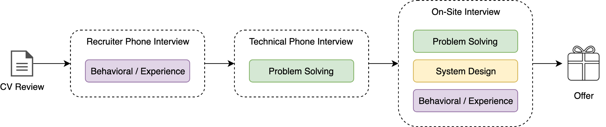

This article is my attempt to summarise common technical interview process steps and to collect in one place some useful insights from recruiters that they normally send to applicants before the interviews. This is not a comprehensive guide of the interview process and the actual interview steps may vary from company to company.

## Interview Process Overview

### Interview Process By Time

The common technical interview process consists of three main steps:

1. **Phone interview with recruiter** when you’ll be ask to tell about your experience and explain your motivation.
2. **Technical phone interview** where you’ll be asked to solve some tech problems in real time.
3. **On-site (in-person) interview** in company’s office when you’ll be asked to solve technical and system design problems as well as to answer some behavioural questions.

### Interview Process By Meaning

All interview steps are mainly consists of three following building blocks:

1. **Problem solving.** The main focus here is your ability to solve technical problems by applying different algorithmic approaches and data structures.
2. **System design.** This one is about your ability to combine many pieces (frameworks, approaches, databases, micro-services) and design a system as a whole that will successfully solve certain tasks.
3. **Behavioural questions** that are focused on your experience, motivations, leadership and soft skills.

Let’s move on and touch every of these 6 aspects of the interview process.

***

## [Interview By Time] Introductory Call

Recruiter will introduce himself and give you more details about the company and projects you might be working on. You’ll be asked to introduce you and explain what was your responsibility on the previous projects.

Normally only things you did during the last 1–3 years matters. So focus on your latest achievements and responsibilities.

Introduce your side-projects, open-source projects and production projects from your latest workplace.

It will be done by means of telephone.

Things to remember:

- Get familiar with the job description and prepare your questions regarding the job.
- Prepare a short introduction of yourself in the context of your profile, professional past, qualifications and education.
- Use specific examples. The strongest examples are work based examples, but you can also use study or personal examples.
- If you haven’t understood the interviewer’s question, ask them to repeat it or explain it further.
- Learn about the company, be passioned about the company’s product (about what company is doing).
- Feel free to ask any questions you have about the role or company in general.

Explain yours experience examples in a clear manner. Using the STAR technique will help you:

- _SITUATION/TASK_ — Describe the situation/task you faced and the context of the story.
- _ACTION_ — What actions did you take?
- _RESULTS_ — How did you measure success for this project? What results did you achieve?

### 📚 Links to explore

- [STAR technique on Wikipedia](https://en.wikipedia.org/wiki/Situation,_task,_action,_result)
- [STAR technique on YouTube](https://www.youtube.com/watch?v=0nN7Q7DrI6Q)
- [105 Smart Questions To Ask In An Interview](https://careersidekick.com/questions-to-ask-the-interviewer/)

_ℹ️ ️️Read more about how to prepare to **behavioural interview** below in this article._

## [Interview By Time] Technical Phone Interview

During the phone interview you’ll have a coding exercise (or task to develop something online).

The call will be 45–60 minutes long.

Some interviews will include 2 people. Don’t worry — one will be there purely for training purposes.

You will need access to a webcam. Wired internet and headphones are recommended but not essential. Your computer may require a plug-in install, so make sure you test the link that will be provided to you by recruiter with enough time before your call. Make sure to take the call in a calm environment.

You might be asked to install and/or use special programs and service like:

- [Amazon Chime](https://aws.amazon.com/chime/)
- [BlueJeans](https://www.bluejeans.com/)
- [Hangouts](https://hangouts.google.com/)
- [Zoom.us](https://zoom.us/)
- [Skype](https://www.skype.com/en/)
- [CoderPad](https://coderpad.io/) or others

**What to expect during the interview:**

- 45 mins initial interview with 1–2 coding questions using a whiteboard (if on site) or laptop and a service similar to CoderPad (if remote).
- You will be tested on your problem solving and core CS fundamental skills (theory, algorithms, data structures, design patterns, recursions, binary tree questions, Fibonacci series etc.)
- You will need to think of an efficient, optimised and bug-free solution to code up quickly and concisely in whatever language you code best in.
- Keep it simple! If you think it’s obvious, it probably is. Start with a simple solution, and think about making it more efficient afterwards.

_ℹ️ ️️Read more about how to prepare to **problem solving** interview below in this article._

## [Interview By Time] On-Site Interview

For the on-site, you generally have 4 to 5 interviews — at least 2 strictly focused on coding, 1 on design, and 1 on conversation/coding. So basically all three building blocks described at the beginning of the chapter will be included.

There will be a 45-minute lunch to break up your day — the lunch will most likely be with one of the engineers. Feel free to be very candid with the engineer — they will not be providing feedback, but are there to answer any questions/concerns you may not have asked during your interview.

_ℹ️ Read more about how to prepare to **problem solving**, **system design** and **behavioural interviews** below in this article._

***

## [Interview By Meaning] Problem Solving Interview

**General tips:**

- **Explain** — Interviewers want to understand how you think, so explain your thought process and decision making throughout the interview. Remember they are not only evaluating your technical ability, but also how you solve problems. Explicitly state and check assumptions with your interviewer to ensure they are reasonable.
- **​Clarify** — Many questions will be deliberately open-ended to provide insight into what categories and information you value within the technological puzzle. Interviewers are looking to see how you engage with the problem and your primary method for solving it. Be sure to talk
  through your thought process and feel free to ask specific questions if you need clarification.
- **Improve** — Think about ways to improve the solution you present. It’s worthwhile to think out loud about your initial thoughts to a question. In many cases, your first answer may need some refining and further explanation. If necessary, start with the brute force solution and improve
  on it — just let the interviewer know that’s what you’re doing and why.
- **Practice** — You won’t have access to an IDE or compiler during the interview so practice writing code on paper or a whiteboard. Be sure to test your code and ensure it’s easily readable without bugs. Don’t stress about small syntactical errors like which substring to use for a given method (e.g. start, end or start, length) — just pick one and let your interviewer know.

### Before the interview

**Practice! Practice! Practice!**

Put yourself under time constraints as speed is important in the interview.

**Problems examples:**

- Write the code to print the first element of each “row” of a binary tree.
- Implement tic-tac-toe.
- Write the code to show the number and type of permutations of a given string.

You may use the following services to get more problems examples and possible solutions:

- [LeetCode](https://leetcode.com/)
- [InterviewBit](https://www.interviewbit.com/practice/)
- [GeeksForGeeks](https://www.geeksforgeeks.org/)
- [HackerRank](https://www.hackerrank.com/)
- [LintCode](https://www.lintcode.com/)
- [Coding problems on Project Euler](https://projecteuler.net/)

You might also want to read [Cracking the coding interview book](http://www.crackingthecodinginterview.com/) that will help you to prepare for coding interviews similar to what you will be solving throughout the interview process.

**Topics to cover:**

- **Coding** — You should know at least one programming language really well, preferably C++, Java, Python, JavaScript, Go, or C. You will be expected to know APIs, Object Oriented Design and Programming, how to test your code, as well as come up with corner cases and edge cases for code. Note that interviewers will focus on conceptual understanding rather than memorisation.
- **Algorithms** — Approach the problem with both bottom-up and top-down algorithms. You will be expected to know the complexity of an algorithm and how you can improve/change it. Algorithms that are used to solve problems include sorting (plus searching and binary search), divide-and-conquer, dynamic programming/memoization, greediness, recursion or algorithms linked to a specific data structure. Know Big-O notations (e.g. run time) and be ready to discuss complex algorithms like Dijkstra and A*. Knowing the runtimes, theoretical limitations, and basic implementation strategies of different classes of algorithms is more important than memorising the specific details of any given algorithm.
- **Sorting** — Be familiar with common sorting functions and on what kind of input data they’re efficient on or not. Think about efficiency means in terms of runtime and space used. For example, in exceptional cases insertion-sort or radix-sort are much better than the generic QuickSort/MergeSort/HeapSort answers.
- **Data structures** — You should study up on as many data structures as possible. Data structures most frequently used are arrays, linked lists, stacks, queues, hash-sets, hash-maps, hash-tables, dictionary, trees and binary trees, heaps and graphs. You should know the data structure inside out, and what algorithms tend to go along with each data structure.
- **Mathematics** — Some interviewers ask basic discrete math questions. Spend some time before the interview refreshing your memory on (or teaching yourself) the essentials of elementary probability theory and combinatorics. You should be familiar with n-choose-k problems and their ilk.
- **Graphs** — Consider if a problem can be applied with graph algorithms like distance, search, connectivity, cycle-detection, etc. There are three basic ways to represent a graph in memory (objects and pointers, matrix, and adjacency list) — familiarize yourself with each representation and its pros and cons. You should know the basic graph traversal algorithms, breadth-first search and depth-first search. Know their computational complexity, their tradeoffs and how to implement them in real code.
- **Recursion** — Many coding problems involve thinking recursively and potentially coding a recursive solution. Use recursion to find more elegant solutions to problems that can be solved iteratively.
- **Object Oriented Design** — You should have a working knowledge of a few common and useful design patterns as well as know how to write software in an object-oriented way, with appropriate use of inheritance and aggregation. You probably won’t be asked to describe the details of how specific design patterns work, but expect to have to defend your design choices.

### During the interview

**Before solving:**

- _Do not jump straight into coding_, take a few minutes to understand the problem and ask any clarifying questions (but not too long!).
- _Make a plan_. Be wary of jumping into code without thinking about your program’s high-level structure. You don’t have to work out every last detail (this can be difficult for more meaty problems), but you should give the matter sufficient thought. Without proper planning, you may be forced to waste your limited time reworking significant parts of your program.
- _Describe your solution_ to your interviewer and get their thoughts on your solution.

**While solving:**

- _Think out loud_. Explain your thought process to your interviewer as you code. This helps you more fully communicate your solution, and gives your interviewer an opportunity to correct misconceptions or otherwise provide high-level guidance.
- _Break the problem down and define abstractions_. One crucial skill the recruiters look for is the ability to handle complexity by breaking problems into manageable sub-problems. For anything non-trivial, you’ll want to avoid writing one giant, monolithic function. Feel free to define helper functions, helper classes, and other abstractions to reach a working
  solution. You can leverage design patterns or other programming idioms as well. Ideally, your solution will be well-factored and as a result easy to read, understand, and prove correct.
- _Optimize_. Proactively suggest ways to optimize to the interviewer and get their feedback to ensure what you’re trying to do is not overly complex and is correct then code it up.

**You have a solution. Now what?**

- _Think about edge cases._ Naturally, you should strive for a solution that’s correct in all observable aspects. Sometimes there will be a flaw in the core logic of your solution, but more often your only bugs will be in how you handle edge cases. (This is true of real-world engineering as well.) Make sure your solution works on all edge cases you can think of.
- _Step through your code and test it._ One of the best ways to check your work is to simulate how your code executes against a sample input. Take one of your earlier examples and make sure your code produces the right result. Huge caveat here: when mentally simulating how your code behaves, your brain will be tempted to project what it wants to happen rather than what actually says happen. Fight this tendency by being as literal as possible.
- _Restate the complexity._ Is it the same, or different to your initial thinking based on what you have actually coded up? Make sure you’re thinking about both space and time.
- _Explain the shortcuts you took._ If you skipped things for reasons of expediency that you would otherwise do in a “real world” scenario, please let us know what you did and why. For example, “If I were writing this for production use, I would check an invariant here.” Since an interview is an artificial environment, this gives him/her a sense for how you’ll treat code once you’re actually on the job.

**Remember:**

- Interviewer can only evaluate you on the code you write.
- Talk about what you are doing throughout the interview. If you need to be quiet to think, that’s great — just let the interviewer know.
- Think out loud if you are working through a solution you are presented with as the Engineer will want to know how you approach and troubleshoot problems.
- If the interviewer gives you hints to improve your code, take them and run with them. It is good to adjust and work through the problems with the interviewer to show your thought process and problem solving ability.
- Discuss initial ideas and solutions with your interviewer, which will help you to clarify any ambiguity.
- Take hints from your interviewer to showcase your thought process and problem-solving ability.
- Generally avoid solutions with lots of edge cases or huge if/else if/else blocks. Deciding between iteration and recursion is always an important step.
- Think about different algorithms and algorithmic techniques (sorting, divide-and-conquer, dynamic programming/memorization, recursion)
- Think about data structures, particularly the ones used most often (Array, Stack/Queue, Hashset/Hashmap/Hashtable/Dictionary, Tree/Binary Tree, Heap, Graph, Bloom Filter, etc.)
- Don’t worry about rote memorization such as runtimes or API/native calls. It’s good to know how to figure out approximate runtimes on the fly but the code you write is more important.
- You will be asked about O(Memory) constraints, the complexity of the algorithm you are writing and its runtime — O(N²), O(N) etc
- Important — think about testing your code throughout the interview
- Make sure you review recursion.
- Make sure you know what your base case is. Bonus points available for talking about or implementing the dynamic programming solution.
- Practice coding on a whiteboard.

### After the Interview

Try to have 1–2 questions prepared for the end for your interviewer.

### 📚 Links to explore

**Books**

- [Cracking the Coding Interview](https://www.amazon.com/Cracking-Coding-Interview-Programming-Questions/dp/0984782850)
- [Introduction to Algorithms](https://books.google.com.ua/books/about/Introduction_to_Algorithms.html?id=VK9hPgAACAAJ&hl=en&redir_esc=y)
- [Programming Interviews Exposed](https://books.google.com.ua/books/about/Programming_Interviews_Exposed.html?id=9_by-rpCSSUC&hl=en&redir_esc=y)
- [Programming Pearls](https://books.google.com.ua/books/about/Programming_Pearls_2_E.html?id=vyhrriC6qcEC&hl=en&redir_esc=y)

**Courses**

- [Algorithms (part 1)](https://www.coursera.org/learn/algorithms-part1)
- [Algorithms (part 2)](https://www.coursera.org/learn/algorithms-part2)

**Problem Solving**

- [LeetCode](https://leetcode.com/)
- [InterviewBit](https://www.interviewbit.com/practice/)
- [GeeksForGeeks](https://www.geeksforgeeks.org/)
- [HackerRank](https://www.hackerrank.com/)
- [LintCode](https://www.lintcode.com/)
- [Coding problems on Project Euler](https://projecteuler.net/)
- [CodeJam: Practice & Learn](https://code.google.com/codejam/past-contests)

**Misc**

- [JavaScript Algorithms and Data Structures](https://github.com/trekhleb/javascript-algorithms)
- [Grokking Dynamic Programming Patterns for Coding Interviews](https://www.educative.io/collection/5668639101419520/5633779737559040?authorName=Design%20Gurus)
- [Google: How we hire](https://careers.google.com/how-we-hire/)
- [Interviewing @ Google](https://careers.google.com/how-we-hire/interview/)
- [Google Tech Dev Guide](https://techdevguide.withgoogle.com/)
- [Preparing for your Software Engineering Interview at Facebook](https://www.facebook.com/careers/life/preparing-for-your-software-engineering-interview-at-facebook)
- [Get that job at Facebook](https://www.facebook.com/notes/facebook-engineering/get-that-job-at-facebook/10150964382448920)
- [The Five Essential Phone-Screen Questions](https://sites.google.com/site/steveyegge2/five-essential-phone-screen-questions)
- [The story of how I landed my job at Facebook](http://cocoanuts.mobi/2014/08/03/facebook/)
- [To what resources should I prepare with and refer to for a software engineering interview at Facebook?](https://www.quora.com/How-should-I-prepare-for-a-software-engineer-interview-at-Facebook)
- [Facebook Interview Questions](https://www.careercup.com/page?pid=facebook-interview-questions)
- [Algorithms and Data Structures to Cover](https://docs.google.com/document/d/1yMBDTeM49rm8Yni-BYzxakwSW3Ce_MKum65s6wEPQic/edit)
- [A perfect guide for cracking a JavaScript interview (A developer’s perspective)](https://medium.com/dev-bits/a-perfect-guide-for-cracking-a-javascript-interview-a-developers-perspective-23a5c0fa4d0d)
- [Tech Interview Handbook](https://github.com/yangshun/tech-interview-handbook)
- [30 minutes guide to rocking your next coding interview](https://medium.freecodecamp.org/coding-interviews-for-dummies-5e048933b82b)
- [The Tech Interview Cheatsheet](https://hackernoon.com/the-tech-interview-cheatsheet-8e28d94f5f04)
- [Grokking the Object Oriented Design Interview](https://www.educative.io/collection/5668639101419520/5692201761767424?authorName=Design%20Gurus)
- [Awesome Interview Questions](https://github.com/MaximAbramchuck/awesome-interview-questions)
- [Practice live interviews with peers](https://www.pramp.com/#/)

## [Interview By Meaning] System Design

You will need to design a system or a product, the problem will be a broad and ambiguous one where you will need to create something, end-to-end, that will scale. You should not assume anything. You should pin down the requirements, the recruiters are looking for you to drive conversation throughout the interview. Be very vocal, say this is what you’re doing/why/ your reasons. It should be your design, not half yours and half the interviewers. Try to cover both breadth and depth, you will need to talk about both high level concepts and details associated.

Interviewers don’t expect you to know crazy algorithms that are domain-specific (like Quad Trees or Paxos). But they do expect you to know that you have a variety of tradeoffs like consistency, availability, partitioning, etc. They also expect that you’re working with a modern computer and know ballpark ideas on throughput/capacity for RAM, Hard Drive, Network, etc.

Some topics you should be familiar with:

-   _Concurrency_. Do you understand threads, deadlock, and starvation? Do you know how to parallelize algorithms? Do you understand consistency and coherence?
-   _Networking_. Do you roughly understand IPC and TCP/IP? Do you know the difference between throughput and latency, and when each is the relevant factor
-   _Abstraction_. You should understand the systems you’re building upon. Do you know roughly how an OS, file system, and database work? Do you know about the various levels of caching in a modern OS?
-   _Real-World Performance_. You should be familiar with the speed of everything your computer can do, including the relative performance of RAM, disk, SSD and your network.
-   _Estimation_. Estimation, especially in the form of a back-of-the-envelope calculation, is important because it helps you narrow down the list of possible solutions to only the ones that are feasible. Then you have only a few prototypes or micro-benchmarks to write.
-   _Availability and Reliability_. Are you thinking about how things can fail, especially in a distributed environment? Do know how to design a system to cope with network failures? Do you understand durability?
-   _Data storage_ (RAM vs.durable storage, compression, byte sizes)
-   [_CAP Theorem_](https://en.wikipedia.org/wiki/CAP_theorem)
-   _Byte math_

Note that that it is not expected for you to be an expert in ALL of these, but you should know enough of them to weigh design considerations and know when to consult an expert.

### How to study

To practice, take any well-known app and imagine you work for a competitor. Your job is to figure out:

1. Where most of their money is spent (compute? people? bandwidth storage?)
2. The fundamental bottleneck of their system. Answering those two questions will necessarily force you to think about how a system is actually implemented. Answering only cost and bottlenecks forces you to focus on important areas and not nerdy details of the design.

For example, YouTube spends a ton of money on bandwidth, and secondarily on storage and compute. On the other hand, their long-tail traffic pattern means that their fundamental bottleneck is random disk seeks. Netflix also is a bandwidth hog but most of their traffic is at night (when it’s cheap) and their library of videos is much much smaller, so disk-seeks are probably not an issue at all. Work out the above problems on a paper and just think about the ways to break them down.

Probably the best way to study is to work out the problems that are mentioned below and just think about the ways to break them down. You may find a lot of example of how to do it in [Grokking the System Design Interview course](https://www.educative.io/collection/5668639101419520/5649050225344512).

**Sample questions:**

- Design a Newsfeed system.
- Speed up this mobile app.
- Implement Ads Targeting.
- Design the backend for Google Photos.
- Design a web crawler.
- Design a key-value store.
- Design search engine.
- Architect a world-wide video distribution system.
- Build Facebook chat.

**A good design shows that you:**

- Clearly understand the problem and break it down in a logical way.
- Think about a the high level design.
- Propose a design for a system that breaks the problem down into components, that can be built independently.
- Identify the bottlenecks as the system scales and can poke holes in the design.
- Think about all relevant trade-offs.
- Understand how to adapt the solution when requirements are changed.
- Draw diagrams that clearly describe the relationship between the different components in the system.
- Calculate the physical resources necessary to make this system work.

### Method of Solving System Design Problems

**Step #1: Understand the Requirements**

Spent 1–2 minutes clarifying the requirements. Either give the interviewer an example of what they are asking (e.g. “To make sure I understand the question — I will design the newsfeed service, so I will need to consider things like “what shows up in the feed”, “in what order”, “privacy”, “latency”, “scaling the systems to billions of requests”, “redundancy”, etc. — Is that what you mean”. Alternatively you can ask them for an example of the product or feature they want you to design. Spend no more than 1–2 minutes here.

Some further examples:

- Are there any requirements on running time (online vs offline paths)?
- Where are the users?
- How many users are there?
- Storage requirements?
- Data access or retention requirements?
- Security requirements?
- Mobile vs Web?
- Any APIs we need to externally expose? Any integration options?

Finally, before you proceed: ask which of the requirements are stronger than others? For instance, is there a strong requirement around data consistency? Latency? Reliability? Data Privacy? Can you write an ordered list of the priorities? Don’t spend a lot of time here, but at least ask the questions — it’s important that you understand what tradeoffs exist when design systems. For instance, when speed and consistency are paramount, you should be thinking about synchronous calls. If some latency and variation in responses is tolerable, then asynchronous/queues are ok.

**Step #2: Know the facts/figure that can help you estimate**

Useful resources:

- [Latency Numbers Every Programmer Should Know](https://gist.github.com/jboner/2841832) (Text)
- [Latency Numbers Every Programmer Should Know](http://i.imgur.com/k0t1e.png) (PNG)

This makes it clearer that you want to be reading from SSD, not disk, and certainly not doing many data center round trips. And you also want to be careful about mutexs and access to shared resources.

Now you will want to estimate the scale of the system you will need — even before you start to design it. Here are a few questions to ask:

- How many API requests will we expect? (e..g What is the QPS?)
- What data will be returned in these requests? (bytes or megabytes or gigabytes)
- Will there be read AND write operations or just read operations?

Chances are, you’ll be given big numbers here. But it will be good to show that you understand that not every problem needs to be solved with a distributed, scaled system (sometimes things fit onto a single machine).

**Step #3: Deep Dive/Design**

There are many things you may want to think about. You could go to the whiteboard write down the appropriate concepts, such as:

- Requirements,
- Scaling,
- Entity Design,
- API Design,
- Data Storage,
- Security/Privacy,
- Logging/Analytics,
- Reliability.

These are a lot of the concepts that need to be covered in any design. You may not get to all of them, but it’s important you show you understand the “big picture”. Having the words written down can also help with the pace of the interview, and help you to remember to address as many of the concepts as you can.

When thinking about **entity modelling and design** (Which objects will be in the system, and what relationships do they have with each other?), write down a few of the objects and relationships between them. When designing an API, make sure you point out that the API can be used by external AND internal developers (e.g. can be used by the mobile app, the web app, and packaged as an SDK for external developers). Think about what happens when this API is called? Here are two excellent articles on it:

- [Design News Feed System (Part 1)](http://blog.gainlo.co/index.php/2016/03/29/design-news-feed-system-part-1-system-design-interview-questions/)
- [Design News Feed System (Part 2)](http://blog.gainlo.co/index.php/2016/04/05/design-news-feed-system-part-2/)

Write out the **overall system topology**. It will almost always look like this at a high level.

**Data Storage** (How will the data be stored physically on both the client and the server, and how will it be accessed). You will almost certainly be designing a distributed system, so you will want to think about how to distribute it (sometimes this is referred to loosely as “how to shard the solution”. All this means is — when you are given a request from a user, how will you decide which backend end server to send to the request? How will the “Load Balancer” in the above diagram work? Will you send it to a different server based on username? Geographic location? A combination of the two? The important thing here is to think about how the scale the requests evenly.

Think also about **caching**: both on the client and server? What data will you cache? And why? How will you invalidate the cache? (will it be based on time? If so, how long?)

**Security/Privacy**

- Who can see what?
- What about permissions?
- But what about employees? Which data do they have access to? Is there new types of data being introduced here?
- Does the API need any special key to work? Will the user be granting a permission to an external company? If so, how will we monitor for abuse

**Logging Analytics**

- What metrics do we care about? How will we log this data so that these metrics can be computed?
- How long do we retain the data?

**Reliability**

- We need monitoring for the new services we introduced
- We need to be able to measure latency
- We need to publish service level agreements and metrics

### 📚 Links to explore

**Misc**

-   [Grokking the System Design Interview](https://www.educative.io/collection/5668639101419520/5649050225344512) — This course contains thoughtful and clear explanations for common system design interview questions
-   [The System Design Primer](https://github.com/donnemartin/system-design-primer) — an organized collection of resources on learning systems at scale.
-   [How to ace a system design interview](https://www.palantir.com/2011/10/how-to-ace-a-systems-design-interview/) — a summary of concepts worth knowing on system design interviews.
-   [Systems design tutorials on Interviewbit](https://www.interviewbit.com/courses/system-design/) — structured exercises that cover a lot of the theory, wrapped into specific exercises.
-   [System Design CheatSheet](https://gist.github.com/vasanthk/485d1c25737e8e72759f)
-   [Bitly: Lessons Learned Building A Distributed System That Handles 6 Billion Clicks A Month](http://highscalability.com/blog/2014/7/14/bitly-lessons-learned-building-a-distributed-system-that-han.html)
-   [Grokking the System Design Interview](https://www.educative.io/collection/5668639101419520/5649050225344512?utm_source=google_ars&utm_medium=cpc)
-   [CAP theorem](https://en.wikipedia.org/wiki/CAP_theorem)

**Google Papers**

-   [The Google File System](https://ai.google/research/pubs/pub51)
-   [Bigtable](https://ai.google/research/pubs/pub27898)
-   [MapReduce](https://ai.google/research/pubs/pub62)
-   [Google Spanner](https://ai.google/research/pubs/pub39966)
-   [Google Chubby](https://ai.google/research/pubs/pub27897)

## [Interview By Meaning] Behavioural Interview

Many people make the mistake of not preparing for this interview.
A good starting point here might be to meditate on [Amazon Leadership Principles](https://www.amazon.jobs/en-gb/principles) and come up with some concrete situation from your professional past as an example to each principle. Explain yours experience examples in a clear manner. Using the [STAR](https://en.wikipedia.org/wiki/Situation,_task,_action,_result) technique will help you.

**Here are some examples of behavioural questions:**

-   Tell me about a time when you were faced with a problem that had a number of possible solutions. What was the problem and how did you determine the course of action? What was the outcome of that choice?
-   When have you ever taken a risk, made a mistake or failed? How did you respond and how did you learn from that experience?
-   Describe a time when you took the lead on a project
-   What did you do when you needed to motivate a group of individuals or encourage collaboration during a particular project?
-   How have you leveraged data to develop a strategy?
-   Can you give an example of a valuable piece of feedback that you have received?
-   Describe a time where you had a disagreement or conflict within your team
-   How would your co-workers describe you?
-   Can you describe a situation where you had to work with a decision that you didn’t agree with?
-   Describe a technical mistake you have made recently? What did you learn?
-   What’s the most difficult/challenging problem you have had to solve?
-   If things aren’t going to plan, how do you move yourself/your projects forward?
-   How do you seek out opportunities?
-   How do you communicate, both within your team and with other teams?
-   What is your biggest failure? What did you learn from this?
-   When did you receive constructive feedback? How did you act upon this?

When you answer questions, you should focus on the question asked, ensure your answer is well-structured and provide examples using metrics or data if applicable. Refer to recent situations whenever possible.

-   We’ll be looking at your leadership experience, this could consist of a number of things from technical leadership, direction of projects or products, making architectural and design decisions to mentoring engineers and people management.
-   Interviewer will be interested in your passions and what you’re motivated by.
-   Interviewer will be looking at your current role, what you’re doing, your ownership and the impact you have had.
-   Conflict management — How you deal with conflict and disagreements with colleagues and managers.
-   Where you have learnt from past mistakes, where you have taken feedback on-board and acted on it.
-   Interviewer will be interested in things that didn’t go so well and what you learned and took away from the experience.
-   Interviewer will be interested in how you could cope with our unstructured environment and can come up with your own work.

### 📚 Links to explore

-   [Amazon Leadership Principles](https://www.amazon.jobs/en-gb/principles)
-   [105 Smart Questions To Ask In An Interview](https://careersidekick.com/questions-to-ask-the-interviewer/)

_I hope you found this aggregated information useful. Good luck with your next interview!_
