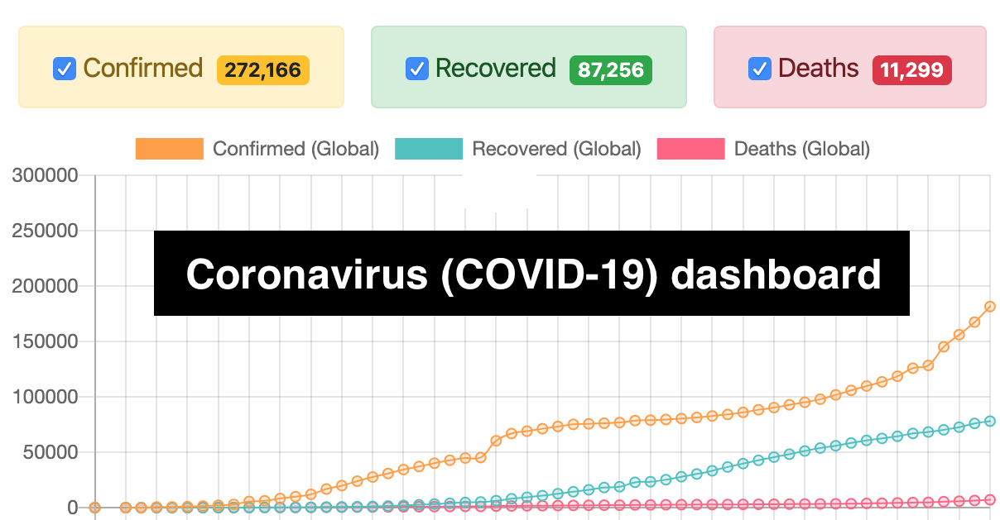
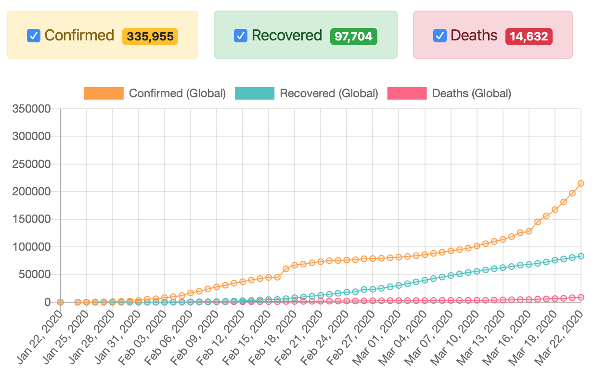
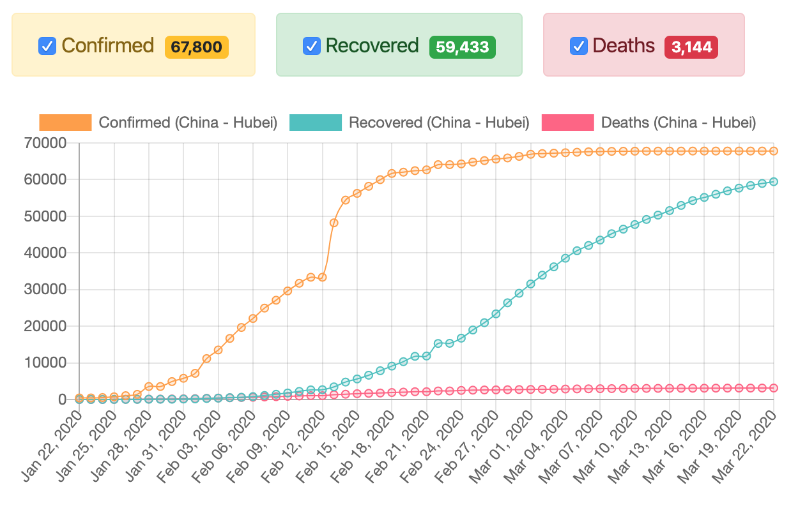
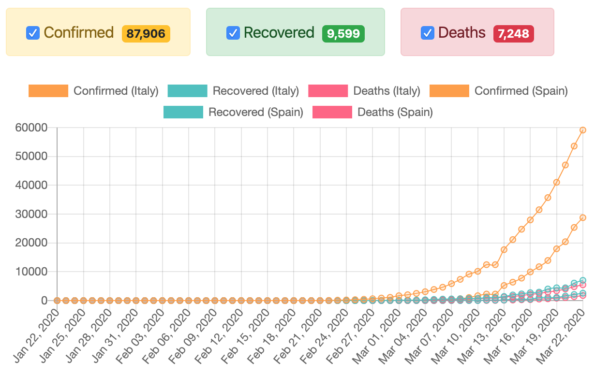

I've recently [open-sourced](https://github.com/trekhleb/covid-19) a new [📈 Coronavirus (COVID-19) Dashboard](https://trekhleb.dev/covid-19/) which shows the dynamics (the curvature of the graph) of Сoronavirus distribution per country.

### Reasoning

The reason for creating a new dashboard was to complement the well-known [JHU Dashboard](https://www.arcgis.com/apps/opsdashboard/index.html#/bda7594740fd40299423467b48e9ecf6) (which is made by Johns Hopkins CSSE) with the feature of seeing the charts with the number of COVID-19 `confirmed` / `recovered`/ `deaths` use-cases per country.

Basically, I personally had a question like _"What about the Netherlands/Ukraine?"_, _"Is the virus spread (growth factor) slowing down?"_, _"How I can compare the recovered/deaths dynamics per-country?"_, _"Which countries are doing the proper things to slow down the growth-factor"_.

Here is how the main function looks like:

### Data source and tech-stack

The dashboard is using [COVID-19 (2019-nCoV) Data Repository by Johns Hopkins CSSE](https://github.com/CSSEGISandData/COVID-19) as a data source.

Front-end wise I've tried to make it as simple as possible, therefore the dashboard is using a pure [React.js](https://reactjs.org/) (without `JSX` transpiler or `CreateReactApp` starter). To display the data I've used [Charts.js](https://www.chartjs.org/) to draw the chart and [Bootstrap Table](https://bootstrap-table.com/) to display a sortable, searchable, and clickable data table.

### Main Functionality

The dashboard is still raw, but it provides the basic functionality of displaying the global and per-country data charts.

For example here is how Global dynamics of confirmed/recovered/deaths use-cases looks like as for March 23rd:

Here we may see positive dynamics for China (Hubei):

We may also compare Italy to Spain:

The regions are displayed in sortable, searchable, and clickable data-table:

### Known issues

The following functionality is not implemented yet but it would improve the usability of the dashboard:

- Grouping the regions by countries to see aggregated statistics for the whole US, China, etc. (for now statistics for the US is split by states)
- Resetting the regions/countries selection by one click
- Putting the selected filters to the URL so that the dashboard link would be sharable (with pre-selected filters)
