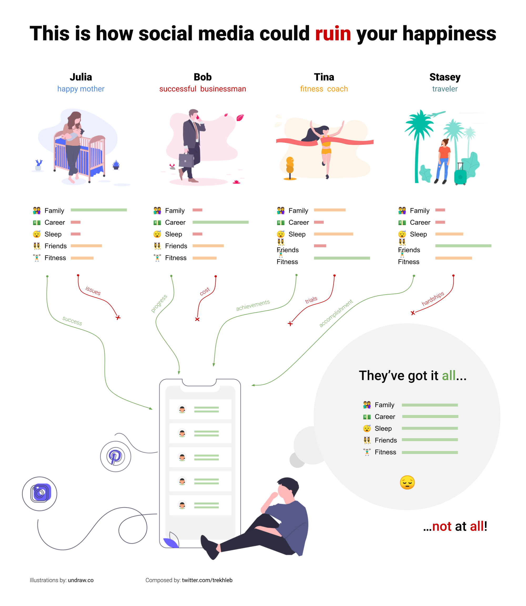

Here’s a recipe for how you can ruin your happiness and start feeling miserable using social media:

1. Stop all attempts to figure out **who you are, what your purpose is** and **what your identity is**.
2. Start **comparing yourself to others** by scrolling social media feeds as often as possible and as much as possible.
3. While doing that start thinking that **people have it all** (while [they are not](https://qz.com/1274601/randi-zuckerbergs-advice-for-achieving-your-life-goals-pick-three/)).
4. Pay attention to their **triumphs** and **victories** only (they won’t show you their **trials, hardships and cost** they paid anyway).

Here you are! *You don’t know who you are, and thoughts of everybody having everything, and you are just having something doesn’t leave your head. Where are you happiness?!* 🧐
