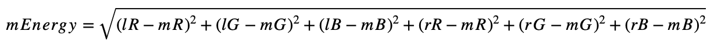

import ImageResizer from './components/ImageResizer';
import InteractivePostArea from '../../../components/shared/InteractivePostArea';


<div className="text-xs text-gray-400 mt-2 flex justify-center items-center font-light">
  <div className="mr-1">
    Background image by
  </div>
  <a
    href="https://unsplash.com/@sadswim?utm_source=unsplash&utm_medium=referral&utm_content=creditCopyText"
    style={{ color: '#aaa', fontWeight: 300 }}
    target="_blank"
    rel="noreferrer"
  >
    Ian Dooley
  </a>
</div>

## TL;DR

There are many great articles written about the *Seam Carving algorithm* already, but I couldn't resist a temptation to explore this elegant, powerful and *yet simple* algorithm on my own, and to write about my personal experience with it. Another point that drew my attention (as a creator of [javascript-algorithms](https://github.com/trekhleb/javascript-algorithms) repo) was the fact that *Dynamic Programming (DP)* approach might be smoothly applied to solve it. And, if you're like me and still on your "learning algorithms" journey, this algorithmic solution may enrich your personal DP arsenal.

So, with this article I want to do three things:

1. Provide you with an interactive **content-aware resizer** so that you could play around with resizing of your own images
2. Explain the idea behind the **Seam Carving algorithm**
3. Explain the **dynamic programming approach** that implements the algorithm (we'll be using TypeScript for it)

### Content-aware image resizing

*Content-aware image resizing* might be applied when it comes to changing the image proportions (i.e. reducing the width while keeping the height) and when losing some parts of the image is not desirable. Doing the straightforward image scaling in this case would distort the objects in it. To preserve the objects proportions while changing the image proportions we may use the [Seam Carving algorithm](https://perso.crans.org/frenoy/matlab2012/seamcarving.pdf) that was introduced by *Shai Avidan* and *Ariel Shamir*.

In the example below you may see how the original image width was reduced by 50% using content-aware resizing (left image) and straightforward scaling (right image). In this particular case the left image looks more natural since proportions of the balloons were preserved.


The idea behind the Seam Carving algorithm is to find the *seam* (continuous sequence of pixels) with the lowest contribution to the image content and then *carve* (remove) it. This process repeats over and over again until we get the required image width or height. In the example below you may see that the hot air balloon pixels contribute more to the content of the image than the sky pixels. Thus, the sky pixels are being removed first.


Finding the seam with the lowest energy is pretty computationally expensive task (especially for large images). To make the seam search faster the *dynamic programming* approach might be applied (we will go through the implementation details below).

### Objects removal

The importance of each pixel (so-called pixel's energy) is being calculated based on its color (`R`, `G`, `B`) difference between two neighbor pixels. Now, if we set the pixel energy to some really low level artificially (i.e. by drawing a mask on top of them), the Seam Carving algorithm would perform an **object removal** for us for free.


### JS IMAGE CARVER demo

I've created the [JS IMAGE CARVER](https://trekhleb.dev/js-image-carver) web-app that you may use to play around with the resizing of your custom images. You may also try its embed version below right away! This widget uses the Seam Carving algorithm that we're going to explore in this article.

<InteractivePostArea title="Content Aware Image Resizer">
  <ImageResizer withSeam />
</InteractivePostArea>

### More examples

Here are some more examples of how the algorithm copes with more complex backgrounds.

Mountains on the background are being shrunk smoothly without visible seams.


The same goes for the ocean waves. Algorithm preserved the waves structure without distorting the surfers.


But also we need to keep in mind that the Seam Carving algorithm is not a silver bullet, and it may fail to resize the images where most of the pixels are edges (looks important to the algorithm). In this case it starts distorting even the important parts of the image. In the example below the content-aware image resizing looks pretty similar to a straightforward scaling since for the algorithm all the pixels look important, and it is hard for it to distinguish Van Gogh's face from the background.


## How Seam Carving algorithms works

Imagine we have a `1000 x 500 px` picture, and we want to change its size to `500 x 500 px` to make it square (let's say the square ratio would better fit the Instagram feed). There might be several requirements to the resizing process in this case:

- Preserve the important parts of the image (i.e. if there were 5 trees before the resizing we want to have 5 trees after resizing as well).
- Preserve the proportions of the important parts of the image (i.e. circle should not be squeezed to the ellipse)

To avoid changing the important parts of the image we may find the *continuous sequence of pixels (the seam)*, that goes from top to bottom and has *the lowest contribution to the content* of the image and then remove it. The seam removal will shrink the image by 1 pixel. We will then repeat this step until the image will get the desirable width.

The question is how to define *the importance of the pixel* and its contribution to the content (in the original paper the authors are using the term **energy of the pixel**). One of the ways to do it is to treat all the pixels that form the edges as important ones. In case if a pixel is a part of the edge its color would have a greater difference between the neighbors (left and right pixels) than the pixel that isn't a part of the edge. Assuming that the color of a pixel is represented by *4* numbers (`R` - red, `G` - green, `B` - blue, `A` - alpha) we may use the following formula to calculate the color difference (pixel energy):



Where:

- `mEnergy` - *Energy* (importance) of the *middle* pixel (`[0..626]` if rounded)
- `lR` - *Red* channel value for the *left* pixel (`[0..255]`)
- `mR` - *Red* channel value for the *middle* pixel (`[0..255]`)
- `rR` - *Red* channel value for the *right* pixel (`[0..255]`)
- `lG` - *Green* channel value for the *left* pixel (`[0..255]`)
- and so on...

In the formula above we're omitting the alpha (transparency) channel for now, assuming that there is no transparent pixels in the image.

> For example, if we would have the following three pixels in a row:
>
> - Left pixel is <span style={{color: 'rgb(235, 0, 0)'}}>red</span>: `rgb(235, 0, 0)`
> - Middle pixel is <span style={{color: 'rgb(0, 245, 0)'}}>green</span>: `rgb(0, 245, 0)`
> - Right pixel is <span style={{color: 'rgb(0, 0, 255)'}}>blue</span>: `rgb(0, 0, 255)`
>
> The middle pixel energy would equal to:
>
> ```
> mEnergy = sqrt((235 - 0)^2 + (0 - 245)^2 + (0 - 0)^2 + (0 - 0)^2 + (0 - 245)^2 + (0 - 255)^2) = 490.2
> ```

Now, since we know how to find the energy of one pixel, we can calculate, so called, **energy map** which will contain the energies of each pixel of the image. On each resizing step the energy map should be re-calculated (at least partially, more about it below) and would have the same size as the image.

For example, on the 1st resizing step we will have a `1000 x 500` image and a `1000 x 500` energy map. On the 2nd resizing step we will remove the seam from the image and re-calculate the energy map based on the new shrunk image. Thus, we will get a `999 x 500` image and a `999 x 500` energy map.

The higher the energy of the pixel the more likely it is important for the image content, and the less likely that we need to remove it.

### Content-aware width resizing

> You may find the source code, and the functions mentioned below in the [js-image-carver](https://github.com/trekhleb/js-image-carver) repository.

For simplicity reasons let's implement the seam carving algorithm only for the image *width* reduction. The image *height* reduction might be implemented in the same way, but we would use the different axis for it (i.e. `Y` instead of `X`). You may think about the height reduction as if you would just rotate the image 90° clock-wise and then applied the width reduction to it.

First, let's define some types that we're going to use while implementing the algorithm.

```typescript
// Type that describes the image size (width and height).
type ImageSize = { w: number, h: number };

// The coordinate of the pixel.
type Coordinate = { x: number, y: number };

// The seam is a sequence of pixels (coordinates).
type Seam = Coordinate[];

// Energy map is a 2D array that has the same width and height
// as the image the map is being calculated for.
type EnergyMap = number[][];

// Type that describes the image pixel's RGBA color.
type Color = [
  r: number, // Red
  g: number, // Green
  b: number, // Blue
  a: number, // Alpha (transparency)
] | Uint8ClampedArray;
```

On the high level the algorithm consists of the following steps:

1. Calculate the **energy map** for the current version of the image.
2. Find the **seam** with the lowest energy based on the energy map (this is where we will apply Dynamic Programming).
3. **Delete the seam** with the lowest energy seam from the image.
4. **Repeat** until the image width is reduced to the desired value.

```typescript
type ResizeImageWidthArgs = {
  img: ImageData, // Image data we want to resize.
  toWidth: number, // Final image width we want the image to shrink to.
};

type ResizeImageWidthResult = {
  img: ImageData, // Resized image data.
  size: ImageSize, // Resized image size (w x h).
};

// Performs the content-aware image width resizing
// using the seam carving method.
export const resizeImageWidth = async (
  { img, toWidth }: ResizeImageWidthArgs,
): Promise<ResizeImageWidthResult> => {
  // For performance reasons we want to avoid changing the img data array size.
  // Instead we'll just keep the record of the resized image width and height separately.
  const size: ImageSize = { w: img.width, h: img.height };

  // Calculating the number of pixels to remove.
  const pxToRemove = img.width - toWidth;
  if (pxToRemove < 0) {
    throw new Error('Upsizing is not supported for now');
  }

  let energyMap: EnergyMap | null = null;
  let seam: Seam | null = null;

  // Removing the lowest energy seams one by one.
  for (let i = 0; i < pxToRemove; i += 1) {
    // 1. Calculate the energy map for the current version of the image.
    energyMap = calculateEnergyMap(img, size);

    // 2. Find the seam with the lowest energy based on the energy map.
    seam = findLowEnergySeam(energyMap, size);

    // 3. Delete the seam with the lowest energy seam from the image.
    deleteSeam(img, seam, size);

    // Reduce the image width, and continue iterations.
    size.w -= 1;
  }

  // Returning the resized image and its final size.
  // The img is actually a reference to the ImageData, so technically
  // the caller of the function already has this pointer. But let's
  // still return it for better code readability.
  return { img, size };
};
```

Let's break down each step ony be one and implement the `calculateEnergyMap()`, `findLowEnergySeam()` and `deleteSeam()` functions.

### Calculating the pixel's energy

```typescript
// Calculates the energy of a pixel.
const getPixelEnergy = (left: Color | null, middle: Color, right: Color | null): number => {
  // Middle pixel is the pixel we're calculating the energy for.
  const [mR, mG, mB] = middle;

  // Energy from the left pixel (if it exists).
  let lEnergy = 0;
  if (left) {
    const [lR, lG, lB] = left;
    lEnergy = (lR - mR) ** 2 + (lG - mG) ** 2 + (lB - mB) ** 2;
  }

  // Energy from the right pixel (if it exists).
  let rEnergy = 0;
  if (right) {
    const [rR, rG, rB] = right;
    rEnergy = (rR - mR) ** 2 + (rG - mG) ** 2 + (rB - mB) ** 2;
  }

  // Resulting pixel energy.
  return Math.sqrt(lEnergy + rEnergy);
};
```

### Calculating the energy map

```typescript
// Helper function that returns the color of the pixel.
const getPixel = (img: ImageData, { x, y }: Coordinate): Color => {
  // The ImageData data array is a flat 1D array.
  // Thus we need to convert x and y coordinates to the linear index.
  const i = y * img.width + x;
  const cellsPerColor = 4; // RGBA
  // For better efficiency, instead of creating a new sub-array we return
  // a pointer to the part of the ImageData array.
  return img.data.subarray(i * cellsPerColor, i * cellsPerColor + cellsPerColor);
};

// Helper function that sets the color of the pixel.
const setPixel = (img: ImageData, { x, y }: Coordinate, color: Color): void => {
  // The ImageData data array is a flat 1D array.
  // Thus we need to convert x and y coordinates to the linear index.
  const i = y * img.width + x;
  const cellsPerColor = 4; // RGBA
  img.data.set(color, i * cellsPerColor);
};
```

```typescript
// Helper function that creates a matrix (2D array) of specific
// size (w x h) and fills it with specified value.
const matrix = <T>(w: number, h: number, filler: T): T[][] => {
  return new Array(h)
    .fill(null)
    .map(() => {
      return new Array(w).fill(filler);
    });
};

// Calculates the energy of each pixel of the image.
const calculateEnergyMap = (img: ImageData, { w, h }: ImageSize): EnergyMap => {
  // Create an empty energy map where each pixel has infinitely high energy.
  // We will update the energy of each pixel.
  const energyMap: number[][] = matrix<number>(w, h, Infinity);
  for (let y = 0; y < h; y += 1) {
    for (let x = 0; x < w; x += 1) {
      // Left pixel might not exist if we're on the very left edge of the image.
      const left = (x - 1) >= 0 ? getPixel(img, { x: x - 1, y }) : null;
      // The color of the middle pixel that we're calculating the energy for.
      const middle = getPixel(img, { x, y });
      // Right pixel might not exist if we're on the very right edge of the image.
      const right = (x + 1) < w ? getPixel(img, { x: x + 1, y }) : null;
      energyMap[y][x] = getPixelEnergy(left, middle, right);
    }
  }
  return energyMap;
};
```

### Finding the seam with the lowest energy (Dynamic Programming approach)

```typescript
// The metadata for the pixels in the seam.
type SeamPixelMeta = {
  energy: number, // The energy of the pixel.
  coordinate: Coordinate, // The coordinate of the pixel.
  previous: Coordinate | null, // The previous pixel in a seam.
};

// Finds the seam (the sequence of pixels from top to bottom) that has the
// lowest resulting energy using the Dynamic Programming approach.
const findLowEnergySeam = (energyMap: EnergyMap, { w, h }: ImageSize): Seam => {
  // The 2D array of the size of w and h, where each pixel contains the
  // seam metadata (pixel energy, pixel coordinate and previous pixel from
  // the lowest energy seam at this point).
  const seamPixelsMap: (SeamPixelMeta | null)[][] = matrix<SeamPixelMeta | null>(w, h, null);

  // Populate the first row of the map by just copying the energies
  // from the energy map.
  for (let x = 0; x < w; x += 1) {
    const y = 0;
    seamPixelsMap[y][x] = {
      energy: energyMap[y][x],
      coordinate: { x, y },
      previous: null,
    };
  }

  // Populate the rest of the rows.
  for (let y = 1; y < h; y += 1) {
    for (let x = 0; x < w; x += 1) {
      // Find the top adjacent cell with minimum energy.
      // This cell would be the tail of a seam with lowest energy at this point.
      // It doesn't mean that this seam (path) has lowest energy globally.
      // Instead, it means that we found a path with the lowest energy that may lead
      // us to the current pixel with the coordinates x and y.
      let minPrevEnergy = Infinity;
      let minPrevX: number = x;
      for (let i = (x - 1); i <= (x + 1); i += 1) {
        if (i >= 0 && i < w && seamPixelsMap[y - 1][i].energy < minPrevEnergy) {
          minPrevEnergy = seamPixelsMap[y - 1][i].energy;
          minPrevX = i;
        }
      }

      // Update the current cell.
      seamPixelsMap[y][x] = {
        energy: minPrevEnergy + energyMap[y][x],
        coordinate: { x, y },
        previous: { x: minPrevX, y: y - 1 },
      };
    }
  }

  // Find where the minimum energy seam ends.
  // We need to find the tail of the lowest energy seam to start
  // traversing it from its tail to its head (from the bottom to the top).
  let lastMinCoordinate: Coordinate | null = null;
  let minSeamEnergy = Infinity;
  for (let x = 0; x < w; x += 1) {
    const y = h - 1;
    if (seamPixelsMap[y][x].energy < minSeamEnergy) {
      minSeamEnergy = seamPixelsMap[y][x].energy;
      lastMinCoordinate = { x, y };
    }
  }

  // Find the lowest energy energy seam.
  // Once we know where the tail is we may traverse and assemble the lowest
  // energy seam based on the "previous" value of the seam pixel metadata.
  const seam: Seam = [];
  if (!lastMinCoordinate) {
    return seam;
  }

  const { x: lastMinX, y: lastMinY } = lastMinCoordinate;

  // Adding new pixel to the seam path one by one until we reach the top.
  let currentSeam = seamPixelsMap[lastMinY][lastMinX];
  while (currentSeam) {
    seam.push(currentSeam.coordinate);
    const prevMinCoordinates = currentSeam.previous;
    if (!prevMinCoordinates) {
      currentSeam = null;
    } else {
      const { x: prevMinX, y: prevMinY } = prevMinCoordinates;
      currentSeam = seamPixelsMap[prevMinY][prevMinX];
    }
  }

  return seam;
};
```

### Removing the seam with the lowest energy

```typescript
// Deletes the seam from the image data.
// We delete the pixel in each row and then shift the rest of the row pixels to the left.
const deleteSeam = (img: ImageData, seam: Seam, { w }: ImageSize): void => {
  seam.forEach(({ x: seamX, y: seamY }: Coordinate) => {
    for (let x = seamX; x < (w - 1); x += 1) {
      const nextPixel = getPixel(img, { x: x + 1, y: seamY });
      setPixel(img, { x, y: seamY }, nextPixel);
    }
  });
};
```

## Objects removal

## What is next
