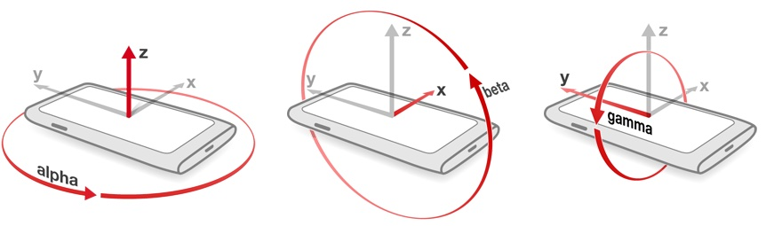
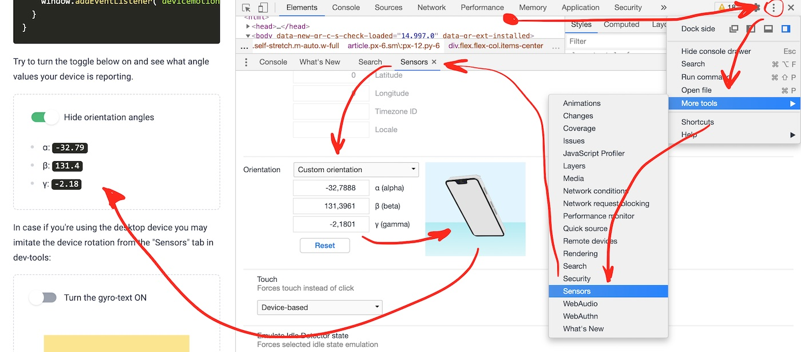

import Alert, { InfoAlert } from '../../../components/shared/Alert';
import InteractivePostArea from '../../../components/shared/InteractivePostArea';
import OrientationInfo from './components/OrientationInfo';
import GyroCube from './components/GyroCube';

<div className="mt-3">
  <Alert type={InfoAlert}>
    Read this article on your mobile device to make the interactive examples work
  </Alert>
</div>

## Accessing device orientation in pure JavaScript

In Javascript you may access your device orientation data by listening to the [deviceorientation](https://developer.mozilla.org/en-US/docs/Web/API/Detecting_device_orientation) event. It is as easy as the following:

```javascript
window.addEventListener('deviceorientation', handleOrientation);

function handleOrientation(event) {
  const alpha = event.alpha;
  const beta = event.beta;
  const gamma = event.gamma;
  // Do stuff...
}
```

Here is the meaning of the `alpha`, `beta` and `gama` angles:



_Image source: [newnow.co](https://newnow.co/me-myself-and-i/)_

**But!** Not every browser allows you to access the orientation data without user's permission. For example, in iOS 13 Apple has introduced the [requestPermission](https://www.w3.org/TR/orientation-event/#dom-deviceorientationevent-requestpermission) method. It must be triggered on user action (click, tap or equivalent).

The example of accessing the device orientation becomes a bit more complicated:

```javascript
function onClick() {
  if (typeof DeviceMotionEvent.requestPermission === 'function') {
    // Handle iOS 13+ devices.
    DeviceMotionEvent.requestPermission()
      .then((state) => {
        if (state === 'granted') {
          window.addEventListener('devicemotion', handleOrientation);
        } else {
          console.error('Request to access the orientation was rejected');
        }
      })
      .catch(console.error);
  } else {
    // Handle regular non iOS 13+ devices.
    window.addEventListener('devicemotion', handleOrientation);
  }
}
```

Try to turn the toggle below on and see what angle values your device is reporting.

<InteractivePostArea>
  <OrientationInfo />
</InteractivePostArea>

## Debugging the orientation access in the browser

In case if you're using the desktop device you may imitate the device rotation from the "Sensors" tab in dev-tools:



Cool! So now we have the access to device orientation, and we can even test it in the browser!

## React hook for accessing the device orientation

The last step I would like to take is to come up with the [React hook](https://reactjs.org/docs/hooks-intro.html), that will encapsulate the orientation fetching for me, and make it easier to use it in the React components (like the one that displayed the angles to you above).

Here is an example of the `useDeviceOrientation.ts` hook, that is written in TypeScript:

```typescript
import { useCallback, useEffect, useState } from 'react';

type DeviceOrientation = {
  alpha: number | null,
  beta: number | null,
  gamma: number | null,
}

type UseDeviceOrientationData = {
  orientation: DeviceOrientation | null,
  error: Error | null,
  requestAccess: () => Promise<boolean>,
  revokeAccess: () => Promise<void>,
};

export const useDeviceOrientation = (): UseDeviceOrientationData => {
  const [error, setError] = useState<Error | null>(null);
  const [orientation, setOrientation] = useState<DeviceOrientation | null>(null);

  const onDeviceOrientation = (event: DeviceOrientationEvent): void => {
    setOrientation({
      alpha: event.alpha,
      beta: event.beta,
      gamma: event.gamma,
    });
  };

  const revokeAccessAsync = async (): Promise<void> => {
    window.removeEventListener('deviceorientation', onDeviceOrientation);
    setOrientation(null);
  };

  const requestAccessAsync = async (): Promise<boolean> => {
    if (!DeviceOrientationEvent) {
      setError(new Error('Device orientation event is not supported by your browser'));
      return false;
    }

    if (
      DeviceOrientationEvent.requestPermission
      && typeof DeviceMotionEvent.requestPermission === 'function'
    ) {
      let permission: PermissionState;
      try {
        permission = await DeviceOrientationEvent.requestPermission();
      } catch (err) {
        setError(err);
        return false;
      }
      if (permission !== 'granted') {
        setError(new Error('Request to access the device orientation was rejected'));
        return false;
      }
    }

    window.addEventListener('deviceorientation', onDeviceOrientation);

    return true;
  };

  const requestAccess = useCallback(requestAccessAsync, []);
  const revokeAccess = useCallback(revokeAccessAsync, []);

  useEffect(() => {
    return (): void => {
      revokeAccess();
    };
  }, [revokeAccess]);

  return {
    orientation,
    error,
    requestAccess,
    revokeAccess,
  };
};
```

The hook might be used as follows:

```tsx
import React from 'react';
import Toggle  from './Toggle';
import { useDeviceOrientation } from './useDeviceOrientation';

const OrientationInfo = (): React.ReactElement => {
  const { orientation, requestAccess, revokeAccess, error } = useDeviceOrientation();

  const onToggle = (toggleState: boolean): void => {
    const result = toggleState ? requestAccess() : revokeAccess();
  };

  const orientationInfo = orientation && (
    <ul>
      <li>ɑ: <code>{orientation.alpha}</code></li>
      <li>β: <code>{orientation.beta}</code></li>
      <li>γ: <code>{orientation.gamma}</code></li>
    </ul>
  );

  const errorElement = error ? (
    <div className="error">{error.message}</div>
  ) : null;

  return (
    <>
      <Toggle onToggle={onToggle} />
      {orientationInfo}
      {errorElement}
    </>
  );
};

export default OrientationInfo;
```

## Demo

Finally, having the access to the device orientation, let's imitate a 3D space, and a possibility to look at the object from a 3D perspective by rotating your mobile device. Imagine you have a virtual shopping item, and you want to see it from different angles and sides before putting it into your basket.

We will use a simple 3D cube which is made with pure CSS by using the [perspective](https://css-tricks.com/almanac/properties/p/perspective/), [perspective-origin](https://css-tricks.com/almanac/properties/p/perspective-origin/) and [transform](https://css-tricks.com/almanac/properties/t/transform/) properties (you may find the full example with styles [on css-tricks.com](https://css-tricks.com/how-css-perspective-works/)).

Here we go, here is our Gyro-Cube that you should be able to see from the different angles depending on your device orientation!

<InteractivePostArea>
  <GyroCube />
</InteractivePostArea>

You may find all the code examples from this article (including the Gyro-cube styles) in [trekhleb.github.io](https://github.com/trekhleb/trekhleb.github.io/tree/master/src/posts/2021/gyro-web/components/) repo.

In case if you're reading the article from the laptop, here's how the demo should work on mobile devices:


I hope this example was useful for you! I also hope that you will come up with much more interesting and realistic use-case for the device orientation than the Gyro-Cube above 😄 Happy coding!
