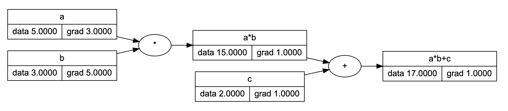
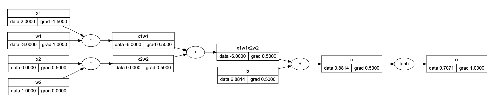
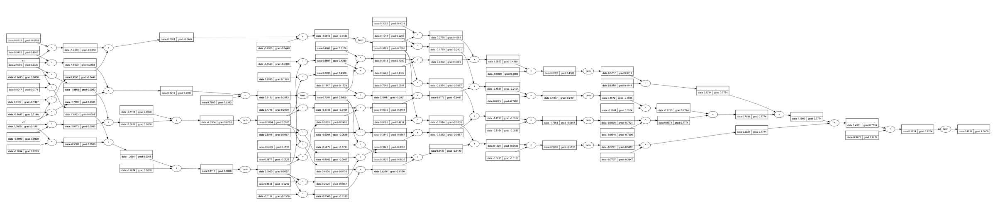
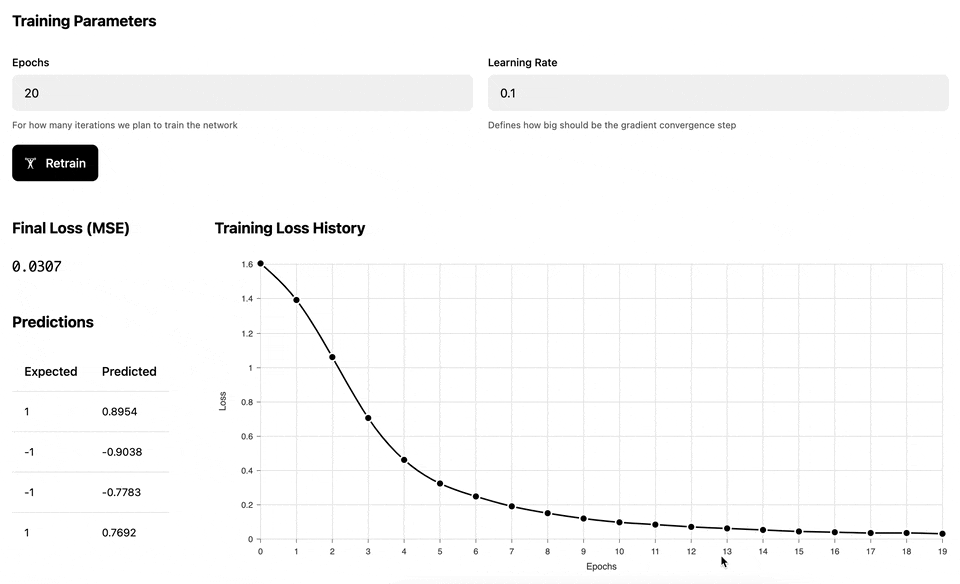

I recently went through a very detailed and well-explained Python-based project/lesson by [karpathy](https://twitter.com/karpathy) which is called [micrograd](https://github.com/karpathy/micrograd). This is a tiny scalar-valued autograd engine and a neural net on top of it. [This video](https://www.youtube.com/watch?v=VMj-3S1tku0) explains how to build such a network from scratch.

The project above is, as expected, built on *Python*. For learning purposes, I wanted to see how such a network may be implemented in *TypeScript* and came up with a 🤖 [micrograd-ts](https://github.com/trekhleb/micrograd-ts) repository (and also with a [demo](https://trekhleb.dev/micrograd-ts/) of how the network may be trained).

Trying to build anything on your own very often gives you a much better understanding of a topic. So, this was a good exercise, especially taking into account that the whole code is just a [~200 lines](https://github.com/trekhleb/micrograd-ts/tree/main/micrograd/) of TS code with no external dependencies.

The [micrograd-ts](https://github.com/trekhleb/micrograd-ts) repository might be useful for those who want to get a basic understanding of how neural networks work, using a TypeScript environment for experimentation.

With that being said, let me give you some more information about the project.

## Project structure

- [micrograd/](https://github.com/trekhleb/micrograd-ts/tree/main/micrograd/) — this folder is the core/purpose of the repo
  - [engine.ts](https://github.com/trekhleb/micrograd-ts/tree/main/micrograd/engine.ts) — the scalar `Value` class that supports basic math operations like `add`, `sub`, `div`, `mul`, `pow`, `exp`, `tanh` and has a `backward()` method that calculates a derivative of the expression, which is required for back-propagation flow.
  - [nn.ts](https://github.com/trekhleb/micrograd-ts/tree/main/micrograd/nn.ts) — the `Neuron`, `Layer`, and `MLP` (multi-layer perceptron) classes that implement a neural network on top of the differentiable scalar `Values`.
- [demo/](https://github.com/trekhleb/micrograd-ts/tree/main/demo/) - demo React application to experiment with the micrograd code
  - [src/demos/](https://github.com/trekhleb/micrograd-ts/tree/main/demo/src/demos/) - several playgrounds where you can experiment with the `Neuron`, `Layer`, and `MLP` classes.

## Micrograd

See the 🎬 [The spelled-out intro to neural networks and back-propagation: building micrograd](https://www.youtube.com/watch?v=VMj-3S1tku0) YouTube video for the detailed explanation of how neural networks and backpropagation work. The video also explains in detail what the `Neuron`, `Layer`, `MLP`, and `Value` classes do.

Briefly, the `Value` class allows you to build a computation graph for some expression that consists of scalar values.

Here is an example of how the computation graph for the `a * b + c` expression looks like:



Based on the `Value` class we can build a `Neuron` expression `X * W + b`. Here we're simulating a dot-product of matrix `X` (input features) and matrix `W` (neuron weights):



Out of `Neurons`, we can build the `MLP` network class that consists of several `Layers` of `Neurons`. The computation graph in this case may look a bit complex to be displayed here, but a simplified version might look like this:



The main idea is that the computation graphs above "know" how to do automatic back propagation (in other words, how to calculate derivatives). This allows us to train the MLP network for several epochs and adjust the network weights in a way that reduces the ultimate loss:



The [following demo](https://trekhleb.dev/micrograd-ts/) illustrates the training process of the Multilayer perceptron against a set of dynamically generated "circular" data, where the inner circle has positive labels (1), and the outer circle has negative labels (-1). Once the network has been trained, we test it against a uniform range of data to build a prediction heatmap: the red area is where the model predicts negative values and the green area is where the model predicts positive values.


## Demo (online)

To see the online demo/playground, check the following link:

🔗 [trekhleb.dev/micrograd-ts](https://trekhleb.dev/micrograd-ts)

## Demo (local)

If you want to experiment with the code locally, follow the instructions below.

### Setup

Clone the current repo locally.

Switch to the demo folder:

```sh
cd ./demo
```

Setup node v18 using [nvm](https://github.com/nvm-sh/nvm) (optional):

```sh
nvm use
```

Install dependencies:

```sh
npm i
```

Launch demo app:

```sh
npm run dev
```

The demo app will be available at `http://localhost:5173/micrograd-ts`

### Playgrounds

Go to the [./demo/src/demos/](https://github.com/trekhleb/micrograd-ts/tree/main/demo/src/demos/) to explore several playgrounds for the `Neuron`, `Layer`, and `MLP` classes.

---

I hope, playing around with the micrograd-ts code above and watching the video from Karpathy will be helpful at least for some of you, learners.

---

🎵 Here is a bit of music-driven MLP training

With a learning rate of `0.3` the training process is stable and converges to the local loss function minimum most of the time.

With a learning rate of `1`, you may see how the gradient descent sometimes skips the local minimum by doing the "steps" that are too large. The learning is unstable in this case.

<iframe width="100%" height="315" src="https://www.youtube.com/embed/Oan0VOWUBYo" title="Multilayer Perceptron Training" frameborder="0" allow="accelerometer; autoplay; clipboard-write; encrypted-media; gyroscope; picture-in-picture; web-share" allowfullscreen></iframe>
