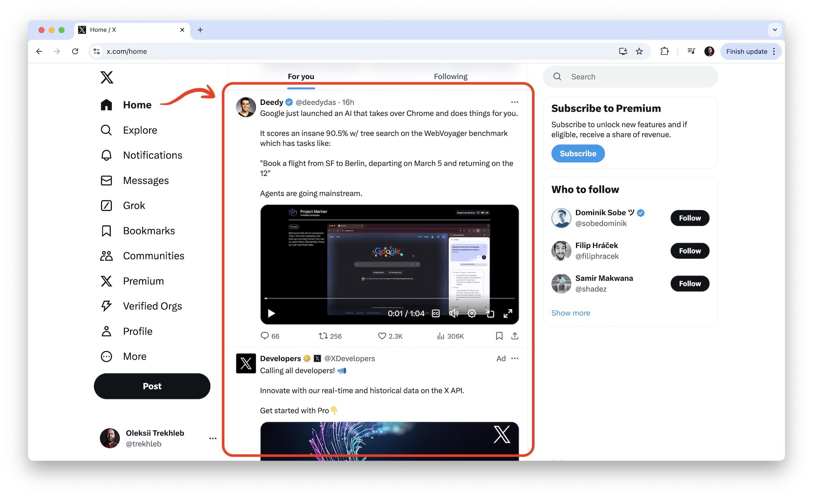
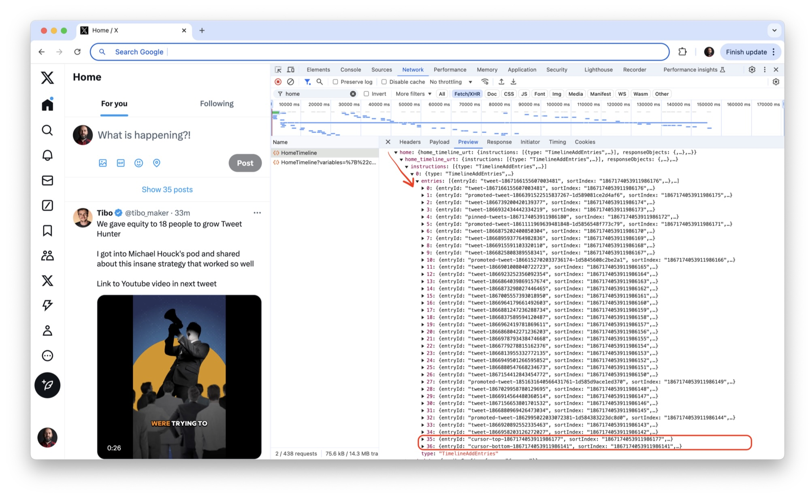
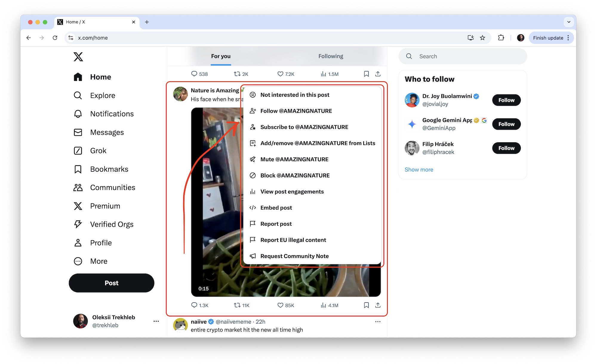

When it comes to designing the API of the system the software engineers often consider different options like [REST vs RPC vs GraphQL](https://okso.app/showcase/system-design/page/0d03d895-b5b1-40c6-3549-945df9d98dcd) (or other hybrid approaches) to determine the best fit for a specific task or project.

In this article, we explore how the **X** (**Twitter**) home timeline (x.com/home) API is designed and what approaches they use to solve the following challenges:
- How to fetch the list of tweets
- How to do a sorting and pagination
- How to return the hierarchical/linked entities (tweets, users, media)
- How to get tweet details
- How to "like" a tweet

We will only explore these challenges on the API level, treating the backend implementation as a black box, since we don't have access to the backend code itself.



> Showing the exact requests and responses here might be cumbersome and hard to follow since the deeply nested and repetitive objects are hard to read. To make it easier to see the request/response payload structure, I've made my attempt to "type out" the home timeline API in TypeScript. So when it comes to the request/response examples I'll use the request and response **types** instead of actual JSON objects. Also, remember that the types are simplified and many properties are omitted for brevity.
>
> You may find all types in [types/x.ts](https://github.com/trekhleb/trekhleb.github.io/blob/master/src/posts/2024/api-design-x-home-timeline/types/x.ts) file or at the bottom of this article in the "Appendix: All types in one place" section.

## Fetching the list of tweets

### The endpoint and request/response structure

Fetching of the list of tweets for the home timeline starts with the `POST` request to the following endpoint:

```
POST https://x.com/i/api/graphql/{query-id}/HomeTimeline
```

Here is a simplified **request** body type:

```typescript
type TimelineRequest = {
  queryId: string; // 's6ERr1UxkxxBx4YundNsXw'
  variables: {
    count: number; // 20
    cursor?: string; // 'DAAACgGBGedb3Vx__9sKAAIZ5g4QENc99AcAAwAAIAIAAA'
    seenTweetIds: string[]; // ['1867041249938530657', '1867041249938530659']
  };
  features: Features;
};

type Features = {
  articles_preview_enabled: boolean;
  view_counts_everywhere_api_enabled: boolean;
  // ...
}
```

And here is a simplified **response** body type (we'll dive deeper into the response sub-types below):

```typescript
type TimelineResponse = {
  data: {
    home: {
      home_timeline_urt: {
        instructions: (TimelineAddEntries | TimelineTerminateTimeline)[];
        responseObjects: {
          feedbackActions: TimelineAction[];
        };
      };
    };
  };
};

type TimelineAddEntries = {
  type: 'TimelineAddEntries';
  entries: (TimelineItem | TimelineCursor | TimelineModule)[];
};

type TimelineItem = {
  entryId: string; // 'tweet-1867041249938530657'
  sortIndex: string; // '1866561576636152411'
  content: {
    __typename: 'TimelineTimelineItem';
    itemContent: TimelineTweet;
    feedbackInfo: {
      feedbackKeys: ActionKey[]; // ['-1378668161']
    };
  };
};

type TimelineTweet = {
  __typename: 'TimelineTweet';
  tweet_results: {
    result: Tweet;
  };
};

type TimelineCursor = {
  entryId: string; // 'cursor-top-1867041249938530657'
  sortIndex: string; // '1866961576813152212'
  content: {
    __typename: 'TimelineTimelineCursor';
    value: string; // 'DACBCgABGedb4VyaJwuKbIIZ40cX3dYwGgaAAwAEAEEAA'
    cursorType: 'Top' | 'Bottom';
  };
};

type ActionKey = string;
```

It is interesting to note here, that "getting" the data is done via "POSTing", which is not common for the REST-like API but it is common for a GraphQL-like API. Also, the `graphql` part of the URL indicates that X is using the GraphQL flavor for their API.

I'm using the word *"flavor"* here because the request body itself doesn't look like a pure [GraphQL query](https://graphql.org/learn/queries/), where we may describe the required response structure, listing all the properties we want to fetch:

```graphql
# An example of a pure GraphQL request structure that is *not* being used in the X API.
{
  tweets {
    id
    description
    created_at
    medias {
      kind
      url
      # ...
    }
    author {
      id
      name
      # ...
    }
    # ...
  }
}
```

The assumption here is that the home timeline API is not a pure GraphQL API, but is a **mix of several approaches**. Passing the parameters in a POST request like this seems closer to the "functional" RPC call. But at the same time, it seems like the GraphQL features might be used somewhere on the backend behind the *HomeTimeline* endpoint handler/controller. A mix like this might also be caused by a legacy code or some sort of ongoing migration. But again, these are just my speculations.

You may also notice that the same `TimelineRequest.queryId` is used in the API URL as well as in the API request body. This queryId is most probably generated on the backend, then it gets embedded to the `main.js` bundle, and then it is used when fetching the data from the backend. It is hard for me to understand how this `queryId` is used exactly since X's backend is a black box in our case. But, again, the speculation here might be that, it might be needed for some sort of performance optimization (re-using some pre-computed query results?), caching (Apollo related?), debugging (join logs by queryId?), or tracking/tracing purposes.

It is also interesting to note, that the `TimelineResponse` contains not a list of tweets, but rather a list of **instructions**, like *"add a tweet to the timeline"* (see the `TimelineAddEntries` type), or *"terminate the timeline"* (see the `TimelineTerminateTimeline` type).

The `TimelineAddEntries` instruction itself may also contain different types of entities:
- Tweets — see the `TimelineItem` type
- Cursors — see the `TimelineCursor` type
- Conversations/comments/threads — see the `TimelineModule` type

```typescript
type TimelineResponse = {
  data: {
    home: {
      home_timeline_urt: {
        instructions: (TimelineAddEntries | TimelineTerminateTimeline)[]; // <-- Here
        // ...
      };
    };
  };
};

type TimelineAddEntries = {
  type: 'TimelineAddEntries';
  entries: (TimelineItem | TimelineCursor | TimelineModule)[]; // <-- Here
};
```

This is interesting from the extendability point of view since it allows a wider variety of what can be rendered in the home timeline without tweaking the API too much.

### Pagination

The `TimelineRequest.variables.count` property sets how many tweets we want to fetch at once (per page). The default is 20. However, more than 20 tweets can be returned in the `TimelineAddEntries.entries` array. For example, the array might contain 37 entries for the first page load, because it includes tweets (29), pinned tweets (1), promoted tweets (5), and pagination cursors (2). I'm not sure why there are  29 regular tweets with the requested count of 20 though.

The `TimelineRequest.variables.cursor` is responsible for the cursor-based pagination.

> "**Cursor pagination** is most often used for real-time data due to the frequency new records are added and because when reading data you often see the latest results first. It eliminates the possibility of skipping items and displaying the same item more than once. In cursor-based pagination, a constant pointer (or cursor) is used to keep track of where in the data set the next items should be fetched from." See the [Offset pagination vs Cursor pagination](https://stackoverflow.com/questions/55744926/offset-pagination-vs-cursor-pagination) thread for the context.

When fetching the list of tweets for the first time the `TimelineRequest.variables.cursor` is empty, since we want to fetch the top tweets from the default (most probably pre-computed) list of personalized tweets.

However, in the response, along with the tweet data, the backend also returns the cursor entries. Here is the response type hierarchy: `TimelineResponse → TimelineAddEntries → TimelineCursor`:

```typescript
type TimelineResponse = {
  data: {
    home: {
      home_timeline_urt: {
        instructions: (TimelineAddEntries | TimelineTerminateTimeline)[]; // <-- Here
        // ...
      };
    };
  };
};

type TimelineAddEntries = {
  type: 'TimelineAddEntries';
  entries: (TimelineItem | TimelineCursor | TimelineModule)[]; // <-- Here (tweets + cursors)
};

type TimelineCursor = {
  entryId: string;
  sortIndex: string;
  content: {
    __typename: 'TimelineTimelineCursor';
    value: string; // 'DACBCgABGedb4VyaJwuKbIIZ40cX3dYwGgaAAwAEAEEAA' <-- Here
    cursorType: 'Top' | 'Bottom';
  };
};
```

Every page contains the list of tweets along with "top" and "bottom" cursors:



After the page data is loaded, we can go from the current page in both directions and fetch either the "previous/older" tweets using the "bottom" cursor or the "next/newer" tweets using the "top" cursor. My assumption is that fetching the "next" tweets using the "top" cursor happens in two cases: when the new tweets were added while the user is still reading the current page, or when the user starts scrolling the feed upwards (and there are no cached entries or if the previous entries were deleted for the performance reasons).

The X's cursor itself might look like this: `DAABCgABGemI6Mk__9sKAAIZ6MSYG9fQGwgAAwAAAAIAAA`. In some API designs, the cursor may be a Base64 encoded string that contains the id of the last entry in the list, or the timestamp of the last seen entry. For example: `eyJpZCI6ICIxMjM0NTY3ODkwIn0= --> {"id": "1234567890"}`, and then, this data is being used to query the database accordingly. In the case of X API, it looks like the cursor is being Base64 decoded into some custom binary sequence that might require some further decoding to get any meaning out of it (i.e. via the Protobuf message definitions). Since we don't know if it is a `.proto` encoding and also we don't know the `.proto` message definition we may just assume that the backend knows how to query the next batch of tweets based on the cursor string.

The `TimelineResponse.variables.seenTweetIds` parameter is used to inform the server about which tweets from the currently active page of the infinite scrolling the client has already seen. This most probably helps ensure that the server does not include duplicate tweets in subsequent pages of results.

## Linked/hierarchical entities

One of the challenges to be solved in the APIs like home timeline (or Home Feed) is to figure out how to return the linked or hierarchical entities (i.e. `tweet → user`, `tweet → media`, `media → author`, etc):
- Should we only return the list of tweets first and then fetch the dependant entities (like user details) in a bunch of separate queries on-demand?
- Or should we return all the data at once, increasing the time and the size of the first load, but saving the time for all subsequent calls?
  - Do we need to normalize the data in this case to reduce the payload size (i.e. when the same user is an author of many tweets and we want to avoid repeating the user data over and over again in each tweet entity)?
- Or should it be a combination of the approaches above?

Let's see how X handles it.

Earlier in the `TimelineTweet` type the `Tweet` sub-type was used. Let's see how it looks:

```typescript
export type TimelineResponse = {
  data: {
    home: {
      home_timeline_urt: {
        instructions: (TimelineAddEntries | TimelineTerminateTimeline)[]; // <-- Here
        // ...
      };
    };
  };
};

type TimelineAddEntries = {
  type: 'TimelineAddEntries';
  entries: (TimelineItem | TimelineCursor | TimelineModule)[]; // <-- Here
};

type TimelineItem = {
  entryId: string;
  sortIndex: string;
  content: {
    __typename: 'TimelineTimelineItem';
    itemContent: TimelineTweet; // <-- Here
    // ...
  };
};

type TimelineTweet = {
  __typename: 'TimelineTweet';
  tweet_results: {
    result: Tweet; // <-- Here
  };
};

// A Tweet entity
type Tweet = {
  __typename: 'Tweet';
  core: {
    user_results: {
      result: User; // <-- Here (a dependent User entity)
    };
  };
  legacy: {
    full_text: string;
    // ...
    entities: { // <-- Here (a dependent Media entities)
      media: Media[];
      hashtags: Hashtag[];
      urls: Url[];
      user_mentions: UserMention[];
    };
  };
};

// A User entity
type User = {
  __typename: 'User';
  id: string; // 'VXNlcjoxNDUxM4ADSG44MTA4NDc4OTc2'
  // ...
  legacy: {
    location: string; // 'San Francisco'
    name: string; //  'John Doe'
    // ...
  };
};

// A Media entity
type Media = {
  // ...
  source_user_id_str: string; // '1867041249938530657'  <-- Here (the dependant user is being mentioned by its ID)
  url: string; // 'https://t.co/X78dBgtrsNU'
  features: {
    large: { faces: FaceGeometry[] };
    medium: { faces: FaceGeometry[] };
    small: { faces: FaceGeometry[] };
    orig: { faces: FaceGeometry[] };
  };
  sizes: {
    large: MediaSize;
    medium: MediaSize;
    small: MediaSize;
    thumb: MediaSize;
  };
  video_info: VideoInfo[];
};
```

What's interesting here is that most of the dependent data like `tweet → media` and `tweet → author` is embedded into the response on the first call (no subsequent queries).

Also, the `User` and `Media` connections with `Tweet` entities are not normalized (if two tweets have the same author, their data will be repeated in each tweet object). But it seems like it should be ok, since in the scope of the home timeline for a specific user the tweets will be authored by many authors and repetitions are possible but sparse.

My assumption was that the `UserTweets` API (that we don't cover here), which is responsible for fetching the tweets of *one particular user* will handle it differently, but, apparently, it is not the case. The `UserTweets` returns the list of tweets of the same user and embeds the same user data over and over again for each tweet. It's interesting. Maybe the simplicity of the approach beats some data size overhead (maybe user data is considered pretty small in size). I'm not sure.

Another observation about the entities' relationship is that the `Media` entity also has a link to the `User` (the author). But it does it not via direct entity embedding as the `Tweet` entity does, but rather it links via the `Media.source_user_id_str` property.

The "comments" (which are also the "tweets" by their nature) for each "tweet" in the home timeline are not fetched at all. To see the tweet thread the user must click on the tweet to see its detailed view. The tweet thread will be fetched by calling the `TweetDetail` endpoint (more about it in the "Tweet detail page" section below).

Another entity that each `Tweet` has is `FeedbackActions` (i.e. "Recommend less often" or "See fewer"). The way the `FeedbackActions` are stored in the response object is different from the way the `User` and `Media` objects are stored. While the `User` and `Media` entities are part of the `Tweet`, the `FeedbackActions` are stored separately in `TimelineItem.content.feedbackInfo.feedbackKeys` array and are linked via the `ActionKey`. That was a slight surprise for me since it doesn't seem to be the case that any action is re-usable. It looks like one action is used for one particular tweet only. So it seems like the `FeedbackActions` could be embedded into each tweet in the same way as `Media` entities. But I might be missing some hidden complexity here (like the fact that each action can have children actions).

More details about the actions are in the "Tweet actions" section below.

## Sorting

The sorting order of the timeline entries is defined by the backend via the `sortIndex` properties:

```typescript
type TimelineCursor = {
  entryId: string;
  sortIndex: string; // '1866961576813152212' <-- Here
  content: {
    __typename: 'TimelineTimelineCursor';
    value: string;
    cursorType: 'Top' | 'Bottom';
  };
};

type TimelineItem = {
  entryId: string;
  sortIndex: string; // '1866561576636152411' <-- Here
  content: {
    __typename: 'TimelineTimelineItem';
    itemContent: TimelineTweet;
    feedbackInfo: {
      feedbackKeys: ActionKey[];
    };
  };
};

type TimelineModule = {
  entryId: string;
  sortIndex: string; // '73343543020642838441' <-- Here
  content: {
    __typename: 'TimelineTimelineModule';
    items: {
      entryId: string,
      item: TimelineTweet,
    }[],
    displayType: 'VerticalConversation',
  };
};
```

The `sortIndex` itself might look something like this `'1867231621095096312'`. It likely corresponds directly to or is derived from a [Snowflake ID](https://en.wikipedia.org/wiki/Snowflake_ID).

> Actually most of the IDs you see in the response (tweet IDs) follow the "Snowflake ID" convention and look like `'1867231621095096312'`.

If this is used to sort entities like tweets, the system leverages the inherent chronological sorting of Snowflake IDs. Tweets or objects with a higher sortIndex value (a more recent timestamp) appear higher in the feed, while those with lower values (an older timestamp) appear lower in the feed.

Here’s the step-by-step decoding of the Snowflake ID (in our case the `sortIndex`) `1867231621095096312`:

- Extract the **Timestamp**:
  - The timestamp is derived by right-shifting the Snowflake ID by 22 bits (to remove the lower 22 bits for data center, worker ID, and sequence): `1867231621095096312 → 445182709954`
- Add **Twitter's Epoch**:
  - Adding Twitter's custom epoch (1288834974657) to this timestamp gives the UNIX timestamp in milliseconds: `445182709954 + 1288834974657 → 1734017684611ms`
- Convert to a **human-readable date**:
  - Converting the UNIX timestamp to a UTC datetime gives: `1734017684611ms → 2024-12-12 15:34:44.611 (UTC)`

So we can assume here that the tweets in the home timeline are sorted chronologically.

## Tweet actions

Each tweet has an "Actions" menu.



The actions for each tweet are coming from the backend in a `TimelineItem.content.feedbackInfo.feedbackKeys` array and are linked with the tweets via the `ActionKey`:

```typescript
type TimelineResponse = {
  data: {
    home: {
      home_timeline_urt: {
        instructions: (TimelineAddEntries | TimelineTerminateTimeline)[];
        responseObjects: {
          feedbackActions: TimelineAction[]; // <-- Here
        };
      };
    };
  };
};

type TimelineItem = {
  entryId: string;
  sortIndex: string;
  content: {
    __typename: 'TimelineTimelineItem';
    itemContent: TimelineTweet;
    feedbackInfo: {
      feedbackKeys: ActionKey[]; // ['-1378668161'] <-- Here
    };
  };
};

type TimelineAction = {
  key: ActionKey; // '-609233128'
  value: {
    feedbackType: 'NotRelevant' | 'DontLike' | 'SeeFewer'; // ...
    prompt: string; // 'This post isn’t relevant' | 'Not interested in this post' | ...
    confirmation: string; // 'Thanks. You’ll see fewer posts like this.'
    childKeys: ActionKey[]; // ['1192182653', '-1427553257'], i.e. NotInterested -> SeeFewer
    feedbackUrl: string; // '/2/timeline/feedback.json?feedback_type=NotRelevant&action_metadata=SRwW6oXZadPHiOczBBaAwPanEwE%3D'
    hasUndoAction: boolean;
    icon: string; // 'Frown'
  };
};
```

It is interesting here that this flat array of actions is actually a tree (or a graph? I didn't check), since each action may have child actions (see the `TimelineAction.value.childKeys` array). This makes sense, for example, when after the user clicks on the **"Don't Like"** action, the follow-up might be to show the **"This post isn’t relevant"** action, as a way of explaining why the user doesn't like the tweet.

## Tweet detail page

Once the user would like to see the tweet detail page (i.e. to see the thread of comments/tweets), the user clicks on the tweet and the `GET` request to the following endpoint is performed:

```
GET https://x.com/i/api/graphql/{query-id}/TweetDetail?variables={"focalTweetId":"1867231621095096312","referrer":"home","controller_data":"DACABBSQ","rankingMode":"Relevance","includePromotedContent":true,"withCommunity":true}&features={"articles_preview_enabled":true}
```

I was curious here why the list of tweets is being fetched via the `POST` call, but each tweet detail is fetched via the `GET` call. Seems inconsistent. Especially keeping in mind that similar query parameters like `query-id`, `features`, and others this time are passed in the URL and not in the request body. The response format is also similar and is re-using the types from the list call. I'm not sure why is that. But again, I'm sure I might be might be missing some background complexity here.

Here are the simplified response body types:

```typescript
type TweetDetailResponse = {
  data: {
    threaded_conversation_with_injections_v2: {
      instructions: (TimelineAddEntries | TimelineTerminateTimeline)[],
    },
  },
}

type TimelineAddEntries = {
  type: 'TimelineAddEntries';
  entries: (TimelineItem | TimelineCursor | TimelineModule)[];
};

type TimelineTerminateTimeline = {
  type: 'TimelineTerminateTimeline',
  direction: 'Top',
}

type TimelineModule = {
  entryId: string; // 'conversationthread-58668734545929871193'
  sortIndex: string; // '1867231621095096312'
  content: {
    __typename: 'TimelineTimelineModule';
    items: {
      entryId: string, // 'conversationthread-1866876425669871193-tweet-1866876038930951193'
      item: TimelineTweet,
    }[], // Comments to the tweets are also tweets
    displayType: 'VerticalConversation',
  };
};
```

The response is pretty similar (in its types) to the list response, so we won't for too long here.

One interesting nuance is that the "comments" (or conversations) of each tweet are actually other tweets (see the `TimelineModule` type). So the tweet thread looks very similar to the home timeline feed by showing the list of `TimelineTweet` entries. This looks elegant. A good example of a universal and re-usable approach to the API design.

## Liking the tweet

When a user likes the tweet, the `POST` request to the following endpoint is being performed:

```
POST https://x.com/i/api/graphql/{query-id}/FavoriteTweet
```

Here is the **request** body types:

```typescript
type FavoriteTweetRequest = {
  variables: {
    tweet_id: string; // '1867041249938530657'
  };
  queryId: string; // 'lI07N61twFgted2EgXILM7A'
};
```

Here is the **response** body types:

```typescript
type FavoriteTweetResponse = {
  data: {
    favorite_tweet: 'Done',
  }
}
```

Looks straightforward and also resembles the RPC-like approach to the API design.

## Conclusion

We have touched on some basic parts of the home timeline API design by looking at X's API example. I made some assumptions along the way to the best of my knowledge. I believe some things I might have interpreted incorrectly and I might have missed some complex nuances. But even with that in mind, I hope you got some useful insights from this high-level overview, something that you could apply in your next API Design session.

Initially, I had a plan to go through similar top-tech websites to get some insights from Facebook, Reddit, YouTube, and others and to collect battle-tested best practices and solutions. I'm not sure if I'll find the time to do that. Will see. But it could be an interesting exercise.

## Appendix: All types in one place

For the reference I'm adding all types in one go here. You may also find all types in [types/x.ts](https://github.com/trekhleb/trekhleb.github.io/blob/master/src/posts/2024/api-design-x-home-timeline/types/x.ts) file.

```typescript
/**
 * This file contains the simplified types for X's (Twitter's) home timeline API.
 *
 * These types are created for exploratory purposes, to see the current implementation
 * of the X's API, to see how they fetch Home Feed, how they do a pagination and sorting,
 * and how they pass the hierarchical entities (posts, media, user info, etc).
 *
 * Many properties and types are omitted for simplicity.
 */

/* eslint-disable max-len */

// POST https://x.com/i/api/graphql/{query-id}/HomeTimeline
export type TimelineRequest = {
  queryId: string; // 's6ERr1UxkxxBx4YundNsXw'
  variables: {
    count: number; // 20
    cursor?: string; // 'DAAACgGBGedb3Vx__9sKAAIZ5g4QENc99AcAAwAAIAIAAA'
    seenTweetIds: string[]; // ['1867041249938530657', '1867041249938530658']
  };
  features: Features;
};

// POST https://x.com/i/api/graphql/{query-id}/HomeTimeline
export type TimelineResponse = {
  data: {
    home: {
      home_timeline_urt: {
        instructions: (TimelineAddEntries | TimelineTerminateTimeline)[];
        responseObjects: {
          feedbackActions: TimelineAction[];
        };
      };
    };
  };
};

// POST https://x.com/i/api/graphql/{query-id}/FavoriteTweet
export type FavoriteTweetRequest = {
  variables: {
    tweet_id: string; // '1867041249938530657'
  };
  queryId: string; // 'lI07N6OtwFgted2EgXILM7A'
};

// POST https://x.com/i/api/graphql/{query-id}/FavoriteTweet
export type FavoriteTweetResponse = {
  data: {
    favorite_tweet: 'Done',
  }
}

// GET https://x.com/i/api/graphql/{query-id}/TweetDetail?variables={"focalTweetId":"1867041249938530657","referrer":"home","controller_data":"DACABBSQ","rankingMode":"Relevance","includePromotedContent":true,"withCommunity":true}&features={"articles_preview_enabled":true}
export type TweetDetailResponse = {
  data: {
    threaded_conversation_with_injections_v2: {
      instructions: (TimelineAddEntries | TimelineTerminateTimeline)[],
    },
  },
}

type Features = {
  articles_preview_enabled: boolean;
  view_counts_everywhere_api_enabled: boolean;
  // ...
}

type TimelineAction = {
  key: ActionKey; // '-609233128'
  value: {
    feedbackType: 'NotRelevant' | 'DontLike' | 'SeeFewer'; // ...
    prompt: string; // 'This post isn’t relevant' | 'Not interested in this post' | ...
    confirmation: string; // 'Thanks. You’ll see fewer posts like this.'
    childKeys: ActionKey[]; // ['1192182653', '-1427553257'], i.e. NotInterested -> SeeFewer
    feedbackUrl: string; // '/2/timeline/feedback.json?feedback_type=NotRelevant&action_metadata=SRwW6oXZadPHiOczBBaAwPanEwE%3D'
    hasUndoAction: boolean;
    icon: string; // 'Frown'
  };
};

type TimelineAddEntries = {
  type: 'TimelineAddEntries';
  entries: (TimelineItem | TimelineCursor | TimelineModule)[];
};

type TimelineTerminateTimeline = {
  type: 'TimelineTerminateTimeline',
  direction: 'Top',
}

type TimelineCursor = {
  entryId: string; // 'cursor-top-1867041249938530657'
  sortIndex: string; // '1867231621095096312'
  content: {
    __typename: 'TimelineTimelineCursor';
    value: string; // 'DACBCgABGedb4VyaJwuKbIIZ40cX3dYwGgaAAwAEAEEAA'
    cursorType: 'Top' | 'Bottom';
  };
};

type TimelineItem = {
  entryId: string; // 'tweet-1867041249938530657'
  sortIndex: string; // '1867231621095096312'
  content: {
    __typename: 'TimelineTimelineItem';
    itemContent: TimelineTweet;
    feedbackInfo: {
      feedbackKeys: ActionKey[]; // ['-1378668161']
    };
  };
};

type TimelineModule = {
  entryId: string; // 'conversationthread-1867041249938530657'
  sortIndex: string; // '1867231621095096312'
  content: {
    __typename: 'TimelineTimelineModule';
    items: {
      entryId: string, // 'conversationthread-1867041249938530657-tweet-1867041249938530657'
      item: TimelineTweet,
    }[], // Comments to the tweets are also tweets
    displayType: 'VerticalConversation',
  };
};

type TimelineTweet = {
  __typename: 'TimelineTweet';
  tweet_results: {
    result: Tweet;
  };
};

type Tweet = {
  __typename: 'Tweet';
  core: {
    user_results: {
      result: User;
    };
  };
  views: {
    count: string; // '13763'
  };
  legacy: {
    bookmark_count: number; // 358
    created_at: string; // 'Tue Dec 10 17:41:28 +0000 2024'
    conversation_id_str: string; // '1867041249938530657'
    display_text_range: number[]; // [0, 58]
    favorite_count: number; // 151
    full_text: string; //  "How I'd promote my startup, if I had 0 followers (Part 1)"
    lang: string; // 'en'
    quote_count: number;
    reply_count: number;
    retweet_count: number;
    user_id_str: string; // '1867041249938530657'
    id_str: string; // '1867041249938530657'
    entities: {
      media: Media[];
      hashtags: Hashtag[];
      urls: Url[];
      user_mentions: UserMention[];
    };
  };
};

type User = {
  __typename: 'User';
  id: string; // 'VXNlcjoxNDUxM4ADSG44MTA4NDc4OTc2'
  rest_id: string; // '1867041249938530657'
  is_blue_verified: boolean;
  profile_image_shape: 'Circle'; // ...
  legacy: {
    following: boolean;
    created_at: string; // 'Thu Oct 21 09:30:37 +0000 2021'
    description: string; // 'I help startup founders double their MRR with outside-the-box marketing cheat sheets'
    favourites_count: number; // 22195
    followers_count: number; // 25658
    friends_count: number;
    location: string; // 'San Francisco'
    media_count: number;
    name: string; //  'John Doe'
    profile_banner_url: string; // 'https://pbs.twimg.com/profile_banners/4863509452891265813/4863509'
    profile_image_url_https: string; // 'https://pbs.twimg.com/profile_images/4863509452891265813/4863509_normal.jpg'
    screen_name: string; // 'johndoe'
    url: string; // 'https://t.co/dgTEddFGDd'
    verified: boolean;
  };
};

type Media = {
  display_url: string; // 'pic.x.com/X7823zS3sNU'
  expanded_url: string; // 'https://x.com/johndoe/status/1867041249938530657/video/1'
  ext_alt_text: string; // 'Image of two bridges.'
  id_str: string; // '1867041249938530657'
  indices: number[]; // [93, 116]
  media_key: string; // '13_2866509231399826944'
  media_url_https: string; // 'https://pbs.twimg.com/profile_images/1867041249938530657/4863509_normal.jpg'
  source_status_id_str: string; // '1867041249938530657'
  source_user_id_str: string; // '1867041249938530657'
  type: string; // 'video'
  url: string; // 'https://t.co/X78dBgtrsNU'
  features: {
    large: { faces: FaceGeometry[] };
    medium: { faces: FaceGeometry[] };
    small: { faces: FaceGeometry[] };
    orig: { faces: FaceGeometry[] };
  };
  sizes: {
    large: MediaSize;
    medium: MediaSize;
    small: MediaSize;
    thumb: MediaSize;
  };
  video_info: VideoInfo[];
};

type UserMention = {
  id_str: string; // '98008038'
  name: string; // 'Yann LeCun'
  screen_name: string; // 'ylecun'
  indices: number[]; // [115, 122]
};

type Hashtag = {
  indices: number[]; // [257, 263]
  text: string;
};

type Url = {
  display_url: string; // 'google.com'
  expanded_url: string; // 'http://google.com'
  url: string; // 'https://t.co/nZh3aF0Aw6'
  indices: number[]; // [102, 125]
};

type VideoInfo = {
  aspect_ratio: number[]; // [427, 240]
  duration_millis: number; // 20000
  variants: {
    bitrate?: number; // 288000
    content_type?: string; // 'application/x-mpegURL' | 'video/mp4' | ...
    url: string; // 'https://video.twimg.com/amplify_video/18665094345456w6944/pl/-ItQau_LRWedR-W7.m3u8?tag=14'
  };
};

type FaceGeometry = { x: number; y: number; h: number; w: number };

type MediaSize = { h: number; w: number; resize: 'fit' | 'crop' };

type ActionKey = string;
```
