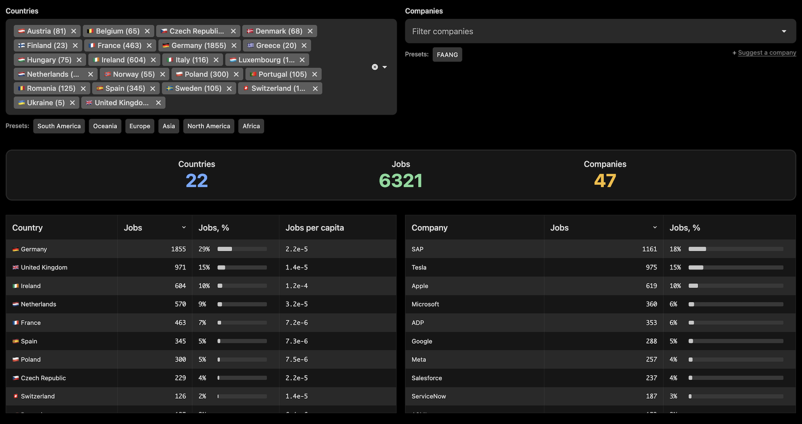
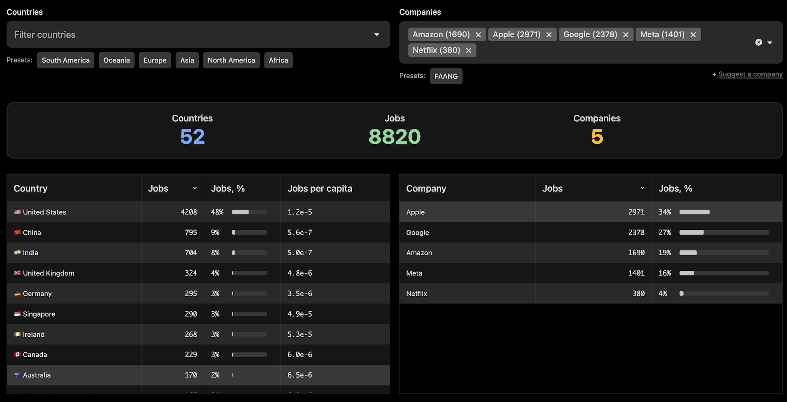
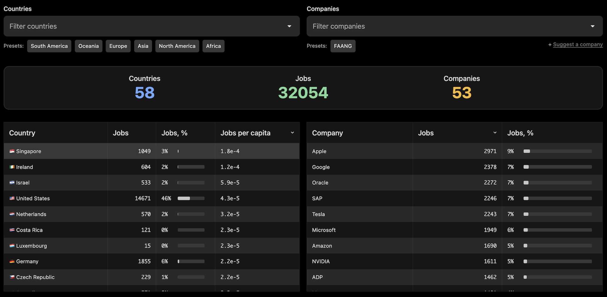

I was curious about the geographical distribution of top tech jobs - for example, how many FAANG jobs are in Europe and where they are primarily concentrated. To explore this, I created a draft (prototype) of **Tech Jobs Radar**: [jobs-radar.com](https://jobs-radar.com)

The dashboard visualizes a snapshot of open top tech positions on a map (currently based on December 2024 data). To make comparisons easier, it aggregates jobs into clusters depending on the zoom level, allowing you to analyze data across continents, countries, states, or counties.

The data for December 2024 contains a snapshot of `32054` open job positions from the top `53` tech companies across `58` countries.

> The "Top Tech" here refers to a subset of the largest tech companies by market capitalization or smaller companies known for their technically challenging products. Please note that the company list is not exhaustive, and the job listings may be incomplete. The website is not intended for active job seeking but rather aims to provide a global perspective on the distribution of high-tech job opportunities.

> The data may contain location errors. Also not all jobs may be technical. So, treat the numbers more like a general trend than a precise statistics.

It also includes company and country filters to help you explore specific slices of the data - for instance, you can check open positions at Uber or identify the main engineering hubs for a particular company.

Additionally, you can search for jobs by title. Each listing includes a link to the detailed description on Indeed.

Here are some numbers...

### Jobs distribution by continents

Among `32054` open job positions (in Dec 2024):
- North America — `16166` (50%)
- Asia — `8334` (26%)
- Europe — `6321` (20%)
- Oceania — `623` (1.9%)
- South America — `553` (1.7%)
- Africa  — `57` (0.1%)

### European tech hubs

Those `53` tech companies that I've collected (the collection is far from being exhaustive though) are mostly presented in:
- 🇩🇪 Germany
- 🇬🇧 United Kingdom
- 🇮🇪 Ireland
- 🇳🇱 Netherlands
- 🇫🇷 France

### FAANG hubs

Here are the Top 10 countries by the number of open job positions at FAANG:

1. 🇺🇸 United States — `4208` (48%)
2. 🇨🇳 China — `795` (9%)
3. 🇮🇳 India — `704` (8%)
4. 🇬🇧 United Kingdom — `324` (4%)
5. 🇩🇪 Germany — `295` (3%)
6. 🇸🇬 Singapore — `290` (3%)
7. 🇮🇪 Ireland — `268` (3%)
8. 🇨🇦 Canada — `229` (3%)
9. 🇦🇺 Australia — `170` (2%)
10. 🇹🇼 Taiwan — `166` (2%)

### Open jobs per capita

I was curious to see the ratio between the number of open tech job positions and the population of each country. Here are the Top 10 countries with the highest amount of jobs per capita:

1. 🇸🇬 Singapore — `18` ×10-5
2. 🇮🇪 Ireland — `12` ×10-5
3. 🇮🇱 Israel — `5.9` ×10-5
4. 🇺🇸 United States — `4.3` ×10-5
5. 🇳🇱 Netherlands — `3.2` ×10-5
6. 🇨🇷 Costa Rica — `2.3` ×10-5
7. 🇱🇺 Luxembourg — `2.3` ×10-5
8. 🇩🇪 Germany — `2.2` ×10-5
9. 🇨🇿 Czech Republic — `2.2` ×10-5
10. 🇦🇺 Australia — `2.2` ×10-5

