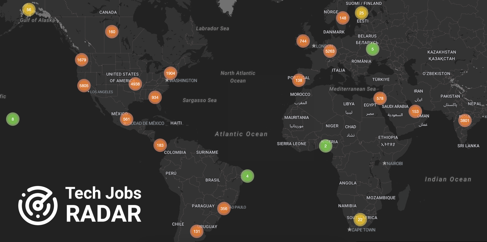
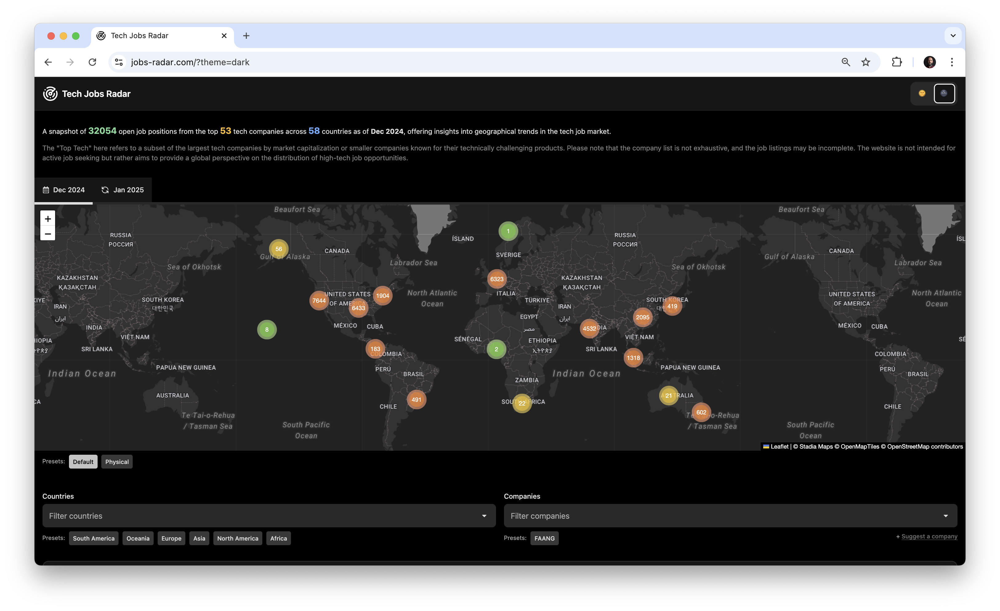
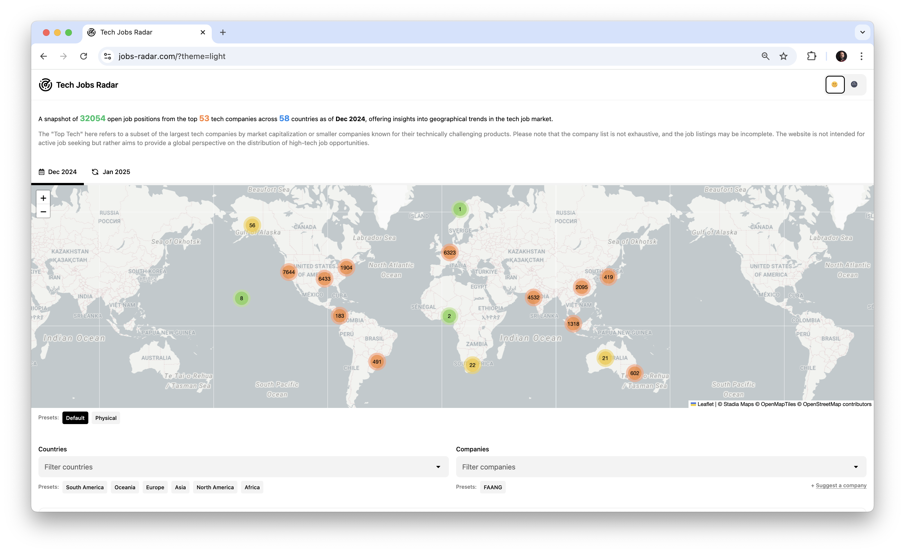
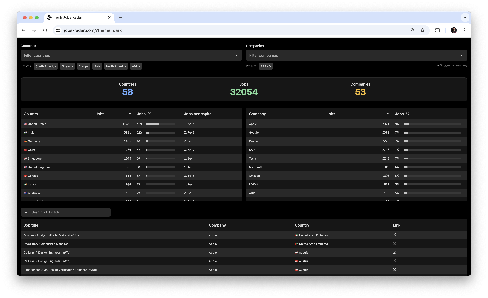

I was curious about the geographical distribution of top tech jobs - for example, how many FAANG jobs are in Europe and where they are primarily concentrated. To explore this, I created a draft (prototype) of **Tech Jobs Radar**: [jobs-radar.com](https://jobs-radar.com)

The dashboard visualizes a snapshot of open top tech positions on a map (currently based on December 2024 data). To make comparisons easier, it aggregates jobs into clusters depending on the zoom level, allowing you to analyze data across continents, countries, states, or counties.

The data for December 2024 contains a snapshot of `32054` open job positions from the top `53` tech companies across `58` countries.

> The "Top Tech" here refers to a subset of the largest tech companies by market capitalization or smaller companies known for their technically challenging products. Please note that the company list is not exhaustive, and the job listings may be incomplete. The website is not intended for active job seeking but rather aims to provide a global perspective on the distribution of high-tech job opportunities.

It also includes company and country filters to help you explore specific slices of the data - for instance, you can check open positions at Uber or identify the main engineering hubs for a particular company.

Additionally, you can search for jobs by title. Each listing includes a link to the detailed description on Indeed.

I'm sharing it here in case others are also curious about analyzing this kind of data.
