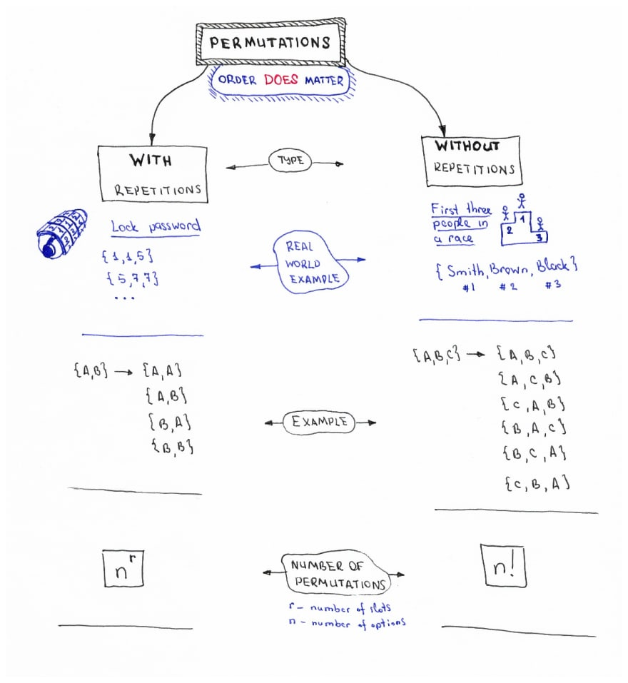

## TL;DR

This article briefly describes the difference between mathematical *permutations* and *combinations*, explains the main idea behind permutations and combinations algorithms and contains links to algorithms implementation in JavaScript.

> JavaScript code examples may be found in [JavaScript Algorithms and Data Structures repository](https://github.com/trekhleb/javascript-algorithms). Read more for further details.

## What are Combinations and Permutations

Let’s say we have a **collection** or **set** of something (collection of numbers, letters, fruits, coins etc.), and we need to **pick items** from a collection to form another collection. For example imagine that you’re picking lottery numbers from the collection of available numbers (`{0, 1, 2, 3, 4, 5, 6, 7, 8, 9} → {4, 5, 9}`). Or you’re picking the fruits from collections of available fruits to make a fruit salad (`{orange, apple, banana, grape} → {apple, banana}`). Or you’re trying to guess the lock password, and you’re choosing 3 numbers out of `{0, 1, 2, 3, 4, 5, 6, 7, 8, 9}` set to guess the correct password (`{1, 1, 2}, {1, 1, 3}, {1, 1, 4}`, ...). In all these cases you’re creating one collection out from the other one by following some rules. These rules define whether your new collection is a **permutation** or a **combination**.

If the **order** of the elements in your new collection **matters** then you’re dealing with **permutations** (for example in case of lock password the set of `{1, 1, 2}` is not the same as set of `{2, 1, 1}`). Otherwise, if the **order doesn’t matter** then you’re making a combination (combination of fruits `{apple, banana}` to make a salad — it doesn’t matter if you’ll pick apple or banana first).

Your new collection **may or may not contain duplicates (or repetitions)**. For example in lock password you’re allowed to use duplicate numbers but when you’re dealing with collection of race winners (`{Black, Smith, Brown}`) you’re not allowed to make duplicates because it doesn’t make sense to have the same person to be on two winning positions.

To illustrate all these differences I’ve created small cheat sheets to make it more easy to remember them.

## Permutations Concept Cheat Sheet

## Combinations Concept Cheat Sheet

## Permutations/Combinations Algorithms Cheat Sheet

If you would want to implement permutation and combination algorithms you might find the following permutation/combination algorithms cheat sheet useful.

## Combinations and Permutations in JavaScript

If you want to see exact implementations of these algorithms in JavaScript you may find follow these links:

- [Combinations in JavaScript](https://github.com/trekhleb/javascript-algorithms/tree/master/src/algorithms/sets/combinations)
- [Permutations in JavaScript](https://github.com/trekhleb/javascript-algorithms/tree/master/src/algorithms/sets/permutations)

I hope you’ll find these cheat sheets helpful, and they will help you to write combinations/permutations algorithms smoothly.

Happy coding!

